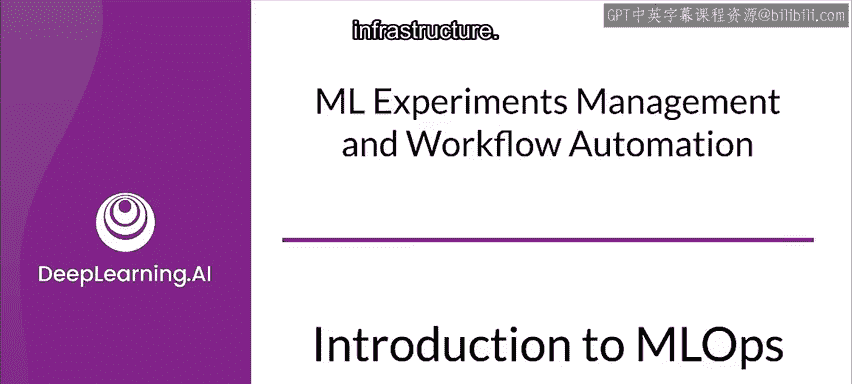
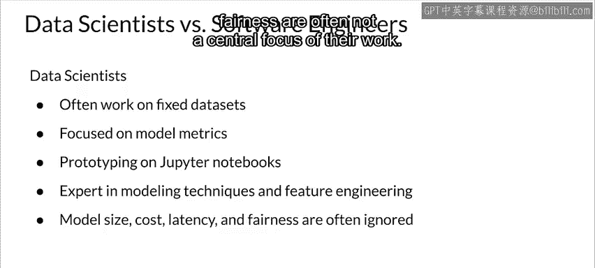
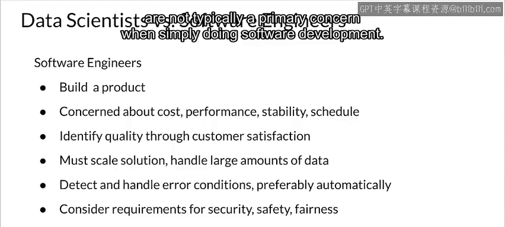
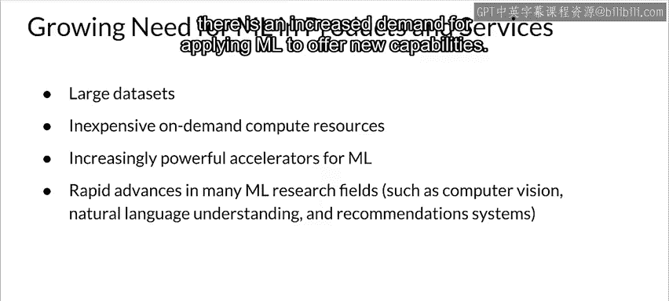
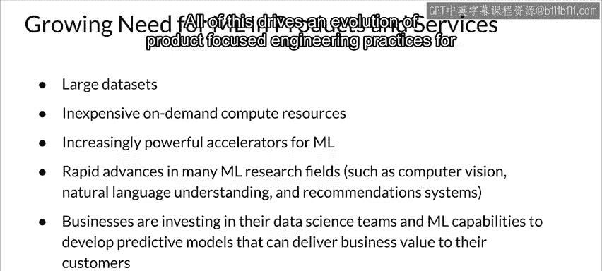
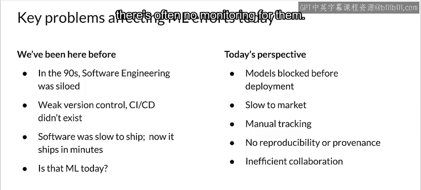
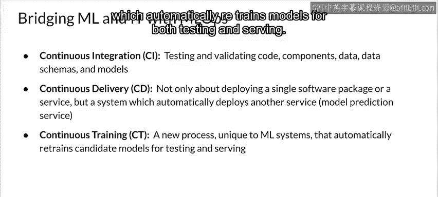
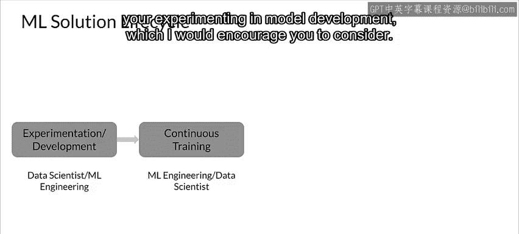
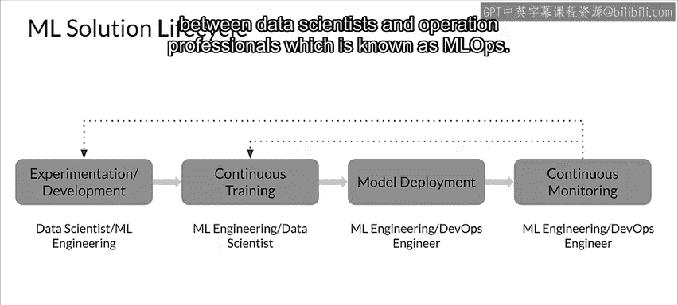
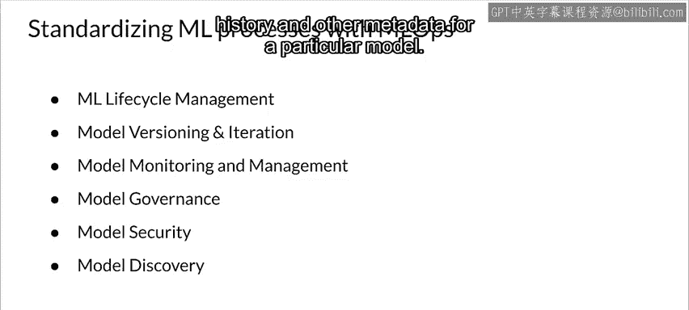

#  146：MLOps简介 🚀

在本节课中，我们将要学习机器学习运维（MLOps）的基本概念。我们将探讨数据科学家与软件工程师角色的差异，理解将机器学习模型投入生产环境所面临的挑战，并介绍MLOps如何借鉴DevOps的理念来构建一套系统化的工程实践，以管理机器学习系统的整个生命周期。

---

## 数据科学家与软件工程师的角色差异

上一节我们概述了MLOps的背景，本节中我们来看看构建机器学习系统的两个核心角色：数据科学家和软件工程师。理解他们的不同关注点，有助于我们明白为什么生产级机器学习需要两者协作。

*   **数据科学家**：通常专注于固定数据集，在笔记本中进行原型设计，主要目标是优化模型指标（如准确率）。他们是建模和特征工程方面的专家，但模型大小、成本、延迟和公平性等问题往往不是其工作的核心。
*   **软件工程师**：更专注于构建产品。成本、性能、稳定性、可扩展性、可维护性和项目进度对他们至关重要。他们非常关注客户满意度、基础设施需求（如可扩展性）、质量保证、测试以及错误检测与缓解，并对安全性、可靠性和公平性有深刻认识。然而，他们通常将产品视为基本静态的，变化主要源于错误修复或新功能。

---

## 机器学习成为核心能力

随着机器学习在解决复杂现实问题、推动行业转型和创造价值方面日益成为核心能力，将模型投入生产的需求变得空前强烈。当前，应用机器学习的要素（如大型数据集、按需计算资源、强大的GPU/TPU加速器）已变得触手可及。计算机视觉、自然语言理解和推荐系统等领域的研究进展迅速，市场对应用机器学习提供新功能的需求也在增长。因此，许多企业已开始投资数据科学团队和机器学习能力，以开发能为客户带来商业价值的预测模型。

这一切推动了面向产品的机器学习工程实践的发展，而这正是MLOps发展的基础。

---

## 当前机器学习工作流面临的挑战

然而，当前的机器学习工作流面临诸多问题，促使我们越来越关注如何改进它。有趣的是，软件工程在不久之前也面临过类似处境。

以下是当前影响机器学习项目的一些主要问题：

*   **部署缓慢**：许多团队在训练好模型后，需要数月时间才能将其部署到生产环境。这种缓慢的上市速度可能意味着错失机会，或部署已经性能衰退的模型。
*   **缺乏追踪与可复现性**：传统数据科学项目缺乏追踪，存在手动记录、模型不可复现、数据缺乏溯源等问题。
*   **协作工具与流程缺失**：不同团队之间普遍缺乏良好的协作工具和流程。
*   **生产环境监控缺位**：模型一旦部署到生产环境，通常缺乏有效的监控。

---

## 从DevOps到MLOps

为了解决上述挑战，我们可以借鉴软件工程领域的成熟实践——DevOps。DevOps是一门专注于开发和管理软件系统的工程学科，它提供了减少开发周期、提高部署速度、确保高质量软件可靠发布等潜在益处。

类似于DevOps，**MLOps是一种旨在统一机器学习系统开发（Dev）与机器学习系统运维（Ops）的机器学习工程文化与实践**。

然而，机器学习系统对DevOps的核心原则提出了独特挑战：
*   **持续集成（CI）**：对机器学习而言，这不仅意味着测试和验证代码与组件，还包括对**数据、数据模式和模型**进行同样的操作。
*   **持续交付（CD）**：不仅仅是部署单个软件或服务，而是部署一个**自动将模型部署到预测服务的机器学习流水线系统**。

随着机器学习从研究走向工程，软件工程、DevOps和机器学习需要融合，形成MLOps。这带来了对新型自动化技术的需求，包括：
*   **持续训练（CT）**：这是机器学习系统独有的新特性，能够自动为测试和服务重新训练模型。

一旦模型进入生产环境，通过**持续监控**来捕获错误、监控推理数据和性能指标就变得至关重要。

---

## 机器学习解决方案的生命周期

现在，让我们考虑一个机器学习解决方案生命周期的主要阶段。

通常，数据科学家或机器学习工程师会从整理数据和开发机器学习模型开始，通过不断实验直到获得符合目标的结果。之后，通常会着手建立持续训练的流水线（除非在实验和模型开发阶段就已经使用了流水线结构，这值得鼓励）。

接着转向**模型部署**，这涉及更多生产环境和流程中的运维与基础设施方面。然后是**持续监控**你的模型、系统以及来自传入请求的数据。这些传入请求的数据将成为进一步实验和持续训练的基础。

因此，当你从持续训练过渡到模型部署时，任务演变为传统上由DevOps工程师负责的范畴。这意味着你需要一位理解机器学习部署和监控的DevOps工程师。

---

## MLOps的核心能力与实践

现在，让我们转向数据科学家和运维专业人员之间协作与沟通的新实践，即MLOps。

MLOps提供的能力将帮助你构建、部署和管理对确保业务流程完整性至关重要的机器学习模型。它通过管理机器学习生命周期，提供了一种将模型从开发环境迁移到生产环境的一致且可靠的方法。

以下是MLOps平台通常提供的关键能力：

*   **模型版本管理与迭代**：模型通常需要迭代和版本控制，以应对不断出现的新需求。模型会根据进一步的训练或更接近当前现实的真实世界数据而变化。MLOps包括按需创建模型版本和维护模型版本历史。
*   **管理模型衰退**：由于真实世界及其数据持续变化，管理模型性能衰退至关重要。通过MLOps，你可以持续监控和管理模型结果，确保准确性、性能及其他目标和关键要求保持在可接受水平。
*   **审计、合规与治理**：MLOps平台通常提供审计合规性、访问控制、治理、测试验证以及访问日志变更的能力。记录的信息可包括与访问控制相关的细节，例如谁发布了模型、修改的原因以及模型何时被部署或在生产中使用。
*   **模型安全**：你需要保护模型免受攻击和未经授权的访问。MLOps解决方案可以提供一些功能，以防止模型被感染的数据破坏、因拒绝服务攻击而变得不可用或被未经授权的用户不当访问。
*   **模型发现与共享**：确保模型安全、可信且准备就绪后，建立一个能让团队轻松发现模型的平台是很好的实践。MLOps可以通过为已生成的模型提供**模型目录**以及可搜索的**模型市场**来实现这一点。这些模型发现解决方案将提供信息来追踪特定模型的数据起源、重要性、模型架构和历史以及其他元数据。

---

## 总结

本节课中，我们一起学习了MLOps的基本概念。我们了解了数据科学家与软件工程师角色的不同侧重点，认识到将机器学习模型投入生产所面临的独特挑战（如部署缓慢、可复现性差、缺乏监控）。我们探讨了MLOps如何借鉴并扩展DevOps的理念，引入了持续集成、持续交付、持续训练和持续监控等实践，以系统化管理机器学习模型从开发到部署、再到运维的完整生命周期。最后，我们介绍了MLOps平台提供的核心能力，包括模型版本管理、性能衰退监控、安全合规保障以及模型发现共享，这些是构建可靠、高效且可维护的生产级机器学习系统的关键。