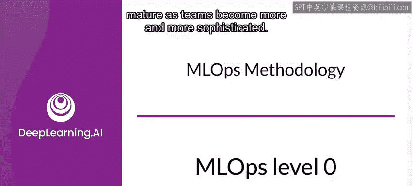
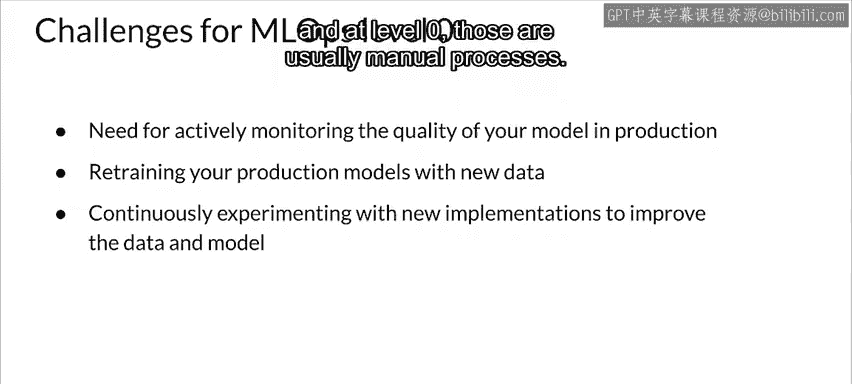

#  147：MLOps 成熟度级别 0 🚦

在本节课中，我们将学习 MLOps 流程如何随着团队经验的增长而演进和成熟。我们将重点介绍 MLOps 成熟度的基础级别——级别 0，并探讨其特点、局限性以及向更高级别演进的需求。

## 概述

MLOps 流程的成熟度根本上由**数据、建模、部署和维护系统的自动化水平**决定。随着成熟度的提高，训练和部署新模型的可用速度也会随之提升。MLOps 团队的目标是**将机器学习模型自动训练和部署到核心软件系统中**，并提供**稳健且全面的监控**。理想情况下，这意味着以尽可能少的人工干预来自动化完整的机器学习工作流。

上一节我们介绍了 MLOps 的基本目标，本节中我们来看看其成熟度模型中的初始级别。

## MLOps 级别 0：手动流程

许多团队拥有能够构建先进模型的数据科学家和机器学习研究员，但他们构建和部署机器学习模型的流程完全是手动的。这被认为是成熟度的基础级别，即**级别 0**。

该流程在很大程度上由脚本或 Notebook 驱动，每个训练步骤都是手动的，包括数据分析、数据准备、模型训练和验证。它需要手动执行每个步骤，并手动从一个步骤过渡到另一个步骤。这个过程通常由实验性代码驱动，这些代码由数据科学家在 Notebook 中交互式地编写和执行，直到产生一个可用的模型。

这造成了机器学习团队与运维团队之间的脱节，并为潜在的**训练-服务偏差**敞开了大门。

为了更好地理解这里的情况，我们假设数据科学家将一个训练好的模型移交给工程团队，以便在他们的基础设施上部署以进行服务或批量预测。这种形式的手动交接可能包括将训练好的模型放在某个文件系统中、将模型对象签入代码仓库，或将其上传到模型注册表。然后，部署模型的工程师需要使所需的输入特征在生产环境中可用（可能用于低延迟服务），这可能导致训练-服务偏差。

以下是级别 0 流程的主要特征：

*   **模型变更频率低**：级别 0 流程假设你的数据科学团队管理着少数不经常变更的模型。变更可能源于模型实现的修改，或使用新数据重新训练模型，或两者兼有。新模型版本可能每年只部署几次。
*   **缺乏持续集成与测试**：由于代码变更较少，持续集成甚至单元测试通常被完全忽略。代码测试通常是 Notebook 或脚本执行的一部分。
*   **实验代码管理**：实现实验步骤的脚本和 Notebook 通常进行版本控制。它们会产生诸如训练好的模型、评估指标和可视化结果等工件。
*   **缺乏持续部署**：因为需要部署的模型版本不多，所以甚至不会考虑持续部署。
*   **仅部署预测服务**：级别 0 流程只关心将训练好的模型部署为预测服务（例如，一个带有 REST API 的微服务），而不是部署整个机器学习系统。
*   **缺乏预测跟踪**：在此级别，你**不会跟踪或记录模型的预测和行动**，而这些是检测模型性能下降和其他模型行为漂移所必需的。

MLOps 级别 0 在许多刚开始将机器学习应用于其用例的企业中很常见。当模型很少更改或重新训练时，这种手动、数据科学驱动的流程可能就足够了。

## 级别 0 的挑战与演进需求

然而在实践中，模型部署到现实世界时经常出现问题。模型无法适应环境动态的变化或描述环境的数据的变化。

为了应对这些挑战并保持模型在生产环境中的准确性，你需要解决以下问题：

首先，需要解决**缺乏主动性能监控**的问题。主动监控你的模型可以让你检测性能下降和模型衰退。它作为一个信号，提示是时候进行新的实验并使用新数据重新训练模型了。

其次，是**模型持续适应最新趋势**的问题。为了克服这一点，你需要经常使用最新的数据重新训练你的生产模型，以捕捉不断演变和新兴的模式。例如，如果你的应用程序使用机器学习推荐时尚产品，其推荐应适应最新的趋势和产品。当然，这要求你拥有新数据并以某种方式为其打标签。而在级别 0，这些通常是手动过程。

## 总结

本节课中，我们一起学习了 MLOps 成熟度模型的**级别 0**。我们了解到这是一个**以手动、脚本驱动为主的流程**，适用于模型变更不频繁的场景。其核心特点包括缺乏自动化、监控和持续部署实践。然而，为了应对现实世界中模型性能衰退和数据漂移的挑战，向更自动化、可监控和可重复的 MLOps 更高级别演进是必要的。下一节，我们将探讨如何通过引入自动化来提升 MLOps 的成熟度。