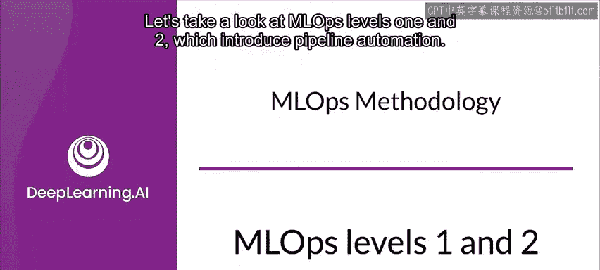
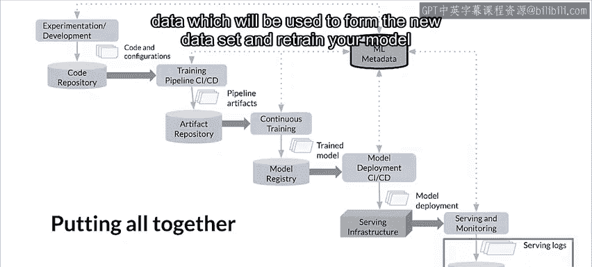

#  148：MLOps 级别 1 与 2 🚀

在本节课中，我们将学习 MLOps 的级别 1 和级别 2。这两个级别主要关注如何通过实现**流水线自动化**，来提升机器学习工作流程的效率和可靠性。我们将了解自动化训练流水线的关键组件、数据与模型验证的重要性，以及如何构建一个从开发到生产的统一部署流程。

---

## 流水线自动化概述

上一节我们了解了 MLOps 的基础概念。本节中，我们来看看如何通过自动化流水线来实现持续训练和持续交付。

级别 1 的一个核心目标是：通过自动化训练流水线，实现模型的**持续训练**。这使得你可以持续地将训练好的模型交付给预测服务。

为了自动化使用新数据在生产环境中重新训练模型的过程，你需要在流水线中引入**自动化数据验证**和**模型验证**步骤，以及**流水线触发器**和**元数据管理**。

机器学习工作流需要具备可重复的训练能力，因此让我们看看流水线自动化的一些特点。

请注意，由于实验步骤是经过编排的，步骤之间的转换是自动化的。这使你能够快速迭代实验，并更容易地将整个流水线迁移到生产环境。

---

## 多环境架构

现在，让我们扩展这个架构，使其包含不同的环境：开发、测试、预生产和生产。请注意，这里展示的架构是典型的，但不同团队会根据需求和基础设施选择以不同方式实现它。

在这个架构中，模型会基于实时流水线触发器（稍后讨论）使用新数据自动重新训练。在开发或实验环境中使用的流水线实现，同样会用于预生产和生产环境，这是统一 DevOps 工作的 MLOps 实践的一个关键方面。

为了构建机器学习流水线，组件需要具备**可重用性**、**可组合性**，并且可能需要在多个流水线之间**可共享**。因此，虽然探索性数据分析代码仍可存在于 Notebook 中，但组件的源代码必须模块化。

此外，组件最好进行**容器化**。这样做是为了将执行环境与自定义代码的运行时解耦，并确保代码在开发和生产环境之间具有可重现性。这实质上隔离了流水线中的每个组件，使它们拥有自己的运行时环境版本，并可以使用不同的语言和库。

请注意，如果探索性数据分析是使用生产组件和生产风格的流水线完成的，将极大地简化该代码向生产的过渡。

---

## 生产中的持续交付

生产中的机器学习流水线会持续地将基于新数据训练出的新模型交付给预测服务。

请注意，当我说“持续”时，指的是一个自动化过程，新模型可能按计划或基于触发器进行交付。模型部署步骤是自动化的，它将训练好并经过验证的模型交付给预测服务，用于在线或批量预测。

在级别 0 中，你只是简单地将训练好的模型部署到生产环境。但在这里，你部署的是整个训练流水线，它会自动且循环地运行，以将训练好的模型作为预测服务提供。

当你将流水线部署到生产环境时，一个或多个触发器会自动执行该流水线。流水线期望获得新的实时数据，以生成基于新数据训练的新模型版本。

因此，生产流水线中需要**自动化数据验证**和**模型验证**步骤。

---

## 数据验证

首先，让我们谈谈为什么在模型训练之前需要进行数据验证，以决定是否应该重新训练模型或停止流水线的执行。

这个决定只有在数据被认为是有效的情况下才会自动做出。例如，**数据模式偏移**被认为是输入数据中的异常，这意味着下游流水线步骤（包括数据处理和模型训练）接收到的数据不符合预期的模式。在这种情况下，你应该停止流水线并发出通知，以便团队进行调查。团队可能会发布修复程序或更新流水线以处理这些模式变化。

模式偏移包括：接收到意外的特征、未接收到所有预期特征，或接收到具有意外值的特征。

此外还有**数据值偏移**，即数据的统计属性发生显著变化，你需要触发模型的重新训练以捕捉这些变化。

---

## 模型验证

模型验证是另一个步骤，在你使用新数据成功训练模型后运行。在这里，你在将模型提升到生产环境之前对其进行评估和验证。

这个离线模型验证步骤可能首先涉及：使用训练好的模型在测试数据集上生成评估指标值，以评估模型的预测质量。

下一步是将新训练模型产生的评估指标值与当前模型（例如，当前的生产模型或基线模型，或任何满足业务要求的模型）进行比较。在这里，你要确保新模型在性能上优于当前模型，然后再将其提升到生产环境。

同时，你需要确保模型在数据的各个部分或切片上的性能是一致的。你新训练的客户流失模型可能在整体预测准确率上优于之前的模型，但每个客户区域的准确率值可能存在很大差异。

最后，在最终部署模型之前，你还需要考虑基础设施兼容性以及与预测服务 API 的一致性等因素。换句话说，新模型是否能在当前基础设施上实际运行。

除了离线模型验证，新部署的模型还会在**金丝雀部署**或 **A/B 测试**设置中进行在线模型验证。在过渡到为在线流量提供预测服务期间，你将在后续课程中了解更多相关内容。

---

## 特征存储

级别 1 MLOps 的一个可选附加组件是**特征存储**。

特征存储是一个集中式存储库，用于标准化训练和服务的特征定义、存储和访问。理想情况下，特征存储将为特征值提供高吞吐量批量服务和低延迟实时服务的 API，并同时支持训练和服务工作负载。

特征存储通过多种方式帮助你。首先，它让你能够发现和重用可用的特征集，而不是重新创建相同或相似的特征集。通过维护特征和相关元数据，可以避免出现定义不同的相似特征。

此外，你可以从特征存储中获取最新的特征值，并通过将特征存储用作实验、持续训练和在线服务的数据源，来避免**训练-服务偏移**。这种方法确保了用于训练的特征与在服务期间使用的特征相同。

例如，在实验方面，数据科学家可以从特征存储中获取离线数据来运行实验。对于持续训练，自动化训练流水线可以获取一批最新的数据特征值。对于在线预测，预测服务可以获取特征值，如客户人口统计特征、产品特征和当前会话聚合特征。

---

## 元数据存储

另一个关键组件是**元数据存储**，其中记录了每次流水线执行的信息，以帮助进行数据和工件溯源、可重现性以及比较。它还有助于你调试错误和异常。

每次执行流水线时，元数据存储都会跟踪诸如执行的流水线和组件版本、开始和结束时间与日期、流水线完成每个步骤所需的时间、每个步骤的输入和输出工件等信息。

基本上，这意味着你可以依赖指向流水线每个步骤产生的工件的指针（例如，准备好的数据的位置、验证异常、计算出的统计数据等），以便在中断时无缝恢复执行。跟踪这些中间输出有助于你从最近的步骤恢复流水线，如果流水线因某个步骤失败而停止，则无需重新启动整个流水线。

---

## MLOps 级别 2

事实上，在 MLOps 最佳实践的当前发展阶段，级别 2 在某种程度上仍然是推测性的。下图展示了当前的一种架构，其重点是**实现生产环境中流水线的快速可靠更新**。

这需要健壮的、自动化的 **CI/CD**，以使你的数据科学家和机器学习工程师能够快速探索关于特征工程、模型架构和超参数的新想法。他们可以实现这些想法，并自动构建、测试和部署新的流水线组件到目标环境。

这种 MLOps 设置包括源代码控制、测试和构建服务、部署服务、模型注册表、特征存储、元数据存储和流水线编排器等组件。由于内容较多，让我们以简化且更易理解的形式，看看机器学习持续集成和持续交付（CI/CD）流水线的不同阶段。

---

## 级别 2 生命周期总结

总而言之，让我们用这张图来理解级别 2 生命周期的步骤。

首先，是**实验与开发**阶段。在这里，你迭代地尝试新算法和新模型，实验步骤是经过编排的。此阶段的输出是机器学习流水线步骤的源代码，然后被推送到源代码仓库。

接下来是用于**训练流水线本身**的 **CI/CD 阶段**。在这里，你构建源代码并运行各种测试。此阶段的输出是流水线实体，如软件包、可执行文件和将在后续阶段部署的工件。

此阶段的输出是一个部署了模型新实现的流水线。然后，你在这里训练模型。流水线会根据计划或响应触发器在生产环境中自动执行。此阶段的输出是一个训练好的模型，并被推送到模型注册表。

一旦模型训练完成，流水线的目标现在是通过持续交付来部署模型。你通过将训练好的模型作为预测服务来提供预测。此阶段的输出是一个已部署的模型预测服务。

最后，一旦你的所有模型都经过训练和部署，**监控服务**的角色就是基于实时数据收集模型性能的统计数据。此阶段的输出是从服务基础设施运行中收集到日志中的数据，包括预测请求数据，这些数据将用于形成新的数据集并重新训练你的模型。

---

## 课程总结

在本节课中，我们一起学习了 MLOps 的级别 1 和级别 2。我们探讨了如何通过**流水线自动化**实现模型的持续训练和交付，深入了解了**数据验证**和**模型验证**在生产流水线中的关键作用，并介绍了**特征存储**和**元数据存储**等重要组件。最后，我们展望了级别 2 的愿景，即通过健壮的 **CI/CD** 流程实现生产流水线的快速可靠更新。掌握这些概念是构建高效、可靠机器学习系统的基石。