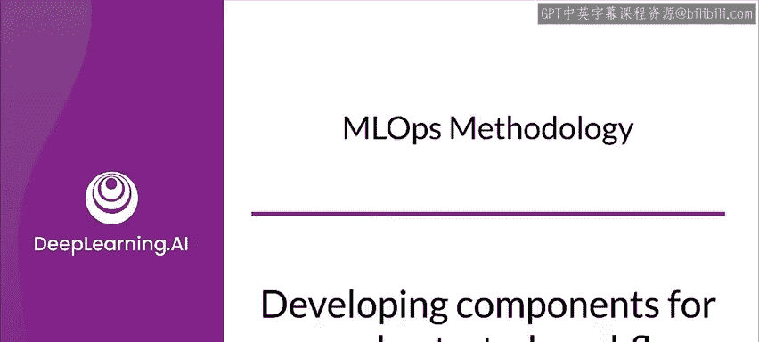
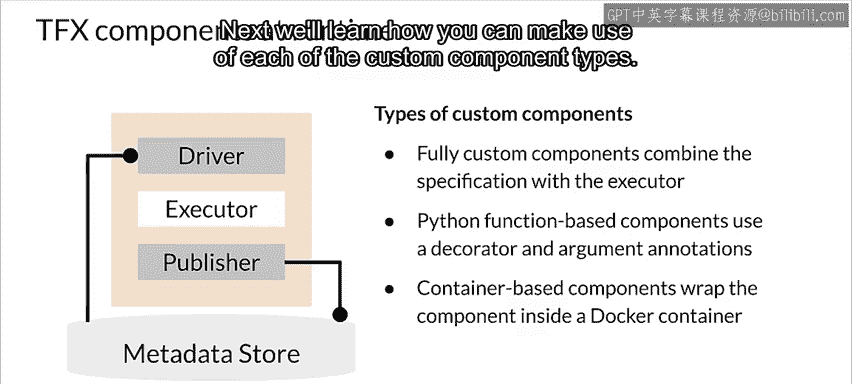
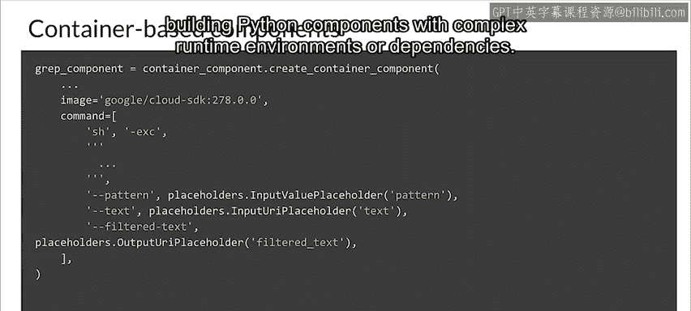
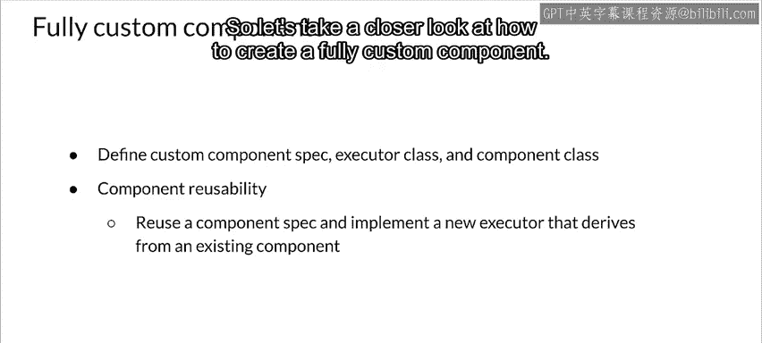
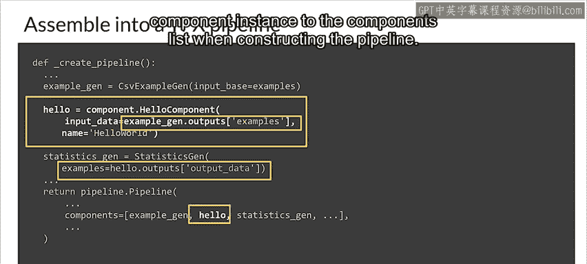

#  149：20_为编排工作流开发组件 🧩

在本节课中，我们将学习如何使用 TFX 框架来开发机器学习训练流水线，并重点探讨如何通过创建自定义组件来满足特定的工作流需求。

---

MLOps 基础设施的一个关键部分是训练流水线。

现在，我们来看看如何使用 TFX 开发训练流水线，包括通过自定义组件来调整流水线以满足需求的方法。

TFX 是一个开源框架，可用于创建机器学习流水线。TFX 使你能够在多种执行环境中实现模型训练工作流，包括像 Kubernetes 这样的容器化环境。

TFX 流水线将你的工作流组织成一系列组件，每个组件执行机器学习工作流中的一个步骤。TFX 标准组件提供了现成的功能，帮助你轻松开始构建机器学习工作流。你也可以在工作流中包含自定义组件，包括创建在容器中运行的组件，这些组件可以使用任何能在容器中运行的语言或库，例如使用 R 进行数据分析。

自定义组件允许你通过创建量身定制的组件来扩展机器学习工作流，例如数据增强、上采样或下采样、异常检测，或与外部系统（如用于警报和监控的帮助台等）对接。

一个入门级或“Hello World”级别的 TFX 流水线通常如下图所示。图中橙色和绿色的部分就是组件。在这个例子中，这些是 TFX 开箱即用的标准组件，但它们也可以是你创建的自定义组件。橙色组件构成训练流水线，绿色组件构成用于批量推理的推理流水线。

因此，通过混合使用标准组件和自定义组件，你可以构建一个满足需求、同时又能利用 TFX 标准组件内置最佳实践的机器学习工作流。

现在，让我们看看 TFX 组件是如何组合在一起的。它们本质上由组件规范和一个执行器类组成，并打包在一个组件类中。

*   规范定义了组件的输入和输出契约。这个契约指定了组件的输入和输出工件以及用于组件执行的参数。
*   执行器类提供了组件执行工作的实现。它是组件的主要代码。
*   最后，组件类将组件规范与执行器结合起来，作为 TFX 流水线中的一个组件使用。

请注意，这是 TFX 标准组件和完全自定义风格组件所使用的实现风格。但创建自定义组件还有其他两种风格，我们接下来会讨论。

当流水线运行一个 TFX 组件时，该组件的执行分为三个阶段：
1.  首先，驱动程序使用组件规范从元数据存储中检索所需的工件，并将其传递给组件。
2.  接着，执行器执行组件的工作。
3.  最后，发布器使用组件规范和执行器的结果，将组件的输出存储到元数据存储中。

大多数自定义组件实现不需要你自定义驱动程序或发布器。通常，只有当你想要改变流水线组件与元数据存储之间的交互时，才需要修改驱动程序和发布器。如果你只想更改组件的输入、输出或参数，则只需修改组件规范。

自定义组件有三种类型：基于 Python 函数的自定义组件、基于容器的自定义组件和完全自定义组件。完全自定义组件在前面的幻灯片中已经讨论过，它允许你通过定义组件规范、执行器和组件接口类来构建组件。这种方法允许你重用和扩展现有标准组件以满足需求。

基于 Python 函数的组件最容易构建，比基于容器的组件或完全自定义组件更简单。它们只需要一个带有装饰器和类型提示的 Python 函数作为执行器。另一方面，基于容器的组件提供了将任何语言编写的代码集成到流水线中的灵活性，前提是你能在 Docker 容器中执行该代码。要创建基于容器的组件，你需要创建一个类似于 Dockerfile 的组件定义，并调用一个包装函数来实例化它。

接下来，我们将学习如何利用每种自定义组件类型。

---

基于 Python 函数的组件风格让你能够轻松创建 TFX 自定义组件，省去了定义组件规范类、执行器类和组件接口类的麻烦。在这种风格中，你编写一个带有装饰器和类型提示的函数。类型提示描述了组件的输入工件、输出工件和参数。

用这种风格为简单的模型验证编写自定义组件非常直接，如下例所示。组件规范在 Python 函数的参数中使用类型注解来定义，描述参数是输入工件、输出工件还是参数。函数体定义了组件的执行器。组件接口通过向函数添加 `@component` 装饰器来定义。

通过用 `@component` 装饰器装饰你的函数，并用类型注解定义函数参数，你可以创建一个组件，而无需构建组件规范、执行器和组件接口的复杂性。

接下来，我们看看如何创建基于容器的组件。

基于容器的组件由容器化的命令行程序支持，在某些方面类似于创建 Dockerfile。要创建一个，你需要指定一个包含组件依赖项的 Docker 容器镜像。然后，你调用 `create_container_component` 函数并传递组件定义，包括组件的输入、输出和参数。配置的其他部分包括容器镜像名称和可选的镜像标签。最后，对于组件的主体，你有 `command` 参数，它定义了容器的入口点命令行。与 Dockerfile 一样，除非你在命令行中指定，否则它不会在 shell 内执行。命令行可以使用占位符对象，这些对象在编译时会被输入、输出或参数替换。占位符对象可以从 `tfx.dsl.component.experimental.placeholders` 导入。

在这个例子中，组件代码使用 `gsutil` 将数据上传到 Google Cloud Storage，因此容器镜像需要安装并配置好 `gsutil`，这是一个依赖项。

这种方法比构建基于 Python 函数的组件更复杂，因为它需要将你的代码打包为容器镜像。这种方法最适合在流水线中包含非 Python 代码，或者为具有复杂运行时环境或依赖项的 Python 构建组件。

---

回到完全自定义组件，这种风格允许你通过直接定义组件规范、执行器类和组件类来构建组件。这种方法也允许你重用和扩展现有标准组件或其他预先存在的组件以满足需求。例如，如果一个现有组件（可能是自定义组件）定义的输入和输出与你正在开发的自定义组件相同，你可以简单地覆盖现有组件的执行器类。这意味着你可以重用组件规范，并实现一个从现有组件派生的新执行器。这样，你可以重用现有组件内置的功能，只实现所需的功能。

这种组件风格的主要用途是扩展现有组件。否则，如果你不需要容器化组件，你可能应该使用 Python 函数风格。然而，深入理解这种完全自定义组件的风格将有助于你更好地理解所有 TFX 组件，所以让我们更仔细地看看如何创建一个完全自定义组件。

---

开发一个完全自定义组件首先需要你定义一个组件规范，其中包含新组件的一组输入和输出工件规范。其次，你必须定义新组件所需的任何非工件的执行参数。

因此，组件规范有三个主要部分：输入、输出和参数。输入和输出被包装在通道中，本质上是输入和输出工件的类型化参数字典。参数是一个额外的执行参数字典，这些参数会传递给执行器，并且不是元数据工件。

接下来，你需要创建一个执行器类。基本上，这是 `base_executor.BaseExecutor` 的一个子类，并重写其 `Do` 函数。在 `Do` 函数中，会传入参数 `input_dict`、`output_dict` 和 `exec_properties`，它们映射到组件规范中定义的输入、输出和参数。对于 `exec_properties`，可以直接通过字典查找获取值。

继续实现用于处理 `input_dict` 和 `output_dict` 中工件的执行器，TFX 的 `artifact_utils` 类中提供了方便的函数，可用于获取工件的实例或 URI。

现在最复杂的部分完成了，下一步是将这些部分组装成一个组件类，以便该组件可以在流水线中使用。有几个步骤：
1.  首先，你需要使组件类成为 `base_component.BaseComponent` 的子类（或者，如果你要扩展现有组件，则是其他组件的子类）。
2.  接下来，你将类变量 `SPEC_CLASS` 和 `EXECUTOR_SPEC` 分别分配给你刚刚创建的组件规范类和执行器类。
3.  完成自定义组件的最后一步是实现 `__init__` 函数来初始化组件。在这里，你使用函数的参数来定义构造函数，以构建组件规范类的一个实例，并使用该值以及一个可选的名称调用父类的 `__init__` 函数。

当创建组件实例时，将调用基类 `base_component.BaseComponent` 中的类型检查逻辑，以确保传入的参数与组件规范类中定义的类型兼容。

最后一步是将新的自定义组件插入到 TFX 流水线中。除了添加新组件的实例外，你还需要将其与上游和下游组件连接起来。通常，你可以通过在新组件中引用上游组件的输出，并在下游组件中引用新组件的输出来实现。另外，需要记住的一点是，在构建流水线时，需要将新组件实例添加到组件的列表中。

---

在本节课中，我们一起学习了 TFX 流水线的基本结构，探讨了三种创建自定义组件的方法：基于 Python 函数的组件、基于容器的组件和完全自定义组件。我们了解了每种方法的适用场景和实现要点，特别是详细剖析了完全自定义组件的开发步骤。掌握这些知识将使你能够灵活地构建和扩展机器学习工作流，以满足各种生产需求。