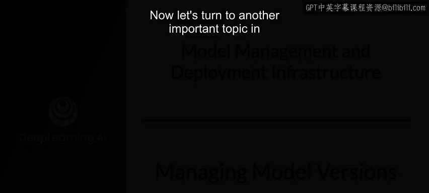
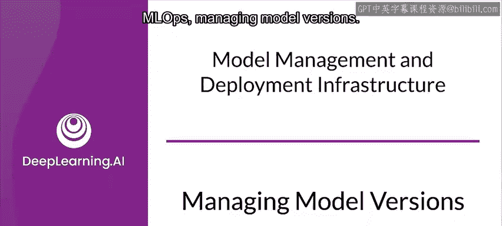
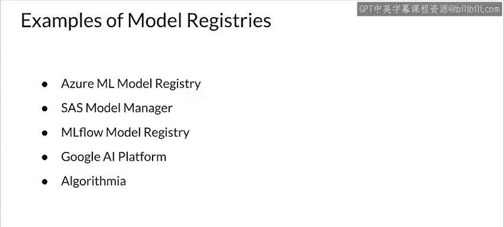

#  150：模型版本管理 📚

在本节课中，我们将要学习机器学习运维（MLOps）中的一个核心主题：模型版本管理。我们将探讨版本控制的重要性、面临的挑战，并介绍一种实用的版本命名方案。此外，我们还将了解模型谱系和模型注册表的概念及其在生产工作流中的作用。

---

## 为什么版本控制至关重要？🤔

在正常的软件开发中，尤其是团队协作时，组织依赖版本控制软件来帮助团队管理和控制代码的变更。

想象一下如果没有版本控制会怎样。你将如何让多位开发者保持同步？出现问题如何回滚？如何进行持续集成？

与软件开发类似，在开发模型时，你同样有这些需求，甚至更多。生成模型是一个迭代过程。在开发期间，你通常会生成多个模型，并相互比较以评估每个模型的性能。

每个模型版本可能拥有不同的代码、数据和配置。你需要跟踪所有这些信息才能正确地复现结果。这就是模型版本管理至关重要的地方。

版本控制将提升从个人开发者到团队乃至整个组织等不同层面的协作效率。

---

## 如何为模型设定版本？🔢

首先，让我们思考如何为软件设定版本。

在大多数情况下，你使用三个数字的组合来为软件设定版本。这些数字分别是主版本号、次版本号和补丁版本号。

*   **主版本号**：通常在做出不兼容的API更改时递增。
*   **次版本号**：在以向后兼容的方式添加功能时递增。
*   **补丁版本号**：在进行向后兼容的错误修复时递增。

那么，你能对模型采用类似的方法吗？截至目前，行业内还没有一个被广泛接受的、统一的模型版本标准。

不同的公司采用了各自的版本命名惯例。作为其组织内的开发者，你需要了解他们如何为模型设定版本。

---

### 一种实用的版本命名方案

以下是我建议的一种可能方案，它易于理解，并且与常规的软件版本命名保持一致。

我们使用三个数字的组合，并将其表示为主版本、次版本和流水线版本。听起来很熟悉，对吗？

*   **主版本**：当发生不兼容的数据变更时递增，例如模式变更或目标变量变更，这些变更可能导致模型在用于预测时与其先前版本不兼容。
*   **次版本**：当你确信已经改进或增强了模型的输出时递增。
*   **流水线版本**：对应于训练流水线的更新，但它不一定改进甚至改变模型本身。

其他版本命名风格包括任意分组、黑盒功能模型和流水线执行版本控制等，但这里不做讨论。相反，我想重点介绍如何检索旧模型、利用模型谱系，以及使用模型注册表来简化生产工作流。

---

## 模型谱系与检索

测试一种版本命名风格的一种方法是问：你能利用模型框架的能力来检索先前训练过的模型吗？

你可能直觉上认为，对于ML框架来说，要检索旧模型，框架内部必须通过某种版本控制技术对模型进行版本管理。

不同的ML框架可能使用不同的技术来检索先前训练过的模型。其中一种技术是利用模型谱系。

**模型谱系**是导致训练模型产生的各工件之间的一组关系。要构建模型工件，你必须能够跟踪构建它们的代码以及数据，包括模型训练和测试时使用的预处理操作。

像TFX这样的ML编排框架会存储这种模型谱系，原因有很多，包括在必要时重新创建模型的不同版本。

请注意，模型谱系通常只包含那些作为模型训练一部分的工件和操作。训练后的工件和操作通常不属于谱系的一部分。

---

## 模型注册表：中央存储库

现在让我们看看模型注册表。**模型注册表**是用于存储已训练模型的中央存储库。

模型注册表提供了一个API，用于在整个模型开发生命周期中管理已训练的模型。模型注册表对于支持模型发现、模型理解和模型重用至关重要，尤其是在拥有数百或数千个模型的大规模环境中。

因此，模型注册表已成为许多开源和商业ML平台不可或缺的一部分。

---

### 注册表中的元数据

接下来，我们看看大多数开源和商业模型注册表中存储的元数据。

元数据通常包括可用的不同模型版本。一些模型注册表为序列化的模型工件提供存储，以提高模型在注册表中的可发现性。

存储一些自由文本注释以及模型的其他结构化或可搜索属性非常重要。为了促进模型谱系，注册表有时会包含指向其他ML工件和元数据存储的链接。

---

### 模型注册表的优势

模型注册表是非常有用的工具。

*   **促进模型搜索与发现**：模型注册表促进了组织内的模型搜索和可发现性，这有助于提高团队对模型的理解。
*   **加强治理**：模型注册表可以帮助强制执行上传模型时需要遵循的一套审批指南，从而有助于改善治理。
*   **促进协作**：通过与团队共享模型，你提高了同事之间协作的机会。
*   **简化部署**：模型注册表还可以帮助简化部署。模型注册表甚至可以提供一个用于持续评估、监控、暂存和升级的平台。

---

### 现有的模型注册表示例

以下是一些当前可用的模型注册表列表，你可以看到有不少选择。每个注册表的功能集都有些不同，这里不做比较，只是为了让你了解一些现有的产品。

例如，有：
*   Azure ML Model Registry
*   SAS Model Manager
*   MLflow Model Registry
*   Google AI Platform
*   Althia

---

## 总结

在本节课中，我们一起学习了模型版本管理。我们探讨了版本控制对MLOps的重要性，并提出了一种结合主版本、次版本和流水线版本的实用命名方案。我们还介绍了**模型谱系**的概念，它记录了模型构建的完整链路。最后，我们了解了**模型注册表**作为中央存储库的关键作用，它能促进模型的发现、理解、协作和治理，是简化生产工作流的重要工具。