#  151：22_持续交付 🚀

在本节课中，我们将学习在成熟的MLOps流程中，如何通过**持续集成（CI）** 与**持续交付（CD）** 构建一个稳健的模型部署流程。这对于管理多个模型，特别是当模型预测作为在线应用的一部分直接面向用户时，至关重要。

---

上一节我们介绍了稳健部署的重要性，本节中我们来看看实现它的核心流程：持续集成与持续交付。

## 持续集成（CI）：确保代码质量

在部署模型之前，必须确保代码能够正常工作。这需要通过全面的**单元测试**来确定。持续集成（CI）自动化了这一过程。

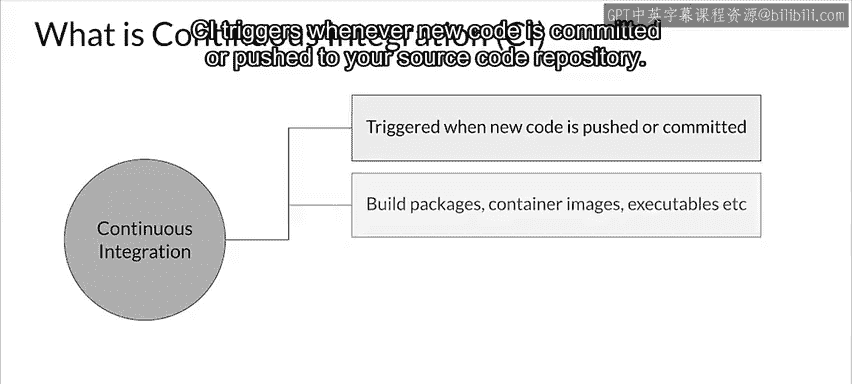

每当有新代码提交或推送到源代码仓库时，CI就会被触发。它主要执行组件的**构建**、**打包**和**测试**。测试的质量取决于单元测试套件的覆盖率和质量。

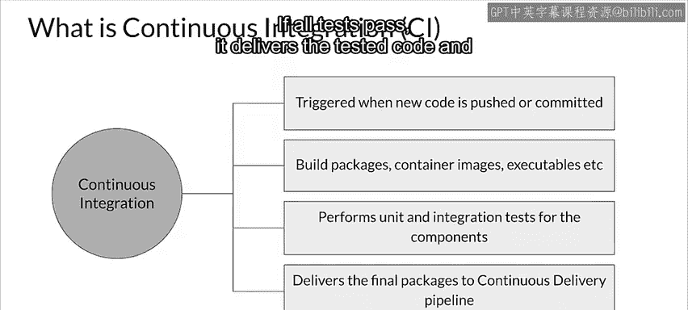

如果所有测试都通过，CI会将测试通过的代码和包交付给持续交付管道。

## 持续交付（CD）：部署到目标环境

接下来，持续交付（CD）负责将新代码和训练好的模型部署到目标环境。它确保代码和模型与目标环境兼容。对于机器学习部署，CD还应检查模型的预测服务性能，以确保新模型能够成功提供服务。

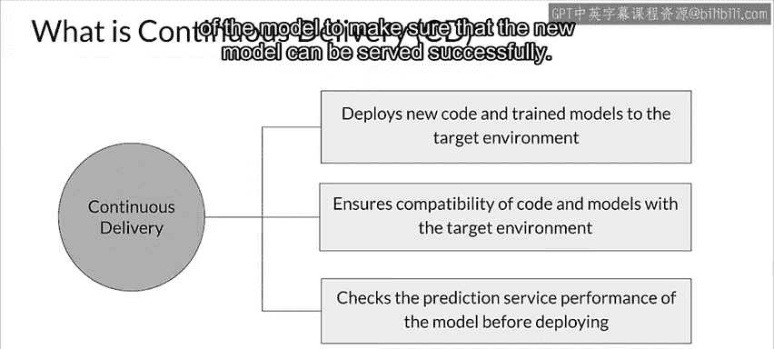

完整的持续集成与持续交付流程及基础设施被称为 **CICD**。

## CICD流程中的数据分析与模型分析

CICD流程包含两种不同形式的数据分析和模型分析。

在实验阶段，数据分析和模型分析通常是数据科学家执行的手动过程。一旦模型和代码被提升到生产训练管道，数据分析和模型分析就应该自动执行。

以下是代码提升到生产环境的关键步骤：

1.  源代码被提交到源代码控制系统，并启动CI。
2.  CD将生产代码部署到生产训练管道，并训练模型。
3.  训练好的模型随后被部署到在线服务环境或批量预测服务。
4.  在服务期间，性能监控会从实时数据中收集模型的性能指标。

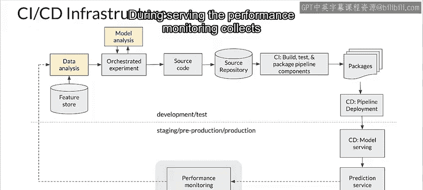

---

上一节我们概述了CICD的整体流程，本节中我们深入探讨在持续集成阶段执行的两项主要测试。

## 持续集成中的主要测试类型

在持续集成中，主要执行两种测试：**单元测试**和**集成测试**。

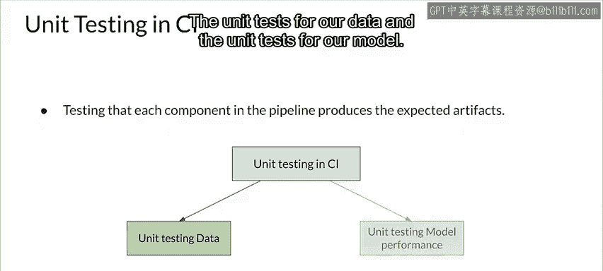

### 单元测试

单元测试用于测试每个组件，以确保它们产生正确的输出。除了遵循软件开发标准实践的代码单元测试外，为机器学习做CI时，还有两种额外的单元测试类型：
*   数据的单元测试
*   模型的单元测试

#### 数据的单元测试

数据的单元测试与对原始特征进行数据验证不同。它主要关注**特征工程**的结果。

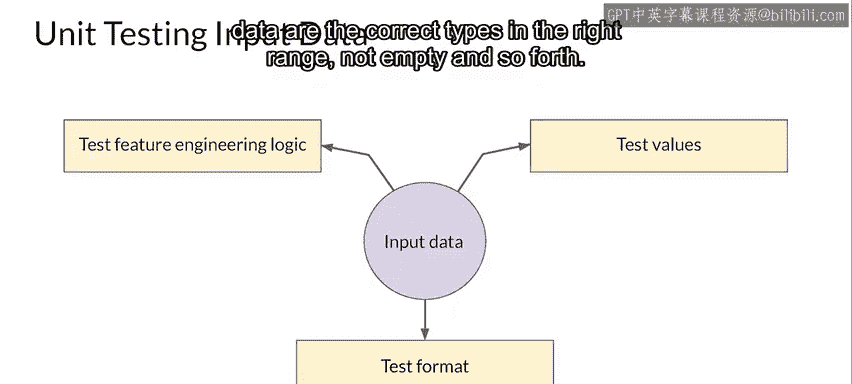

以下是你可以编写的数据单元测试示例：

*   检查工程化特征是否被正确计算。
*   检查特征是否被正确缩放或归一化。
*   检查独热编码值是否正确。
*   检查嵌入是否被正确生成和使用。
*   确认列和数据的类型、范围正确，且不为空等。

#### 模型的单元测试

建模代码也应以模块化方式编写，使其可测试。

以下是需要为建模代码编写的单元测试：

*   测试内部函数是否以正确的形状和类型返回输出。对于数值特征，这包括测试NaN值；对于字符串特征，包括测试空字符串等。
*   添加测试以确保准确率、错误率、AUC、ROC等指标高于你指定的性能基线。
*   即使训练模型具有可接受的准确率，也需要针对数据切片进行测试，以确保模型对数据的关键子集也是准确的，从而避免偏见。

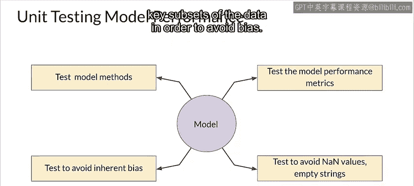

---

上一节我们讨论了标准的单元测试，本节中我们来看看针对机器学习的一些额外考虑。

## 机器学习单元测试的特殊考量

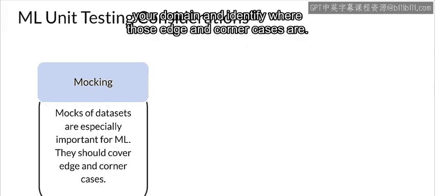

虽然应执行标准的代码单元测试，但对于机器学习还有一些额外的考量。这包括**模拟数据（Mock Data）** 的设计，这对ML单元测试尤为重要。

模拟数据应设计为覆盖你的**边缘情况**和**角落情况**。这要求你思考每个特征和你的领域，并识别这些边缘和角落情况在哪里。

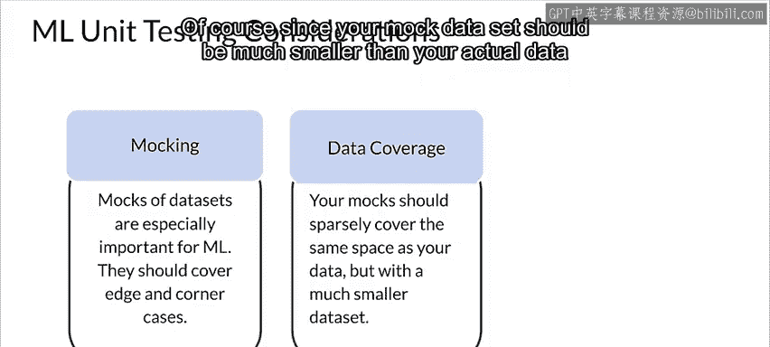

理想情况下，你的模拟数据应大致占据与实际数据相同的特征空间区域，但当然要稀疏得多，因为在大多数情况下，模拟数据集应远小于实际数据集。

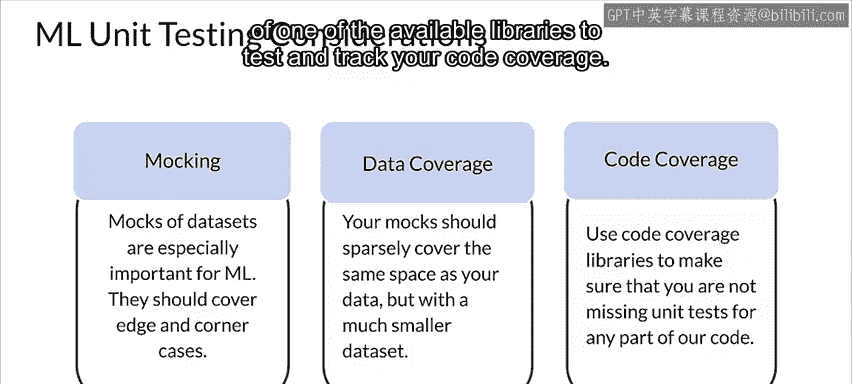

如果你创建了良好的模拟数据和测试，就应该有良好的代码覆盖率。但为了确保万无一失，可以利用现有的库来测试和跟踪你的代码覆盖率。

---

上一节我们确保了代码和模型逻辑的正确性，本节中我们来看看部署前的最后一道防线。

## 基础设施验证：生产前的预警

基础设施验证是在将模型推送到生产环境之前的一个预警层，旨在避免模型在生产中实际服务请求时无法运行或性能低下的问题。它侧重于**模型服务器二进制文件**与即将部署的**模型**之间的兼容性。

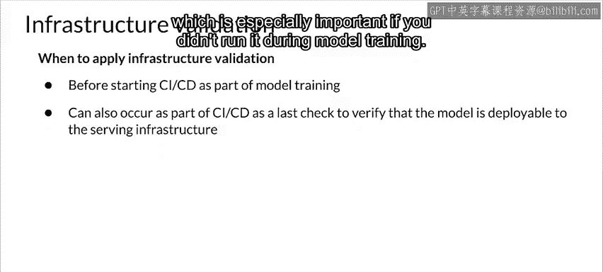

将基础设施验证包含在你的训练管道中是一个好主意，这样在训练模型时就可以及早避免问题。你也可以将其作为CICD工作流的一部分来运行，如果你在模型训练期间没有运行它，这一点尤其重要。

### 基础设施验证示例

让我们看一个在训练管道中运行基础设施验证的例子。

在TFX管道中，**基础设施验证器组件**会获取模型，启动一个包含该模型的沙箱模型服务器，并查看它是否能成功加载并可选择性地进行查询。

如果模型行为符合预期，则它被称为“受祝福的”，并被认为已准备好部署。

基础设施验证器侧重于模型服务器二进制文件（例如TensorFlow Serving）与要部署的模型之间的兼容性。尽管名为“基础设施验证器”，但正确配置环境是用户的责任。基础设施验证器仅与用户配置环境中的模型服务器交互，以查看其是否按预期工作。正确配置此环境将确保你的基础设施验证通过或失败，能够指示模型在生产服务环境中是否可服务。

---

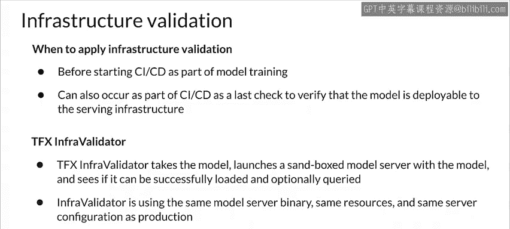

在本节课中，我们一起学习了如何通过持续集成（CI）和持续交付（CD）构建稳健的机器学习部署流程。我们探讨了CI中的单元测试（包括对数据和模型的特殊测试）、模拟数据的设计，以及部署前的基础设施验证。掌握这些实践，是确保机器学习模型能够可靠、高效地服务于生产环境的关键。