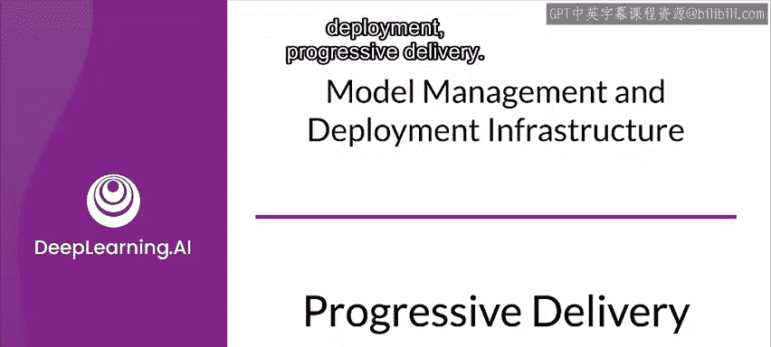
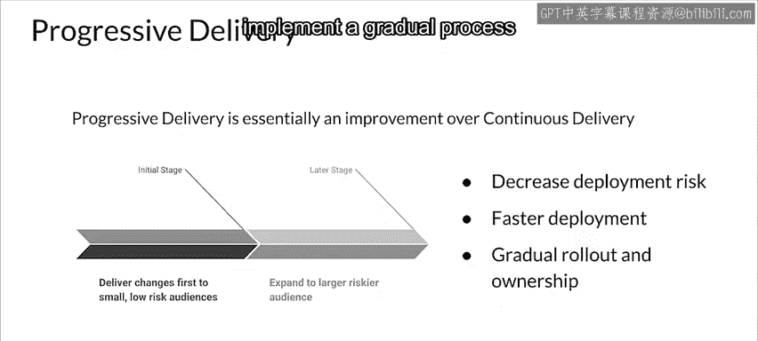
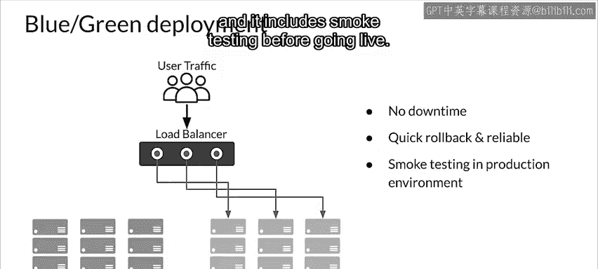
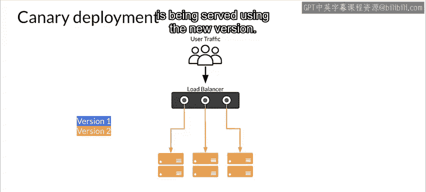
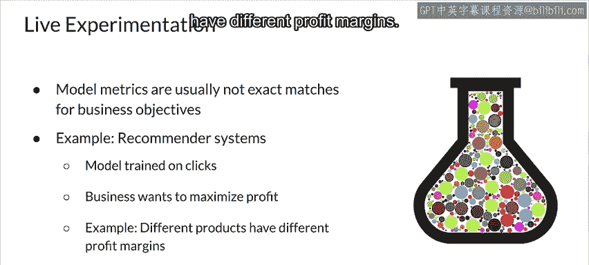
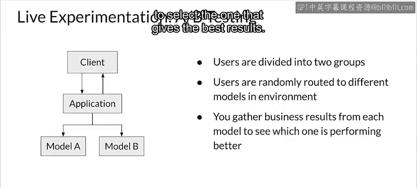
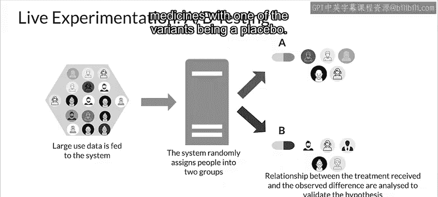
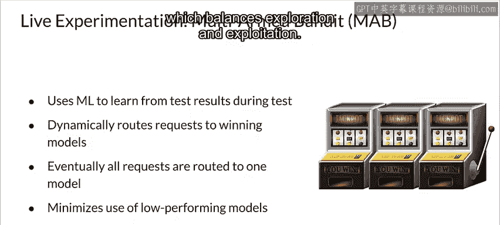
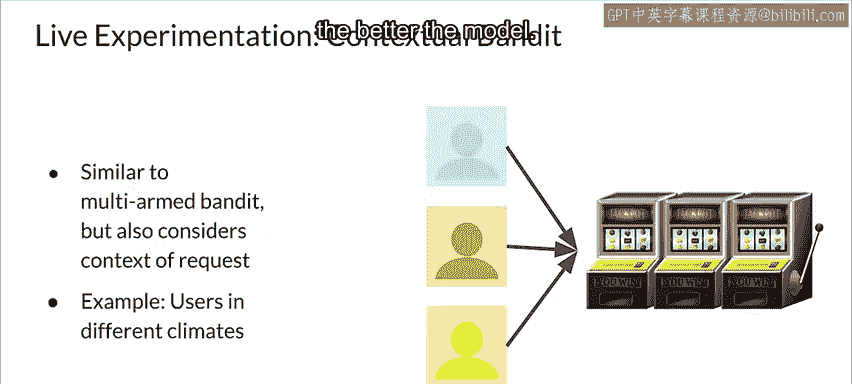

#  152：渐进式交付 🚀

在本节课中，我们将学习一种更高级的部署方式——渐进式交付。这是一种在持续集成和持续交付核心理念基础上发展起来的软件开发流程，旨在通过逐步推出新功能来降低风险并评估用户反馈。

---

## 什么是渐进式交付？🤔

渐进式交付建立在持续集成和持续交付的核心原则之上，本质上是对CICD的改进。它包含了许多现代软件开发流程，例如金丝雀部署、A/B测试、多臂赌博机算法和可观测性。

其核心思想是逐步推出新功能，以限制潜在的负面影响，并评估用户对新功能的反应。该流程首先将变更交付给少量、低风险的用户，然后逐步扩展到更大、风险更高的受众，从而验证结果。

渐进式交付的优势在于，它提供了诸如功能标志等控制和保障措施，以提高部署速度并降低风险。这通常能带来更快的部署速度，并为推出和所有权管理实施一个渐进的过程。

---

## 渐进式交付的常见模式 🛠️

上一节我们介绍了渐进式交付的概念，本节中我们来看看几种具体的实践模式。这些模式通常涉及同时部署多个版本，以便进行性能比较。这种做法源于软件工程，尤其适用于在线服务。每个模型执行相同的任务，以便进行比较。

以下是几种关键模式：

*   **蓝绿部署**：这是渐进式交付的一种简单形式。存在两个生产服务环境（蓝环境和绿环境）。请求流经负载均衡器，该均衡器将流量导向当前活跃的环境（称为蓝环境）。同时，新版本被部署到绿环境，绿环境充当预发布环境，在此进行一系列测试以确保性能和功能。通过测试后，流量被导向绿环境部署。如果出现任何问题，流量可以切回蓝环境。这意味着部署期间没有停机时间，回滚容易，可靠性高，并且在上线前包含冒烟测试。
*   **金丝雀部署**：金丝雀部署类似于蓝绿部署，但不是一次性将所有传入流量从蓝环境切换到绿环境，而是逐步切换流量。随着流量开始使用新版本，会监控新版本的性能。如有必要，可以停止并回滚部署，而不会造成停机，并且用户对新版本的暴露最小。最终，所有流量都将使用新版本提供服务。
*   **在线实验**：渐进式部署与在线实验密切相关。在线实验用于测试模型，以衡量其带来的实际业务结果，或尽可能测量与业务结果密切相关的数据。这是必要的，因为你在训练期间用于优化模型的模型指标，通常与业务目标不完全匹配。例如，考虑推荐系统。你训练模型以最大化点击率（这是你数据的标注方式）。但业务真正想要的是最大化利润。这与点击率密切相关，但并不完全匹配，因为有些点击带来的利润比其他点击更高（例如，不同产品的利润率不同）。

---

## 在线实验的具体方法 🔬

上一节提到了在线实验的重要性，本节中我们来看看两种具体的实验方法：A/B测试和多臂赌博机。

以下是A/B测试的基本流程：

*   **A/B测试**：这是一种简单的在线实验形式。在A/B测试中，你至少有两个不同的模型（或N个模型），通过比较它们之间的业务结果，来选择能带来最佳业务表现的模型。具体做法是将用户分成两组或N组，并将用户路由到随机选择的模型。**注意**：重要的是，如果用户发出多个请求，他们在整个会话期间应持续使用同一个模型。然后，你收集每个模型的结果，选择表现最好的一个。A/B测试实际上是许多科学领域广泛使用的工具，而不仅仅是机器学习。它是比较同一系统的两个变体的过程，通常通过测试变体A与变体B的响应，并得出结论哪个变体更有效。A/B测试常用于测试药物，其中一个变体是安慰剂。

一种更高级的方法是**多臂赌博机**。多臂赌博机方法类似于A/B测试，但使用机器学习从测试期间收集的结果中学习。随着它了解到哪些模型表现更好，它会动态地将越来越多的请求路由到胜出的模型。这意味着最终所有请求都将被路由到单个模型或一组性能相似的较小模型组。其主要好处之一是，它通过不等待测试结束来选择胜者，从而最大限度地减少低性能模型的使用。多臂赌博机方法是一种强化学习架构，它平衡了探索和利用。

---

## 更高级的上下文赌博机 🧠

多臂赌博机方法已经相当先进，但还有一种更高级的变体：上下文赌博机。

上下文赌博机算法是多臂赌博机方法的扩展，在选择“赌博机”（即模型或策略）时，你还会考虑客户的环境或请求的其他上下文信息。上下文会影响每个赌博机所关联的奖励。因此，随着上下文的变化，模型应该学会调整其赌博机的选择。

例如，考虑向不同气候地区的人们推荐服装选择。炎热气候下的客户与寒冷气候下的客户将具有非常不同的上下文。你不仅希望找到最大奖励，还希望在探索不同赌博机时减少奖励损失。在判断模型性能时，衡量奖励损失的指标称为**遗憾**。遗憾是最优策略的累积奖励与模型随时间累积的奖励总和之间的差值。遗憾越低，模型越好，而上下文赌博机有助于最小化遗憾。

---

## 总结 📝

本节课中我们一起学习了渐进式交付这一高级部署策略。我们从其核心概念出发，了解了它如何通过逐步推出和验证来降低风险。接着，我们探讨了蓝绿部署和金丝雀部署这两种具体模式，它们提供了可控的发布流程。然后，我们深入研究了在线实验的重要性，并介绍了A/B测试和多臂赌博机这两种评估模型业务价值的关键方法。最后，我们了解了更高级的上下文赌博机，它通过结合请求的上下文信息来进一步优化决策，最小化遗憾。

理解这些渐进式交付和实验技术，对于构建稳健、可适应且能持续提供业务价值的机器学习系统至关重要。