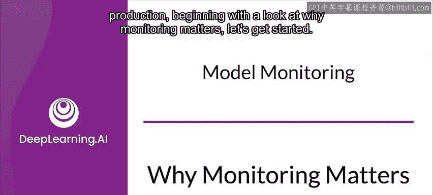
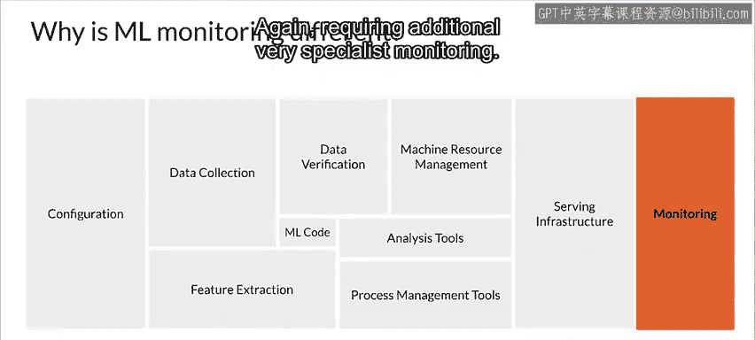

#  153：为何监控很重要 🔍

在本节课中，我们将探讨机器学习模型部署到生产环境后，为何持续监控至关重要。我们将了解监控如何帮助发现模型性能衰退、数据偏移等问题，并区分功能性监控与非功能性监控。理解这些概念是构建可靠、可持续的机器学习系统的基石。

---

## 模型部署后的持续循环 🔄

上一节我们介绍了机器学习从开发到部署的流程，本节中我们来看看部署并非终点。监控生产环境中的模型是一个持续的任务，只要模型仍在运行，就需要进行监控。

通过监控收集的数据将指导您构建下一个版本的模型，并使您意识到模型性能的变化。这是一个循环迭代的过程，需要最后一步——监控——来完成整个流程。

您应该注意，此图仅关注与模型性能直接相关的监控。但您还需要监控包含在您整个产品或服务中的系统和基础设施，例如数据库和Web服务器。这类监控仅关注产品或服务的基本运行，而非模型本身，但对用户体验至关重要。基本上，如果系统宕机，您的模型再好也无济于事。

---

## 预防胜于治疗 🛡️

本杰明·富兰克林曾写道：“一盎司的预防胜过一磅的治疗。” 在我们的场景中，您可以将同样的理念应用于预防“消防演习”——即系统性能突然变差，需要紧急修复的情况。

以下是如果不监控模型性能可能发生的几种“消防演习”：

*   **初始数据偏移**：如果您的训练数据过于陈旧，即使首次部署新模型，也可能立即出现数据偏移。如果不从一开始就进行监控，您可能很容易忽视这个问题，导致新模型从一开始就不准确。
*   **模型陈旧化**：正如之前讨论的，模型也会变得陈旧或不准确，因为世界在不断变化，您最初收集的训练数据可能不再反映当前状态。同样，没有监控，您不太可能意识到这个问题。
*   **负反馈循环**：这是一个更复杂的问题，当您在从生产环境收集的数据上自动训练模型时会出现。如果这些数据存在任何偏见或损坏，那么基于这些数据训练的模型将表现不佳。即使对于自动化流程，监控也很重要，因为它们也可能出现问题。

---

## 两种类型的监控 📊

现在我们来区分两种主要的监控类型。

**ML监控（功能性监控）** 涉及密切关注模型的预测性能和服务数据的变化。这包括：
*   模型在训练期间优化的**指标**。
*   服务数据中每个特征的**分布和特性**。

**系统监控（非功能性监控）** 指的是监控整个生产系统的性能、系统状态和服务系统的可靠性。这包括：
*   每秒查询数。
*   故障率。
*   延迟。
*   资源利用率等。

---

## ML监控为何与众不同？🤔

您可能会问，为什么ML监控与软件监控不同？与纯软件系统不同，在ML系统中需要考虑两个额外的组件：**数据**和**模型**。

与传统软件系统不同，ML系统的准确性取决于模型在多大程度上反映了它所要建模的世界，而这又取决于用于训练的数据以及服务请求时接收到的数据。这不仅仅是监控系统故障（如段错误、内存不足或网络问题）那么简单。模型和数据也需要额外的、非常专业的监控。

由于**纠缠**和**配置**两个方面，ML系统中的代码和配置也变得更加复杂和敏感。

*   **纠缠**：这里指的是“改变任何东西都会改变一切”的问题。您需要谨慎处理特征工程和特征选择，并理解模型的敏感性。
*   **配置**：模型超参数、版本和特征通常由系统配置控制，此处最微小的错误都可能导致模型行为发生根本性变化，而传统的软件测试无法发现这些问题，因此同样需要额外的、非常专业的监控。

---

## 总结 📝

本节课中，我们一起学习了机器学习模型生产监控的重要性。我们了解到，监控是一个持续的循环过程，能预防性能衰退和数据偏移等问题。我们区分了**功能性监控**（关注模型性能和数据）和**非功能性监控**（关注系统健康）。最后，我们明白了ML监控的特殊性在于需要同时关注**数据**和**模型**的动态变化，以及由**纠缠**和**配置**带来的额外复杂性。建立全面的监控体系是确保机器学习系统在生产环境中长期稳定、可靠运行的关键。