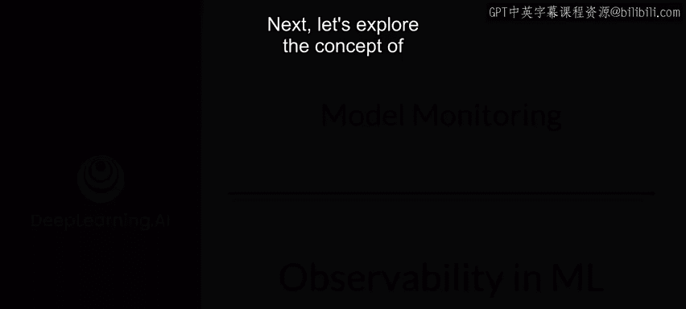
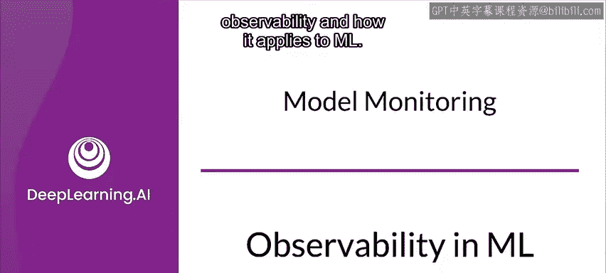
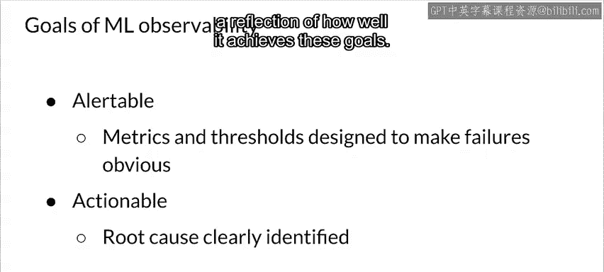

#  154：机器学习中的可观测性 🕵️

在本节课中，我们将要学习机器学习系统中的“可观测性”概念。我们将探讨其定义、重要性、在复杂ML系统中的具体应用，以及如何通过数据切片、监控和告警来实现有效的系统观测。

---

接下来，让我们探讨可观测性的概念，以及它如何应用于机器学习运维。

首先，什么是可观测性？可观测性衡量的是，仅通过了解系统的输入和输出来推断其内部状态的能力。对于机器学习系统，这意味着监控和分析模型的预测请求及其生成的预测结果。

可观测性并非一个新概念。它实际上源于控制理论，并在该领域已确立数十年。在控制理论中，可观测性与可控性紧密相连。你只能在你能够观测到的范围内控制系统。

对于一个基于机器学习的产品或服务，这映射到一个理念：要控制整体结果的准确性（通常涉及模型的不同版本），就需要可观测性。这也增加了模型可解释性的重要性。

在机器学习系统中，可观测性成为一个更复杂的问题，因为你需要考虑多个相互作用的系统和服务，例如云部署、容器化基础设施、分布式系统和微服务。这通常意味着存在大量需要监控和聚合的系统。因此，我们常常需要依赖供应商的监控系统来收集（有时是聚合）数据，因为每个实例的可观测性可能有限。例如，监控一个自动扩展的容器化应用程序的CPU利用率，与简单地监控单个服务器的CPU使用情况有很大不同。

可观测性是关于进行测量。就像你在训练期间分析模型性能时一样，仅测量顶层指标是不够的，并且会提供不完整的图景。你需要对数据进行切片，以了解模型在不同数据子集上的表现。

例如，在自动驾驶汽车中，你需要了解其在雨天和晴天条件下的性能，并分别进行测量。更普遍地说，数据切片为分析不同人群或不同类型条件提供了有用的方法。

这意味着领域知识在生产环境中观察和监控系统时非常重要，就像你在训练模型时一样。是你的领域知识将指导你如何对数据进行切片。

TFX框架和TensorFlow模型分析是非常强大的工具，包含了对已部署模型进行多数据切片可观测性分析的功能。

这对于模型的监督式和非监督式监控都适用。在监督式设置中，可以使用真实标签来衡量预测的准确性。相比之下，在非监督式设置中，你将监控每个特征的均值、中位数、范围和标准差等指标。无论在监督式还是非监督式设置中，你都需要对数据进行切片，以了解系统在不同子集下的行为。

回到自动驾驶汽车的例子，按天气条件进行切片非常重要，以避免在雨天做出糟糕的驾驶决策。

在监控的背景下，可观测性的主要目标是预防系统故障或对其采取行动。为此，观测需要在故障发生时提供警报，并理想情况下提供建议措施以使系统恢复正常行为。

更具体地说，告警能力指的是设计指标和阈值，以便在故障发生时能够非常清晰地识别。这可能包括定义规则，将多个测量值关联起来以识别故障。

知道系统出现故障是一个好的开始。但基于故障性质的可操作建议对于纠正这种行为更有帮助。可操作的警报明确定义了系统故障的根本原因。至少，你的系统应该收集足够的信息以支持根本原因分析。

告警能力和可操作性都是目标，而系统的有效性反映了它实现这些目标的程度。

---

本节课中，我们一起学习了机器学习可观测性的核心概念。我们了解到，可观测性是通过输入和输出来推断系统内部状态的能力，对于确保ML系统的可靠性和性能至关重要。实现有效的可观测性需要结合领域知识进行数据切片分析，并建立具备良好告警能力和可操作建议的监控系统。