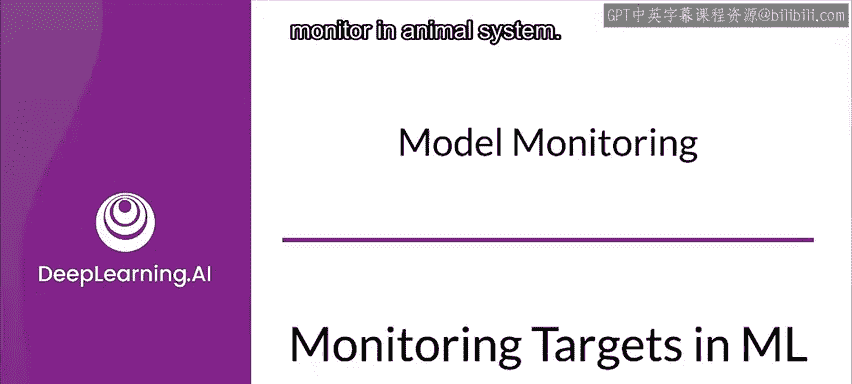
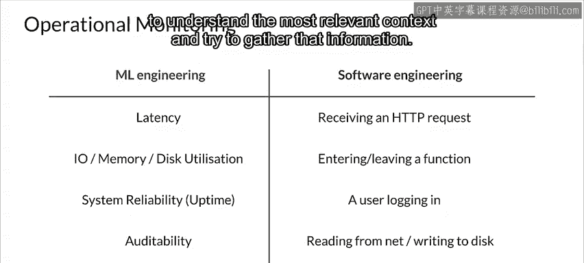

#  155：机器学习中的监控目标 📊

在本节课中，我们将学习在机器学习系统中可以实际观察和监控哪些内容。我们将从系统的基础输入输出开始，逐步深入到更具体的监控指标、统计方法以及软件工程领域的监控实践。

---

## 监控系统的基础：输入与输出

上一节我们介绍了监控的重要性，本节中我们来看看监控的具体对象。首先，你可以监控系统的**输入**和**输出**。

在已部署的系统中，输入是预测请求，每个请求都是一个特征向量。你可以监控每个特征的统计度量，包括它们的分布，并寻找可能与故障相关的变化。同样，这不应仅仅是顶层的测量，还应包括与你的业务领域相关的数据切片的测量。

输出是模型的预测结果，你也可以对其进行监控和测量。这包括理解不同模型版本的部署情况，以帮助你了解不同版本的表现。

---

## 输入数据的监控与分析

以下是针对输入数据（即预测请求）进行监控的关键方面：

*   **错误监控**：对于每个特征，应监控其值是否超出允许的范围或类别集合。这些错误条件通常基于领域知识来定义。
*   **分布变化监控**：监控每个特征的分布如何随时间变化，并将其与训练数据的分布进行比较。
*   **切片数据分析**：在数据切片上进行错误和变化监控，能帮助你更好地理解和识别潜在的系统故障。

---

## 统计测试与比较

统计测试和比较是分析数据的基本工具。典型的描述性统计包括中位数、均值、标准差和范围值。

对于监控模型预测，你也可以使用统计测试。在某些场景下，例如预测点击率时，如果标签可用，你还可以在已知标签和模型预测之间进行比较。

**公式示例**：如果变量呈正态分布，那么均值应落在**均值区间**的标准误差范围内。

此外，如果你曾为纠正类别不平衡或公平性问题而调整过训练数据的分布，那么在将其与通过监控预测请求收集的输入数据分布进行比较时，需要考虑这一点。

---

## 软件工程领域的监控实践

软件工程领域的监控实践更为成熟。因此，围绕我们机器学习系统的运维关注点可能包括：

*   **系统性能监控**：例如延迟、I/O、内存或磁盘利用率等指标。
*   **系统可靠性监控**：例如正常运行时间。
*   **可审计性监控**：在考虑可审计性的同时进行监控。

在软件工程中，严格来说，谈论监控就是谈论**事件**。事件几乎可以是任何操作，例如接收一个HTTP请求、进入或离开一个函数（无论是否包含ML代码）、用户登录、从网络读取或写入磁盘等等。

这里列出的所有事件都带有一些**上下文**。拥有所有事件的完整上下文对于调试和理解系统在技术和业务层面的表现非常有帮助。然而，收集所有上下文信息通常不切实际，因为要处理和存储的数据量可能非常庞大。因此，理解最相关的上下文并尝试收集这些信息至关重要。

---

## 总结

本节课中，我们一起学习了机器学习系统中监控的核心目标。我们从监控系统的基础输入和输出开始，探讨了如何监控输入数据的错误和分布变化，并强调了在数据切片上进行监控的重要性。接着，我们介绍了用于分析的统计工具，并指出了在比较数据分布时需要考虑训练数据处理历史。最后，我们了解了软件工程中更广泛的监控实践，包括性能、可靠性监控以及事件上下文收集的挑战。有效的监控是确保机器学习系统在生产环境中稳定、可靠运行的关键。