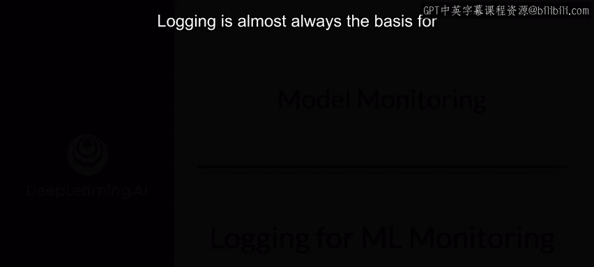
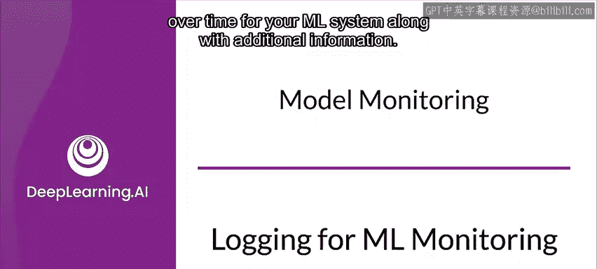
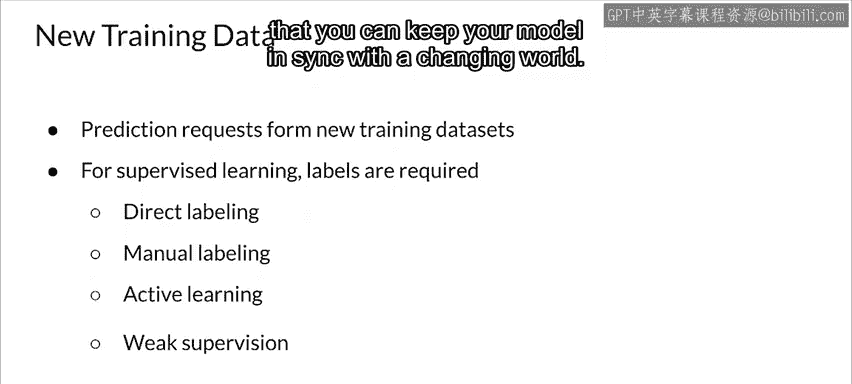

#  156：第27课 机器学习监控的日志记录 📝

在本节课中，我们将要学习机器学习系统中日志记录的核心概念、重要性以及实施方法。日志是监控模型和系统的基础，它记录了系统运行过程中发生的离散事件，是进行问题诊断、性能分析和模型迭代的宝贵数据来源。

---

## 什么是日志？📖

上一节我们介绍了课程概述，本节中我们来看看日志的具体定义。

日志是机器学习系统随时间发生的离散事件的**不可变时间戳记录**，通常附带额外的上下文信息。这包括从应用程序打印到日志的调试或性能分析消息，以及根据日志记录详细程度设置自动生成的警告、错误和调试消息。

**核心概念**：`日志 = 不可变(事件 + 时间戳 + 上下文)`

---

## 为什么需要日志记录？🔍

为了避免重复犯错，从历史中学习很重要。对于机器学习系统，这一逻辑同样适用。日志记录在此变得非常有用，尤其是在构建系统可观测性时。

以下是日志记录的主要目的：
*   **问题调查与根因分析**：日志信息可用于调查事故并帮助进行根本原因分析。
*   **提供详细上下文**：事件日志与上下文一起提供了有价值的洞察力，提供了平均值和百分位数无法呈现的细节。
*   **记录特定事件**：指标显示服务或应用程序的趋势，而日志则侧重于记录特定事件。
*   **生成后续训练数据**：日志数据当然也是你下一个训练数据集的基础。

---

## 如何实施日志记录？🛠️

探索了日志的“为什么”之后，我们来看看“如何做”。你可以从开箱即用的日志和指标开始。

以下是实施日志记录的一般步骤：
1.  **利用基础监控**：开箱即用的日志和指标通常能提供一些基本的整体监控能力。
2.  **补充应用日志**：例如，在谷歌计算引擎平台中，如果需要额外的应用程序日志，可以安装代理来收集这些日志。
3.  **收集云服务指标**：云监控默认从所有云服务收集指标，然后你可以用这些指标来构建仪表板。
4.  **添加自定义指标**：当需要额外的应用程序或业务级别指标时，可以使用这些自定义指标进行长期监控。
5.  **集中化管理日志**：使用聚合接收器和工作区，可以将来自许多不同来源或服务的日志集中起来，以便创建应用程序的统一视图。

主要的云服务商也提供基于云的分布式服务的托管日志服务，例如 Google Cloud Monitoring、Amazon CloudWatch 和 Azure Monitor，以及一些第三方托管产品。

---

## 日志记录的挑战与处理 🚧

然而，日志记录并非完美无缺。在实施过程中，需要注意以下挑战和处理方式：

*   **性能影响**：过多的日志记录会对系统性能产生负面影响。
*   **处理成本**：由于性能问题，对日志的聚合操作可能成本高昂，因此基于日志的警报应谨慎处理。
*   **数据处理流程**：原始日志在被持久化到 Elasticsearch 或 BigQuery 等数据存储之前，几乎总是需要通过 Logstash、Fluentd、Fluent Bit 或 Heka 等工具进行规范化、过滤和处理。
*   **运维成本**：设置和维护这些工具会带来显著的运营成本。托管服务的主要优势之一就是消除了这部分成本。

---

## 日志数据存储与分析 📊

如何存储日志数据会显著影响其被查询分析的难易程度。此时，你应该考虑解析并存储你的输入和预测数据。

以下是存储与分析的关键点：
*   **使用可查询的数据存储**：将输入和预测数据以及你能收集到的任何标签，存储在可查询的数据存储（如数据库或基于搜索引擎的工具如 Elasticsearch）中。
*   **支持分析**：这支持对诸如生成特征分布和统计信息等进行分析，这些信息可以随时间跟踪和比较。
*   **时间序列分析**：通过为每个项目关联时间戳，你还可以对数据进行排序，这对于识别趋势和季节性很重要。
*   **根因分析**：通过识别所涉及的系统，可以帮助进行系统故障的根因分析。
*   **支持报告与告警**：在可查询的数据存储中拥有这些数据还支持离线自动报告、仪表板和告警。

---

## 数据收集与标注技术 🏷️

至少，收集预测请求应该能提供代表你的应用程序所处世界当前状态的特征向量，因此这些数据非常有价值。让我们简要考虑一下标注问题和标注技术。

以下是几种常见的标注方法：
*   **直接标注**：如果你所在的领域足够幸运，你将能够使用直接标注。例如，对于推荐系统，你通常可以在推荐后捕获用户行为，以确定是否推荐了正确的选项。
*   **人工标注**：在其他情况下，你将需要使用人工标注，这可能缓慢且昂贵，但有时也是唯一可行的选择。
*   **主动学习**：使用像主动学习这样的技术，可以通过仅选择最重要的样本来标注，从而帮助降低成本，这包括为类不平衡和公平性等问题塑造你的数据集。
*   **弱监督**：弱监督是一种具有显著优势的强大技术，但也存在一些挑战。

最重要的是，你需要捕获这些有价值的数据，以便让你的模型与不断变化的世界保持同步。

---

## 需要警惕的信号 🚩

到目前为止的讨论大多围绕如何使用指标来监控机器学习系统中的输入数据和预测。这通常是监控应用程序时收集数据的基本方式。

以下是一些需要警惕的信号示例：
*   **特征不可用**：特征变得不可用，尤其是当你的预测请求中包含需要从数据存储中检索的历史数据时。
*   **输入分布偏移**：关键输入值的分布发生显著变化。例如，在训练数据中相对罕见的分类值变得更常见。
*   **特定模式变化**：特定于你的模型的模式变化，例如，在自然语言处理场景中，训练数据中未出现过的单词数量突然增加，这也可能是导致问题的潜在变化的另一个迹象。

---

## 总结 ✨

本节课中我们一起学习了机器学习监控中日志记录的核心知识。我们明确了日志是**不可变的时间戳事件记录**，是系统可观测性的基础。我们探讨了实施日志记录的步骤、面临的挑战（如性能影响和处理成本）以及如何通过可查询的数据存储（如数据库或 Elasticsearch）来有效存储和分析日志数据，以支持特征分析、趋势识别和根因分析。最后，我们强调了收集预测数据对于模型迭代的重要性，并简要介绍了直接标注、人工标注、主动学习和弱监督等数据标注技术。记住，持续捕获真实环境中的数据是使模型适应动态世界的关键。