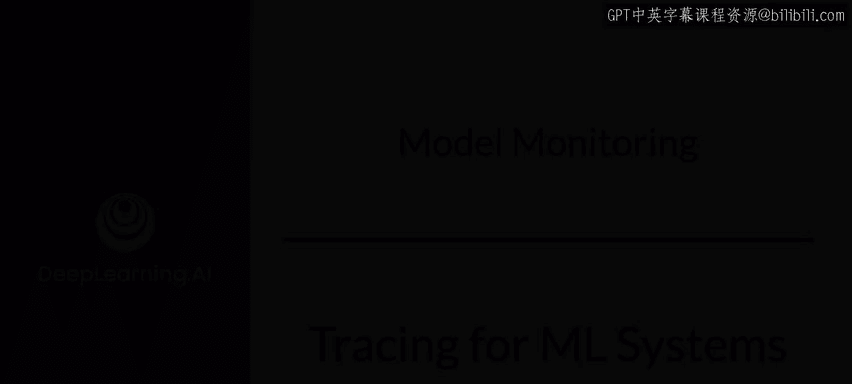
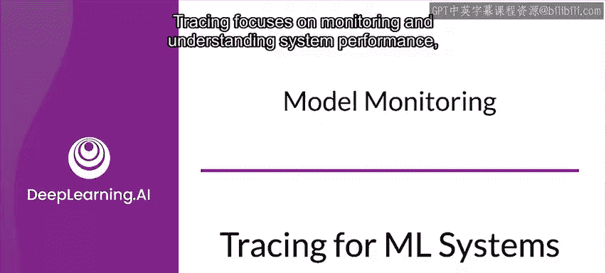
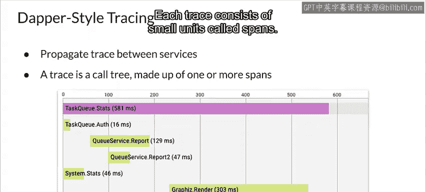

#  157：机器学习系统的追踪 🕵️

在本节课中，我们将学习分布式机器学习系统中的追踪技术。追踪专注于监控和理解系统性能，尤其是在基于微服务的应用程序中。我们将探讨为何在分布式系统中追踪变得至关重要，以及如何通过追踪来诊断性能瓶颈和问题。

---

## 从单体系统到分布式系统

上一节我们介绍了追踪的基本概念。本节中我们来看看，当系统架构从单体式转变为分布式时，追踪面临的挑战。

在单体系统中，从系统的不同部分收集诊断数据相对容易。所有模块甚至可能在一个进程内运行，并共享用于日志记录的公共资源。

当考虑分布式系统时，情况变得更有趣。假设你正在尝试排查一个预测延迟问题。你的系统由许多独立服务组成，预测是通过许多下游服务生成的。你无法确定是哪些服务导致了速度变慢。你无法清楚地了解这是程序错误、集成问题、架构选择不当导致的瓶颈，还是网络性能不佳。

如果你的服务作为分布式系统中的独立进程运行，解决这个问题会变得更加困难。你无法依赖那些有助于诊断单体系统的传统方法。你需要更细粒度地了解每个服务内部发生了什么，以及它们在用户请求的生命周期内如何相互交互。

---

## 分布式追踪的必要性

从上一节可知，在分布式系统中定位问题非常困难。本节我们将深入探讨为何需要专门的追踪技术。

从前端网络服务器开始，跟踪一个调用，直到预测结果返回给用户，这个过程变得更加困难。你会注意到，我们真正关注的是在线服务。

为了正确检查和调试分布式系统中请求的延迟问题，你需要理解服务的顺序和并行性，以及每个服务对系统最终延迟的贡献。

---

## Dapper：分布式追踪的解决方案

为了解决上述问题，谷歌开发了分布式追踪系统Dapper，用于检测和分析其生产服务。Dapper论文启发了许多开源项目，如Zipkin和Jaeger。Dapper风格的追踪已成为行业范围内的标准。

在基于服务的架构中，Dapper风格的追踪通过**在服务之间传播追踪数据**来工作。每个服务用额外的数据注释追踪信息，并将追踪头传递给其他服务，直到最终请求完成。

以下是其核心工作流程的简述：
1.  请求进入系统，生成一个唯一的追踪ID。
2.  该ID随请求在服务间传递。
3.  每个服务记录其操作的开始时间、结束时间和其他元数据（称为一个`Span`）。
4.  所有`Span`数据被收集到追踪后端。

---

## 追踪的组成与可视化

每个追踪都是一个调用树，从请求的入口点开始，到服务器的响应结束，包括沿途所有的RPC调用。每个追踪由称为**Span**的小单元组成。

服务负责将其追踪数据上传到追踪后端。追踪后端然后将相关的延迟数据像拼图一样组合在一起。追踪后端还提供用户界面，用于分析和可视化追踪数据。

---

## 总结

本节课中，我们一起学习了机器学习系统中追踪技术的重要性。我们了解到，在分布式微服务架构中，传统的日志调试方法难以定位性能瓶颈。通过引入类似Dapper的分布式追踪系统，我们可以传播追踪上下文、记录每个服务单元的Span、并在后端聚合可视化，从而清晰地洞察请求在系统中的完整路径和每个环节的耗时，最终有效地诊断延迟等复杂问题。