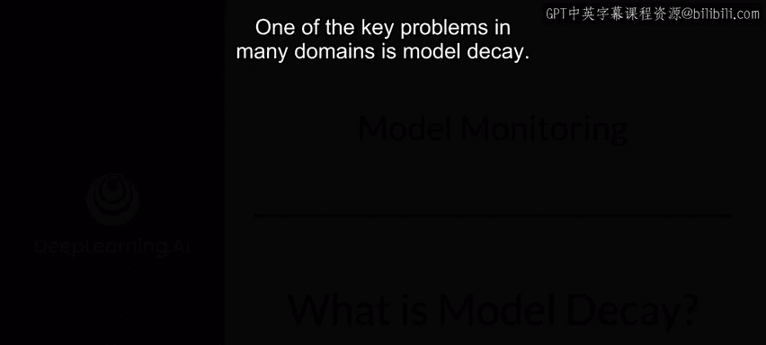
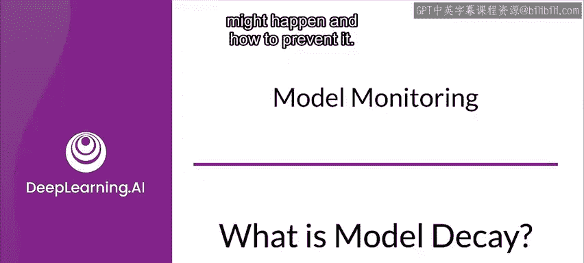
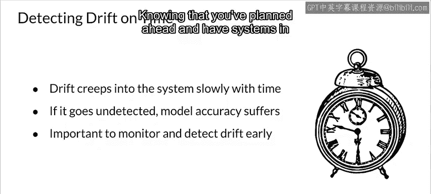

#  158：29_什么是模型衰减 📉

在本节课中，我们将要学习机器学习模型在生产环境中面临的一个核心问题：模型衰减。我们将探讨模型衰减发生的原因、主要类型以及如何预防它，以确保模型在动态变化的环境中保持高性能。

---

## 模型衰减概述

在许多应用领域中，模型衰减是一个关键问题。模型衰减指的是随着时间的推移，机器学习模型在生产环境中的性能逐渐下降的现象。这通常是因为模型所处的环境是动态变化的，而静态的模型无法适应这些变化。

上一节我们介绍了模型衰减的基本概念，本节中我们来看看为什么模型衰减会发生以及如何理解它。

生产环境中的机器学习模型通常在动态环境中运行。动态环境会发生变化，这正是“动态”一词的含义。例如，一个推荐系统试图推荐用户可能喜欢的音乐。音乐品味和流行趋势是不断变化的，新音乐不断涌现，人们的喜好也在改变。如果模型是静态的，并持续推荐已经过时的音乐，那么推荐的质量就会下降。模型逐渐偏离了当前的真实情况，因为它没有针对当前的新趋势进行训练。

---

## 模型衰减的两种主要类型

模型衰减主要有两种类型：数据漂移和概念漂移。以下是这两种类型的详细说明。

### 数据漂移

数据漂移发生在输入特征（即模型接收的数据）的统计属性发生变化时。随着输入数据的变化，预测请求的输入数据会越来越偏离模型训练时使用的数据，从而导致模型准确性下降。这类变化通常发生在人口统计特征上，例如年龄分布，这些特征可能会随时间而变化。

右侧的图表展示了年龄特征的均值和方差如何增加。这就是数据漂移的一个例子。

**公式表示**： 若训练数据分布为 `P_train(X)`，而生产环境中的数据分布变为 `P_prod(X)`，当 `P_train(X) ≠ P_prod(X)` 时，即发生数据漂移。

### 概念漂移

概念漂移发生在特征与标签之间的关系发生变化时。当模型被训练时，它学习的是输入特征与真实标签之间的关系。如果这种关系随时间发生变化，就意味着你试图预测的事物的“含义”本身发生了改变。世界已经变了，但我们的模型并不知道。

例如，请看右侧的图表。你可以看到两个类别（蓝点和红点）的特征分布在时间间隔 T1、T2 和 T3 中发生了变化。如果你的模型仍然基于 T1 时期的关系进行预测，而世界已经进入了 T3 时期，那么它的许多预测将是错误的。

**公式表示**： 若训练时的条件分布为 `P_train(Y|X)`，而生产环境中的条件分布变为 `P_prod(Y|X)`，当 `P_train(Y|X) ≠ P_prod(Y|X)` 时，即发生概念漂移。

> 注：还存在其他相关的漂移形式，例如预测漂移（仅模型预测结果发生漂移）或标签漂移，但本课程不会详细讨论它们。

---

## 模型衰减的影响与应对策略

如果不提前为漂移做好计划，它会随着时间的推移慢慢渗透到你的系统中。系统漂移的速度取决于你所处领域的性质。有些领域（如金融市场）可能在几小时甚至几分钟内就发生变化，而其他领域的变化则更为缓慢。

如果未能检测到漂移（无论是数据漂移、概念漂移还是两者兼有），模型的准确性就会受损，而你却可能对此一无所知。这可能导致需要对模型进行紧急重新训练，这是应该尽量避免的情况。

因此，监控和提前规划至关重要。知道你已经提前做好了计划并建立了相应的系统，可能会让你在晚上睡得更安稳。

以下是应对模型衰减的关键步骤：

1.  **持续监控**：建立系统以持续监控模型输入数据的分布和模型预测性能。
2.  **设定警报**：当检测到统计属性发生显著变化时，触发警报。
3.  **定期评估与再训练**：规划模型的定期评估周期，并在性能下降时启动再训练流程。
4.  **自动化管道**：构建自动化的模型再训练和部署管道，以快速响应变化。

---

## 总结

本节课中我们一起学习了模型衰减的概念。我们了解到，模型衰减是由于生产环境动态变化而导致的模型性能下降，主要分为**数据漂移**和**概念漂移**两种类型。通过理解这些漂移发生的原因，我们可以采取监控、预警和定期再训练等策略来预防和应对模型衰减，从而确保机器学习系统能够长期稳定、有效地运行。提前规划应对机制是维持模型在生产环境中生命力的关键。