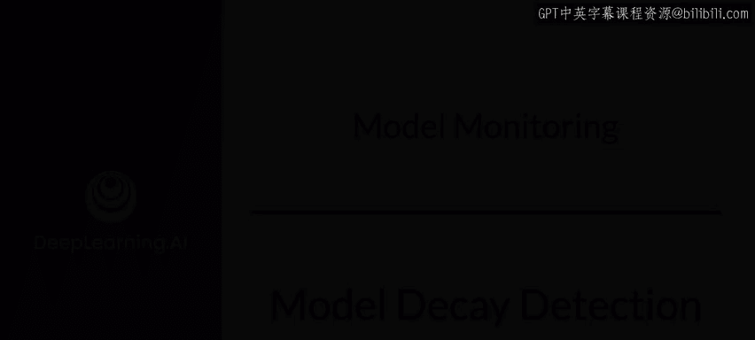
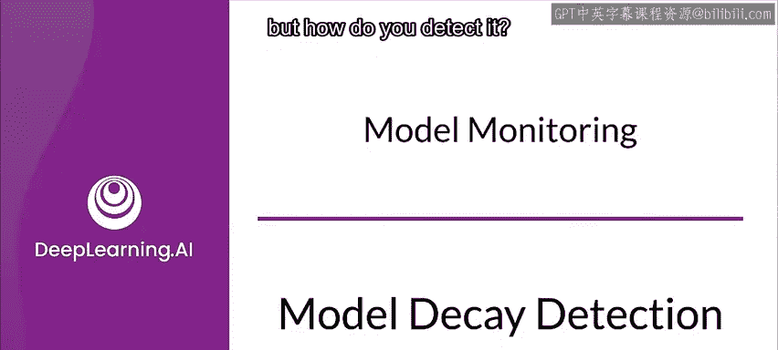
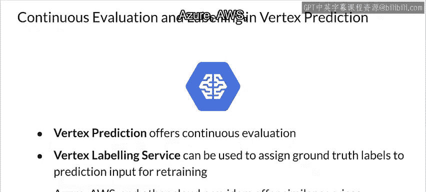
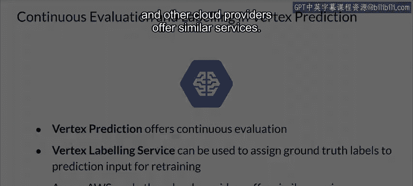

#  159：第30课 检测模型衰减 📉

在本节课中，我们将学习如何检测机器学习模型在生产环境中可能发生的性能衰减。模型衰减通常由数据漂移或概念漂移引起，及时发现这些问题是维持模型有效性的关键。

---

## 概述：检测模型衰减的方法

上一节我们讨论了模型衰减是一个普遍存在的问题。本节中，我们来看看如何具体地检测它。

检测模型衰减，无论是数据漂移还是概念漂移，都始于收集当前数据。

---

## 数据收集：检测的基础

以下是检测工作的第一步，即数据收集的具体要求：

*   你应该收集所有传入模型的预测请求数据，以及模型做出的预测结果。
*   如果你的应用场景允许，还应该收集模型本应预测出的正确标签或真实值。这对于后续的模型重新训练也极具价值。
*   但至少，你必须捕获预测请求数据，这些数据可以用来通过无监督的统计方法检测数据漂移。

---

## 检测流程与工具

一旦你建立了持续监控和记录数据的机制，检测过程就相当直接了。

你将使用工具，借助成熟的统计方法，来比较当前数据与之前的训练数据。同时，你还会使用仪表板来监控数据随时间变化的趋势和季节性。本质上，你是在处理时间序列数据，因为你的数据是有序的，并且与时间成分相关联。

在这方面，你无需重复造轮子，已有一些优秀的工具和库可以帮助你完成这类分析。

以下是可用于此类分析的工具和库示例：

*   **TensorFlow Data Validation (TFDV)**
*   **`River`** 库（原 `scikit-multiflow`）

此外，包括谷歌在内的云服务提供商也提供了托管服务来协助完成这项工作。

---

## 云服务的持续评估功能

以谷歌的 Vertex AI Prediction 为例，它可以帮助你对预测请求进行持续评估。

**`continuous_evaluation`** 服务会定期从你部署到 Vertex Prediction 的已训练机器学习模型中，对预测输入和输出进行采样。

随后，Vertex 的数据标注服务会分配人工审核员为你的预测输入提供真实值标签，或者你也可以自行提供真实值标签。

数据标注服务会将模型的预测结果与真实值标签进行比较，从而持续提供关于模型随时间推移的性能表现反馈。

Azure、AWS 和其他云服务提供商也提供类似的服务。

---

## 总结

本节课中，我们一起学习了检测模型衰减的核心步骤。关键在于**系统地收集生产环境中的预测请求、模型输出以及（如有可能）真实标签数据**。利用专门的工具（如 TFDV、`River`）或云平台的托管服务，通过统计比较和时间序列分析，可以有效地监控数据分布和模型性能的变化，从而及时发现衰减迹象。