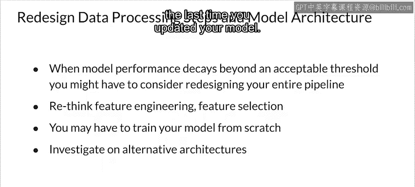

#  160：31_缓解模型衰减的方法 🛠️

在本节课中，我们将学习当检测到模型性能衰减（即模型衰减）后，可以采取哪些具体措施来缓解这一问题。模型衰减通常由数据漂移引起，我们将探讨从数据管理、模型再训练策略到流程自动化的完整应对方案。

---

## 检测到衰减后的基本步骤

上一节我们讨论了如何检测模型衰减。本节中我们来看看检测到衰减后，首先应该做什么。

你需要将模型衰减的情况告知相关的运营和业务利益相关者，并附上你对漂移严重程度的初步评估。

随后，你的工作重点是将模型的性能恢复到可接受的水平。

---

## 构建新的训练数据集

在着手恢复模型性能之前，你需要决定如何处理新旧训练数据。以下是几种常见的方法。

首先，可以尝试使用无监督方法（如聚类）或统计方法（如计算散度）来确定旧训练数据中哪些部分仍然有效。可选的方法包括**Kullback-Leibler (KL) 散度**、**Jensen-Shannon (JS) 散度**或**Kolmogorov-Smirnov (KS) 检验**。这一步是可选的，但在新数据不足时，尽可能保留有效的旧数据尤为重要。

另一种方法是，直接丢弃训练数据集中某个日期之前收集的部分，并加入新数据。

或者，如果你有足够新标注的数据，可以直接创建一个全新的数据集。

具体选择哪种方法，通常取决于你的应用场景现实和收集新标注数据的能力。

---

## 模型再训练策略

现在你有了新的训练数据集。对于如何训练模型，你基本上有两种选择：**微调**或**从头开始**。

你可以选择继续训练现有模型，使用新数据从最后一个检查点开始进行**微调**。

也可以选择**重新初始化模型并完全重新训练**。

这两种方法都有效。选择哪种很大程度上取决于你拥有的新数据量，以及自上次训练以来数据分布发生了多大程度的漂移。

理想情况下，如果你有足够的新数据，应该尝试两种方法并比较结果。

---

## 制定再训练策略

为模型再训练制定明确的策略通常是个好主意。这里没有绝对正确或错误的答案，一切取决于你的具体情况。

你可以选择在必要时才重新训练模型，例如检测到数据漂移时，或者需要**增删类别标签或特征**时。

你也可以按照固定的时间表重新训练模型，无论是否需要。实践中很多人这样做，因为它简单易懂，并且在许多领域效果相当好。

然而，这可能导致不必要的训练和数据收集成本（如果训练过于频繁），或者允许模型衰减超出理想范围（如果训练不够频繁）。

最后，你可能受到新训练数据可用性的限制。在数据标注缓慢且昂贵的场景中尤其如此。因此，你可能被迫尽可能长时间地保留旧训练数据，并避免完全重新训练模型。

---

## 实现自动化再训练流程

如果能自动化检测需要模型再训练的条件，那将是最理想的。

这包括能够检测到**模型性能下降**并触发再训练，或者检测到**显著的数据漂移**时自动触发。

为了实现自动化再训练，你应该有一个独立的流程来自动收集和标注数据，并且只在有足够数据可用时才触发再训练。

理想情况下，你还应该设置**持续训练、集成和部署**流程，使整个过程完全自动化。对于那些变化快速、需要频繁再训练的领域，这些自动化流程不再是奢侈品，而是必需品。

---

## 模型架构与设计的重新考量

当模型衰减超出可接受的阈值，或者你试图预测的变量含义发生显著变化时，你可能需要重新设计数据预处理步骤和模型架构。

我喜欢将此视为一个改进的机会。

你可能需要重新思考**特征工程**、**特征选择**等，以使你的模型适应当前数据，并选择从头开始重新训练模型，而不是应用微调。

你可能还需要研究其他潜在的模型架构，我个人认为这非常有趣。

这里的重点是，没有模型可以永远有效。你需要定期回到起点重新开始，并应用自上次更新模型以来所学到的一切。

---

## 总结

本节课中，我们一起学习了缓解模型衰减的一系列方法。我们从检测到衰减后的基本沟通步骤开始，探讨了如何构建新的训练数据集，比较了微调与完全重新训练两种策略，并讨论了制定再训练计划的重要性。我们还了解了实现自动化再训练流程的价值，以及在必要时重新考量模型架构与设计的必要性。记住，应对模型衰减是一个持续的过程，需要结合监控、策略和自动化来有效管理。