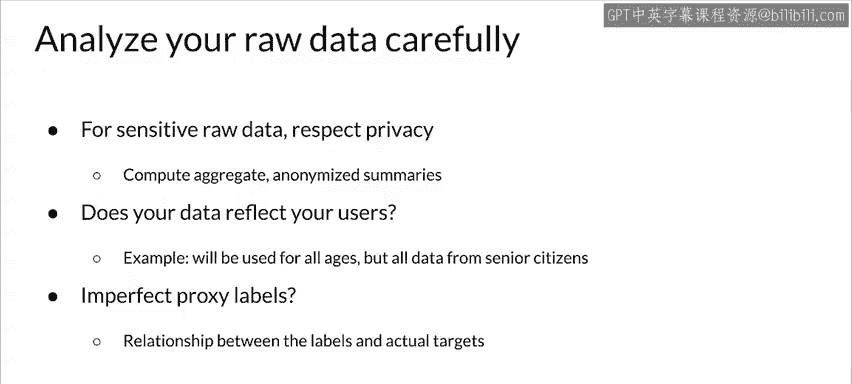

#  161：负责任的AI 🧠

在本节课中，我们将探讨负责任的AI这一新兴议题，并了解作为开发者，你可以采取哪些措施来确保你的模型和应用尽可能负责任。

---

## 概述

人工智能的发展为改善世界各地人们的生活创造了新机遇，从商业到医疗保健再到教育等领域。然而，与此同时，它也引发了关于如何最好地将公平性、可解释性、隐私和安全性融入这些系统的新问题。这些问题远未解决，是当前极其活跃的研究和开发领域。

## 构建负责任的AI系统

上一节我们介绍了负责任AI的重要性，本节中我们来看看构建此类系统时需要考虑的具体方面。

### 关注用户体验

评估系统预测、推荐和决策的真实影响，关键在于实际用户的体验。例如，你应该在设计功能时就内置适当的披露说明。清晰度和可控性对于良好的用户体验至关重要。

### 考虑辅助与建议

在答案很可能满足多样化用户和用例的情况下，提供单一答案是合适的。但在其他情况下，系统向用户建议几个选项可能更好。事实上，这样做有时甚至更容易，因为要确保单一答案（Top-1）的高精确度，通常比确保前几个答案（例如Top-3）的精确度要困难得多。

### 规划与测试

在设计过程的早期，就应尝试规划对潜在负面反馈的建模。随后，在全面部署之前，应对一小部分流量进行具体的实时测试和迭代。

### 吸纳多元反馈

最后，与多样化的用户群体和不同的用例场景互动，并在项目开发之前和整个过程中吸纳他们的反馈。这将在项目中融入丰富的用户视角，增加从技术中受益的人数，并帮助你及早发现潜在问题。

## 评估与度量

上一节我们讨论了构建过程中的考量，本节中我们来看看如何评估系统的表现。

以下是评估系统时可以考虑的一些关键度量指标：

*   **用户反馈**： 包括来自用户调查的反馈。
*   **系统性能**： 跟踪整体系统性能的量化指标。
*   **产品健康度**： 短期和长期的产品健康指标，例如点击率和客户终身价值。
*   **错误率分析**： 在不同子群体中切分的假阳性率和假阴性率。

当然，你选择的度量指标至关重要。你应该努力确保你的指标适合系统的背景和目标。例如，火灾报警系统应该具有**高召回率**，即使这意味着偶尔会有误报。

## 数据的重要性

正如我们一直强调的，一切最终都回到数据上。机器学习模型将反映它们所训练的数据，因此请仔细分析你的原始数据以确保你理解它。

### 理解你的数据

在无法直接分析原始数据的情况下（例如涉及敏感数据），应在尊重隐私的前提下尽可能理解你的输入数据。例如，可以通过计算聚合的匿名摘要来实现。

### 检查数据代表性

考虑你的数据采样方式是否能代表你的用户。例如，如果你的应用将被所有年龄段的人使用，但你的训练数据仅来自老年人，那么它可能对其他年龄段的用户效果不佳。想象一下，当你所有的数据都来自老年人时，去做音乐推荐，我的猜测是它对青少年可能效果不佳。

### 注意代理标签

有时，你会使用模型来预测你感兴趣的实际目标的代理标签，因为对实际目标进行标注很困难或不可能。在这些情况下，请考虑你拥有的数据标签与你试图预测的实际事物之间的关系。是否存在有问题的差距？例如，如果你使用数据标签 `X` 作为代理来预测目标 `y`，那么在哪些情况下 `x` 和 `y` 之间的差距会成为问题？

---

## 总结

本节课中，我们一起学习了负责任的AI的核心概念。我们探讨了在构建AI系统时关注用户体验、进行多元化测试与反馈的重要性。我们了解了评估系统时使用多种度量指标的必要性，并再次强调了深入理解数据、检查其代表性以及注意代理标签潜在问题的基础性作用。虽然构建完全负责任的AI系统是一个持续的挑战，但通过应用这些原则和不断发展的工具，开发者可以显著提升其模型和应用的负责任程度。