#  162：安全私密AI的法律要求 ⚖️🔒

在本节课中，我们将探讨实践负责任AI所涉及的法律层面。我们将了解现有的法律要求、数据隐私的重要性，以及如何保护机器学习模型免受攻击，确保用户数据的安全与私密。

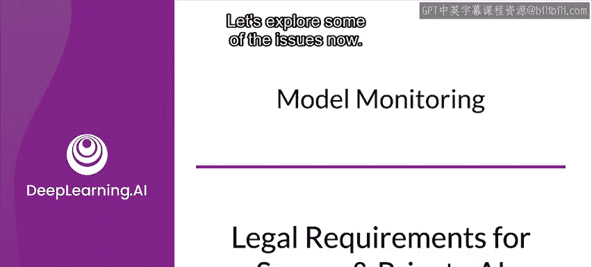

---

## 法律要求概览

实践负责任AI存在法律层面。一些国家和地区已有法律要求，且这一趋势正在增长。承担民事责任的风险是另一个需要关注的问题。

现在我们来探讨一些具体问题。

## 敏感数据的隐私保护

训练数据、预测请求或两者都可能包含关于个人的非常敏感的信息。对于预测请求，这些人就是你的用户。

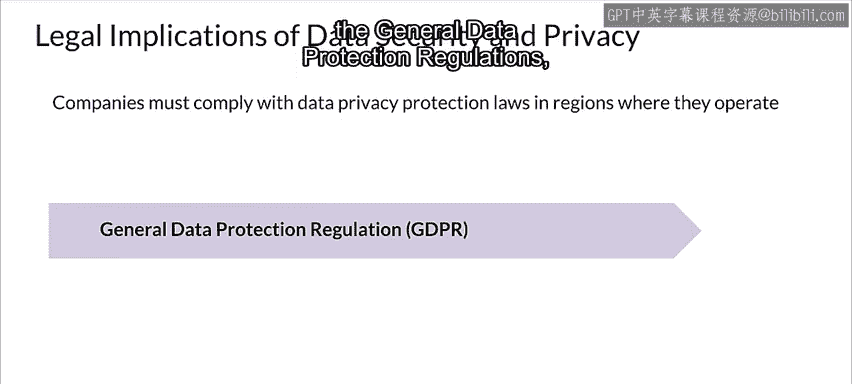

敏感数据的隐私应受到保护。这不仅包括遵守法律和监管要求，还需考虑社会规范和个人的普遍期望。

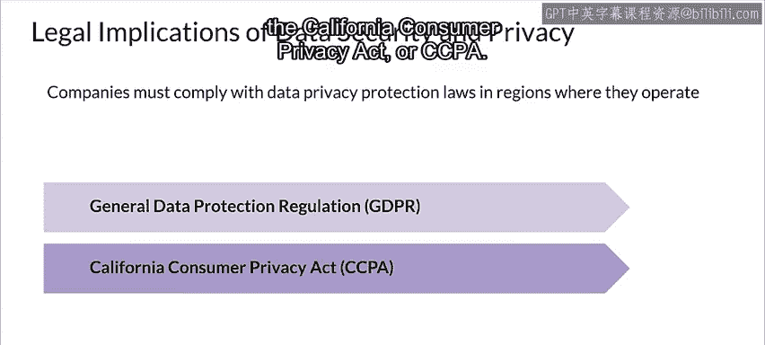

考虑到机器学习模型可能会记住或暴露它们所接触数据的某些方面，你需要采取哪些保障措施来确保个人隐私？

需要哪些步骤来确保用户对其数据拥有足够的透明度和控制权？

这并非仅由你决定需要什么。例如，在欧洲，你需要遵守《通用数据保护条例》（GDPR）；在加利福尼亚州，你需要遵守《加州消费者隐私法案》（CCPA）。

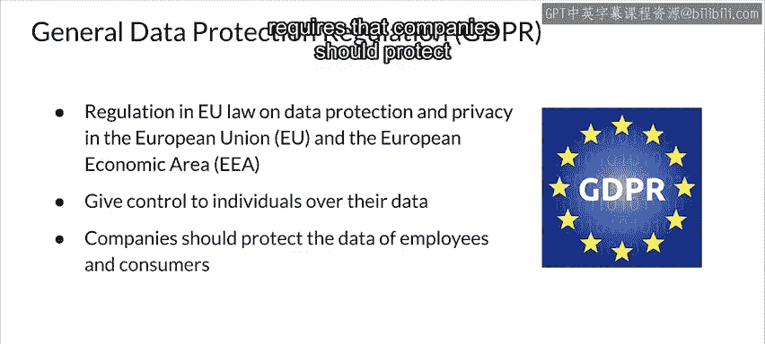

## 主要法规介绍

上一节我们提到了数据隐私的重要性，本节中我们来看看两项重要的法律框架。

**《通用数据保护条例》（GDPR）** 由欧盟于2016年颁布，并成为欧盟以外许多国家法律的范本，包括智利、日本、巴西、韩国、阿根廷和肯尼亚。它规范了欧盟和欧洲经济区的数据保护与隐私。GDPR赋予个人对其个人数据的控制权，并要求公司保护员工和消费者的数据。

当数据处理基于同意时，数据主体（通常为个人）有权随时撤销其同意。

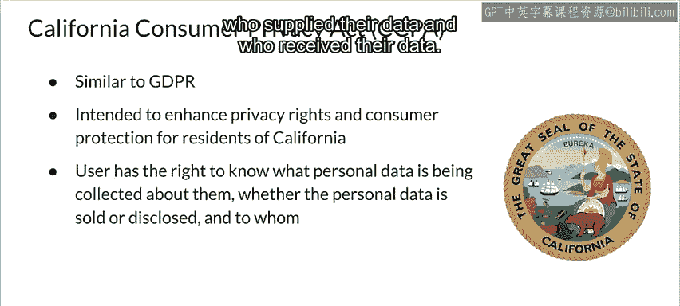

**《加州消费者隐私法案》（CCPA）** 以GDPR为范本，具有相似的目标，包括增强加州居民的隐私权和消费者保护。它规定用户有权知道正在收集关于他们的哪些个人数据，包括个人数据是否被出售或以某种方式披露、谁提供了他们的数据以及谁接收了他们的数据。

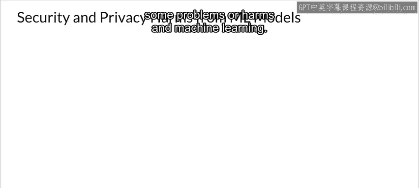

用户可以访问公司持有的关于他们的个人数据，阻止其数据被出售，并要求企业删除其数据。

## 机器学习中的安全与隐私危害

安全与隐私对于机器学习中的某些问题或危害是紧密相连的。

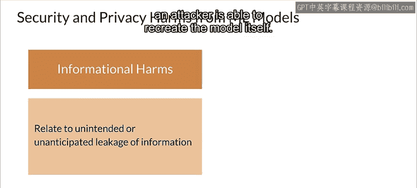

**信息危害** 是指信息从模型中泄露所造成的危害。至少存在三种不同类型的信息危害：

以下是不同类型信息危害的列表：
*   **成员推断**：攻击者能够确定某个个体的数据是否包含在训练集中。
*   **模型反演**：攻击者实际上能够重建训练集。
*   **模型提取**：攻击者能够重建模型本身。

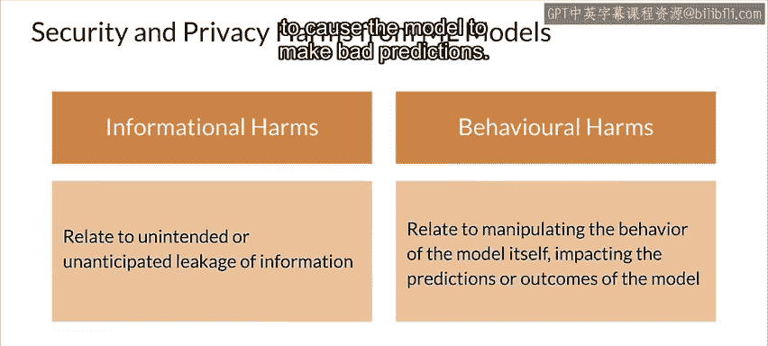

**行为危害** 是指攻击者能够改变模型本身行为所造成的危害。这包括：

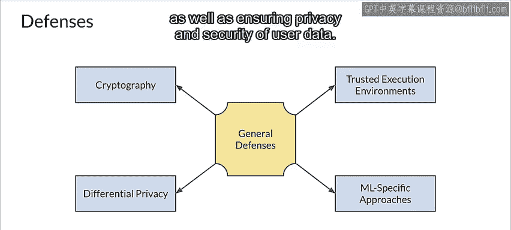

以下是不同类型行为危害的列表：
*   **投毒攻击**：攻击者能够将恶意数据插入训练集。
*   **规避攻击**：攻击者对预测请求进行微小更改，导致模型做出错误预测。

因此，保护你的模型免受攻击，同时确保用户数据的隐私和安全至关重要。

## 防御攻击的方法

了解了可能面临的危害后，本节我们来看看如何防御这些攻击。

在训练和服务模型时，你应该考虑隐私增强技术，例如**安全多方计算（SMC）** 或**全同态加密（FHE）**。

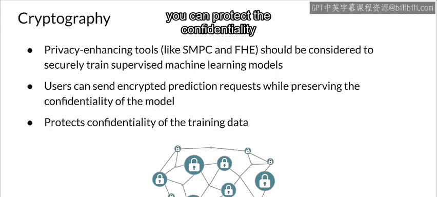

简而言之，SMC使多个系统能够安全地协作来训练和/或服务模型，同时通过使用共享秘密来确保实际数据的安全。另一方面，FHE使开发人员能够在加密数据上训练模型，而无需先解密。特别是FHE，允许用户发送加密的预测请求并接收加密的结果。在整个过程中，数据除了用户之外从未被解密。然而，你应该意识到，目前FHE的计算成本非常高。

这里的目标是，通过使用密码学，你可以保护训练数据的机密性。

## 差分隐私简介

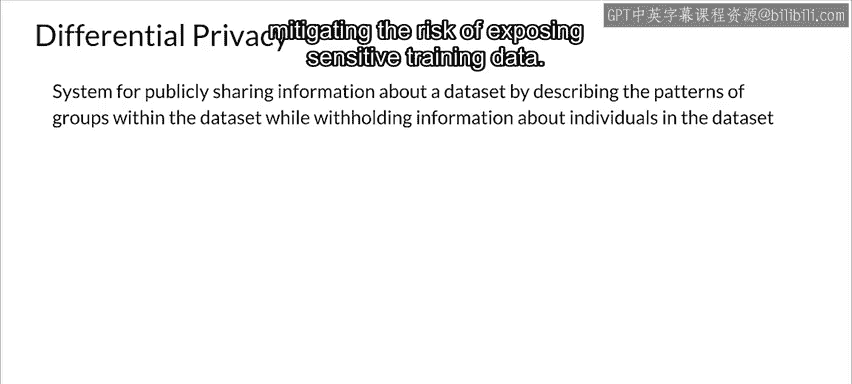

粗略地说，如果一个攻击者看到模型的预测结果后，无法判断某个特定用户的信息是否包含在训练数据中，那么这个模型就是**差分隐私**的。

通过实现差分隐私，你可以在私有数据上负责任地训练模型。它提供了可证明的隐私保证，降低了暴露敏感训练数据的风险。

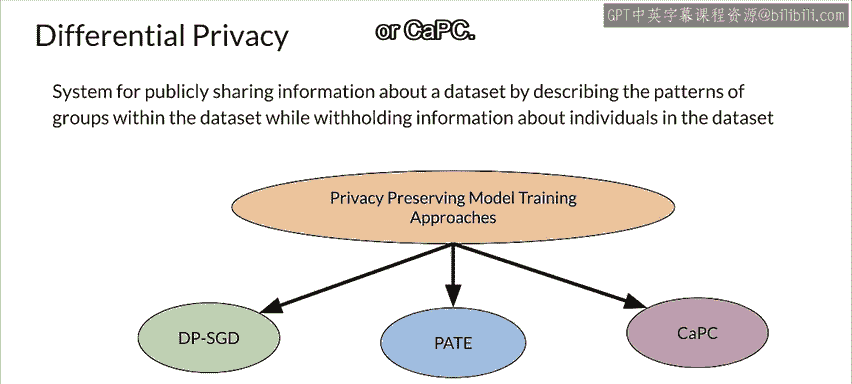

让我们简要讨论实现差分隐私的三种不同方法：

以下是三种差分隐私实现方法的列表：
*   **差分隐私随机梯度下降（DP-SGD）**
*   **教师模型集合的私有聚合（PATE）**
*   **保密与隐私协作学习（CAPC）**

### 差分隐私随机梯度下降（DP-SGD）

如果攻击者能够获得一个正常训练的模型的副本，那么他们可以利用权重来提取私有信息。

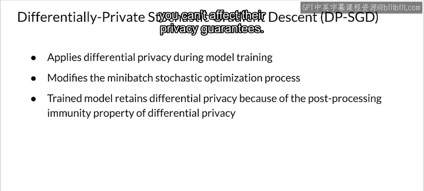

**差分隐私随机梯度下降（DP-SGD）** 通过在训练过程中应用差分隐私来消除这种可能性。它通过在小批量随机优化过程中添加噪声来实现这一点。结果是得到一个训练好的模型，由于差分隐私的后处理免疫特性，该模型保留了差分隐私。

> 后处理免疫是差分隐私的一个基本属性，意味着无论你如何处理模型的预测，都不会影响其隐私保证。

### 教师模型集合的私有聚合（PATE）

接下来，我们看看**教师模型集合的私有聚合（PATE）**。

PATE首先将敏感数据划分为K个不重叠的分区。然后分别在每个分区数据上训练K个模型作为教师模型，然后将它们的结果聚合到一个聚合教师模型中。这与用于知识蒸馏的师生模型类似。

在聚合教师模型的聚合过程中，你会以一种不影响最终预测结果的方式向输出添加噪声。所有这些模型和敏感数据对最终用户（包括攻击者）都是不可用的。

对于部署，你将创建一个学生模型。为了训练学生模型，你将获取未标记的公共数据，并将其输入聚合教师模型。此过程的输出是标记数据，且保持了隐私性。你将使用这些数据作为学生模型的训练集。训练完成后，你将丢弃本图左侧的所有内容，仅部署学生模型供使用。

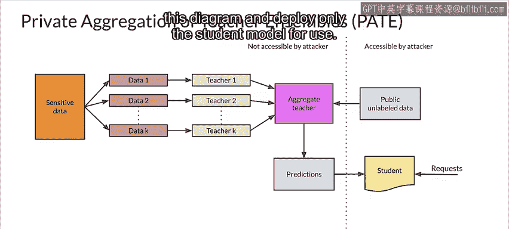

### 保密与隐私协作学习（CAPC）

**保密与隐私协作学习（CAPC）** 使使用不同数据的多个开发人员能够协作提高模型准确性，而无需共享信息。这同时保护了隐私和机密性。

为了实现这一点，它应用了密码学和差分隐私的技术与原理。这包括使用**同态加密（HE）** 来加密每个协作模型接收的预测请求，从而不泄露预测请求中的信息。然后，它使用PATE向每个协作模型的预测添加噪声，并使用投票来得出最终预测，同样不泄露信息。

CAPC应用的一个很好的例子是考虑一组希望协作改进彼此模型和预测的医院。由于医疗隐私法，他们不能直接共享信息，但使用CAPC，他们可以在保护患者隐私和机密性的同时获得更好的结果。

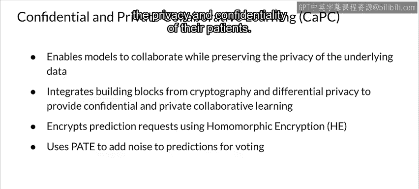

---

## 总结

本节课中，我们一起学习了实践安全私密AI的法律要求。我们了解了GDPR和CCPA等关键法规，认识了机器学习中信息危害和行为危害的类型，并探讨了通过安全多方计算、全同态加密以及差分隐私技术（如DP-SGD、PATE和CAPC）来防御攻击、保护用户数据隐私和安全的方法。遵守法律要求并实施强有力的隐私保护措施，是构建负责任且可信赖的AI系统的基石。