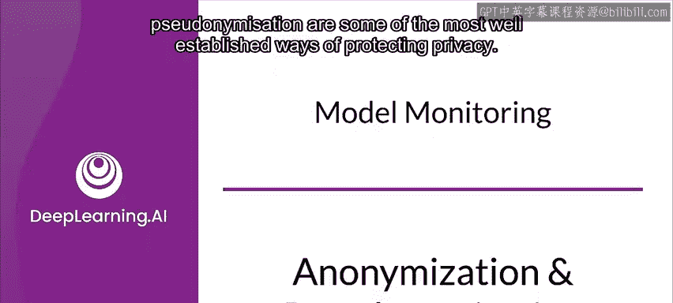
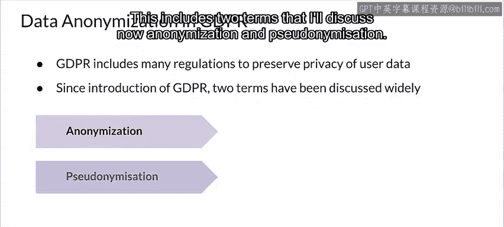
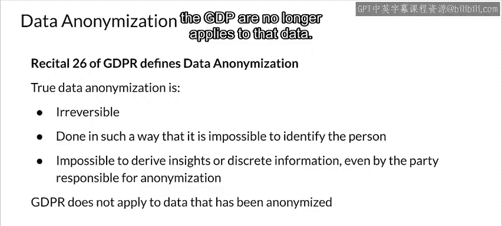
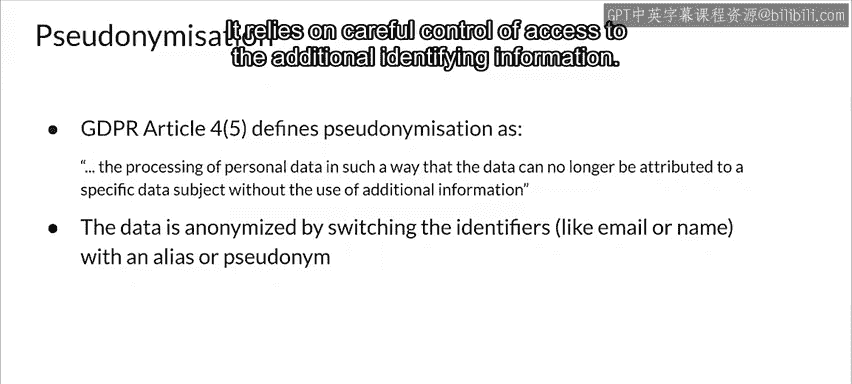
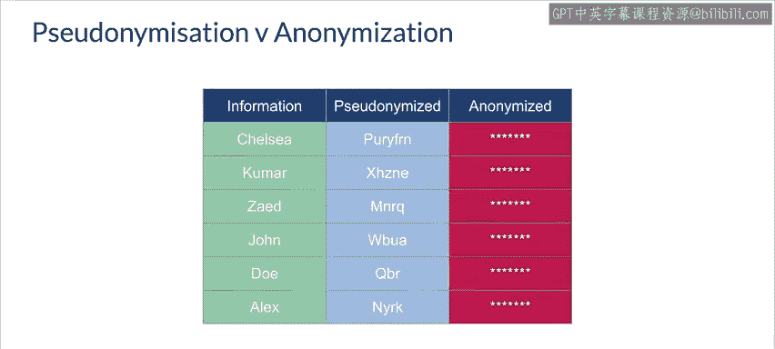
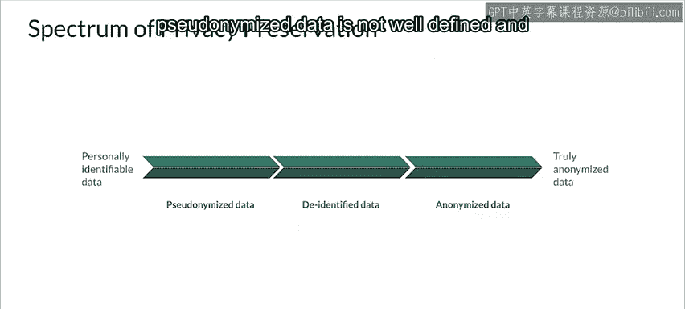
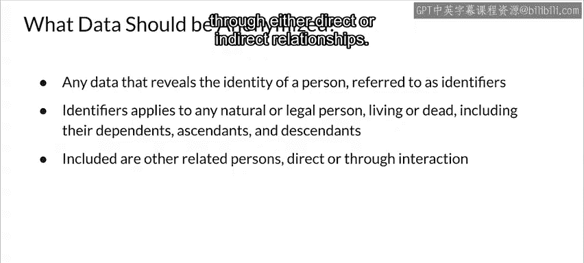

#  163：匿名化与伪匿名化 🔒

在本节课中，我们将学习数据隐私保护中的两个核心概念：匿名化与伪匿名化。我们将探讨它们的定义、区别、实现方式以及在《通用数据保护条例》（GDPR）框架下的应用。

---

《通用数据保护条例》（GDPR）包含了许多旨在保护用户数据隐私的法规，并对其使用的诸多术语进行了定义。其中，我们将重点讨论两个术语：匿名化与伪匿名化。

## 匿名化：不可逆的隐私保护

上一节我们提到了GDPR的隐私保护目标，本节中我们来看看匿名化的具体含义。

匿名化是指从数据集中移除所有个人可识别信息（PII），使得数据所描述的个人身份保持匿名。GDPR第26条序言将可接受的匿名化定义为**不可逆**的过程，其实现方式必须达到无法识别具体个人的程度。这意味着，即使是负责匿名化的一方，也无法从数据中推导出任何见解或离散的个人信息。

一旦数据被成功匿名化，GDPR的法规将不再适用于该数据。

**核心概念**：`匿名化数据 = 原始数据 - 所有个人可识别信息(PII)`，且此过程不可逆。

## 伪匿名化：可逆的标识符处理

了解了不可逆的匿名化后，我们再来看看另一种可逆的处理方式。

伪匿名化则有所不同。这是一个**可逆**的过程，意味着如果获得了正确的附加信息，仍然可以识别出具体的个人。伪匿名化可以通过数据掩码、加密或令牌化等技术来实现。它的有效性依赖于对附加识别信息访问权限的严格控制。

**核心概念**：`伪匿名化数据 = 原始数据 - 直接标识符 + 加密密钥/映射表`，此过程可逆。

## 核心区别：可逆性

为了更清晰地理解，匿名化与伪匿名化之间最大的区别在于：伪匿名化数据可以通过一组附加信息或加密密钥进行还原，而匿名化则是不可逆的。

## 数据隐私的连续光谱

多年来，业界已经发展出许多方法、机制和工具，能够产生具有不同匿名程度和可识别能力的数据。这构成了一个从“个人可识别”到“完全匿名”的连续光谱。

以下是这个光谱的主要组成部分：
*   **个人可识别数据**：包含姓名、地址、电话、邮箱等直接标识符。
*   **伪匿名化与去标识化数据**：构成了光谱的中间类别。它们确实是保护数据隐私某些方面的一种方式，但尚未达到真正匿名化数据的级别。需要注意的是，去标识化数据与伪匿名化数据之间的界限并不十分明确，许多讨论会将它们归为一类。
*   **真正的匿名化数据**：符合GDPR指南，不包含任何个人可识别信息（PII），并且即使拥有附加信息也无法与PII关联。

## 需要匿名化的数据范围

那么，数据的哪些部分应该被匿名化呢？基本上，所有属于个人可识别信息（PII）的部分都需要处理。

这包括任何能够揭示个人身份的数据，即所谓的“标识符”。这里的“标识符”指任何在世或已故的自然人或法人，包括其家属、祖先和后代。此外，也包括那些可能通过直接或间接关系被识别的其他相关人员。

例如，需要处理的标识符特征包括：
*   姓氏、父姓、名字、婚前姓、别名
*   地址、电话号码
*   银行账户详情、信用卡信息
*   税号等

---

本节课中，我们一起学习了匿名化与伪匿名化这两个关键的数据隐私保护技术。我们明确了匿名化是不可逆的移除PII的过程，而伪匿名化则是可逆的标识符替换或加密过程。理解它们在数据隐私连续光谱中的位置，以及明确哪些数据属于需要处理的PII，对于在GDPR等法规框架下合规地处理用户数据至关重要。