#  164：35_被遗忘权 👤➡️🗑️

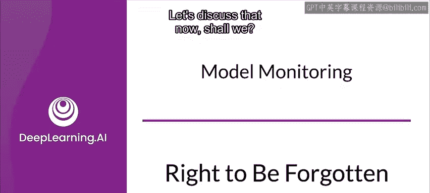

在本节课中，我们将学习《通用数据保护条例》（GDPR）中的“被遗忘权”。我们将了解其定义、适用场景、例外情况以及如何在实践中实施数据删除。理解这些内容对于负责任地处理用户数据和构建合规的机器学习系统至关重要。

---

## 概述与术语澄清

首先，我们需要澄清一些关键术语。在GDPR的语境中：
*   **数据主体**：指个人。
*   **控制者**：指控制包含个人可识别信息（PII）数据集的个人或组织。

明确了这些术语后，我们可以开始探讨核心问题。

---

## 被遗忘权的适用场景

那么，个人在什么情况下拥有被遗忘权呢？GDPR列举了一系列个人有权要求删除其个人数据的原因。以下是主要情形列表：

*   个人数据对于组织最初收集或处理它的目的而言不再必要。
*   组织依赖个人同意作为处理数据的合法依据，而该个人撤回了同意。
*   组织以合法利益为由处理个人数据，个人对此提出反对，且组织没有压倒性的合法利益来继续处理。
*   组织为直接营销目的处理个人数据，个人对此提出反对。
*   组织非法处理了个人数据。
*   组织必须删除个人数据以遵守法律裁决或义务。
*   组织处理了儿童的个人数据以向其提供信息社会服务（例如社交网络）。

通常，如果满足上述任一条件，就必须删除该个人的数据。这些规定大多符合常识。

---

## 被遗忘权的例外情况

然而，在某些情况下，组织处理个人数据的权利可能优先于个人的被遗忘权。以下是GDPR中列举的例外情况：

*   数据被用于行使言论自由和信息自由权。
*   数据被用于遵守法律裁决或义务。
*   数据被用于执行符合公共利益的任务或行使组织的官方职权。
*   被处理的数据对于公共卫生目的和公共利益是必要的。
*   被处理的数据对于执行预防性或职业性医学是必要的（仅适用于由受职业保密法律义务约束的健康专业人员处理数据时）。
*   数据代表了服务于公共利益、科学研究、历史研究或统计目的的重要信息，删除数据可能会损害或阻碍实现处理目标。
*   数据被用于建立法律辩护或行使其他法律主张。

此外，如果组织能证明删除请求是毫无根据或过度的，可以收取合理费用或拒绝该请求。但一般而言，除非你明确符合上述例外条件之一，否则应避免凌驾于个人的被遗忘权之上。如有疑问，应以保护隐私为先。

---

## 其他相关数据权利

GDPR还规定了数据主体拥有的其他一系列权利。上一节我们讨论了被遗忘权，本节中我们来看看这些补充性权利，它们共同构成了个人数据保护的核心。

*   **更正权**：个人有权要求更正其不准确的个人信息。这在信用记录、健康记录或就业记录等场景中尤为重要。
*   **访问权**：数据主体有权访问其个人数据。
*   **限制处理权**：数据主体有权限制对其数据的处理。
*   **数据可携权**：数据主体有权以结构化、通用和机器可读的格式接收其提供给控制者的个人数据，并有权将这些数据传输给另一个控制者。
*   **反对权**：数据主体有权反对基于特定情况对其个人数据进行的处理。

作为一般规则，最好以保护隐私为先，将数据中的所有个人信息都视为敏感信息。应限制对其的访问并确保其安全。最重要的是，应将其视为信息所属者的财产，并尊重他们的意愿。

---

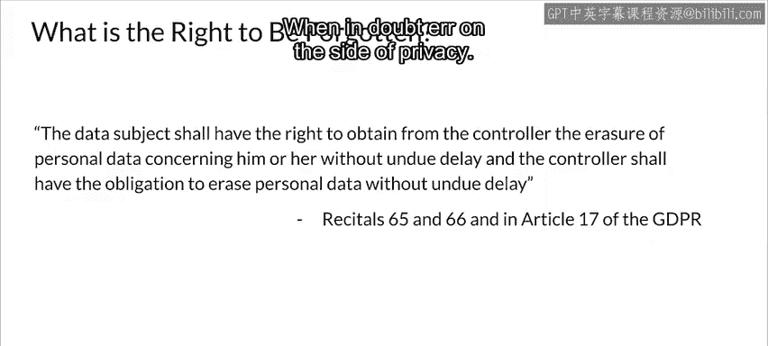

## 实施数据删除的要求

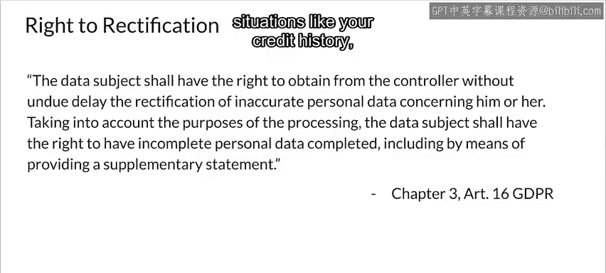

当你收到有效的删除个人信息请求时，需要执行一系列操作。以下是需要完成的步骤列表：

*   **识别所有相关信息**：识别与请求删除内容相关的所有信息。
*   **删除关联元数据**：识别并删除与该个人相关的所有元数据。
*   **处理衍生数据**：如果你进行过任何分析或训练过任何模型，则衍生的数据、日志和模型也必须被删除或修正。

此处的目标是尽可能做到仿佛你从未拥有过他们的数据。

---

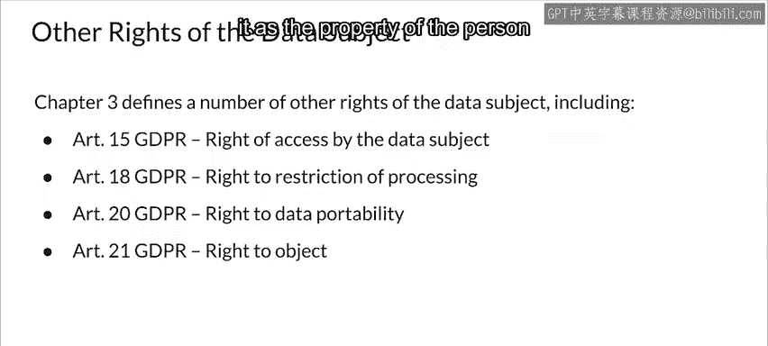

## 数据删除的两种方法

基本上有两种删除数据的方法可以满足GDPR的要求。

**1. 数据匿名化**
正如之前所见，匿名化将使数据在GDPR条款下不再具有个人可识别性。GDPR将不再适用于匿名化后的数据。

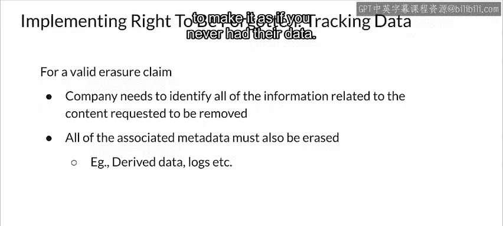

**2. 硬删除**
即实际删除数据，包括数据库中可能包含它的任何行。

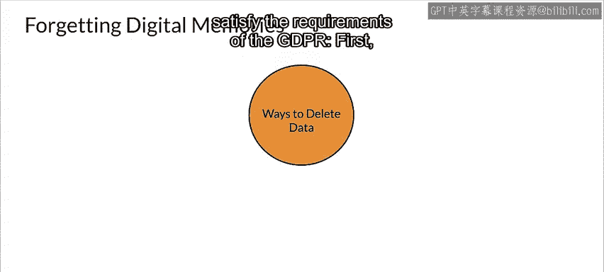

通常，你的第一反应可能总是进行硬删除。但这通常会带来问题，因此匿名化是另一个选择。

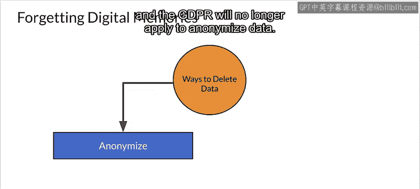

---

## 匿名化与硬删除的考量

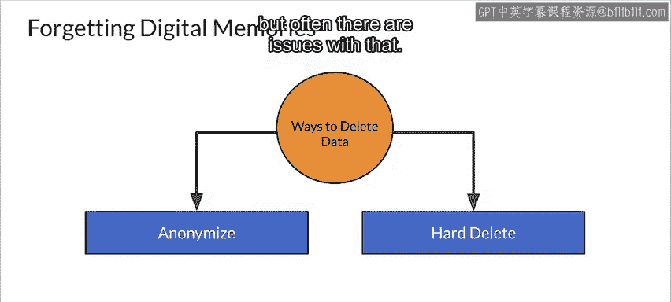

在数据库或任何类似的关系型数据存储中，删除记录可能会造成严重破坏。部分原因是用户数据通常被多个表引用。删除这些记录会破坏连接，这在大型复杂数据库中尤其困难。例如，它可能破坏外键约束。

另一方面，匿名化保留记录，只对包含PII的字段进行匿名化处理，同时仍能满足GDPR的要求。这通常能更好地维持数据完整性和系统稳定性。

---

## 实施被遗忘权的挑战

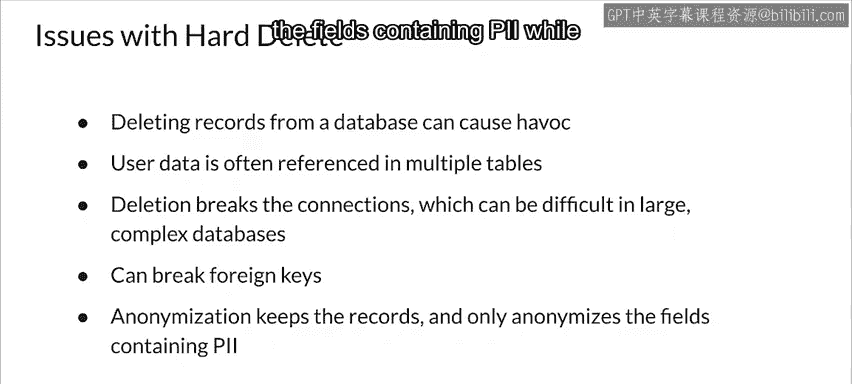

实施被遗忘权面临几个挑战。识别数据隐私是否被侵犯的过程本身就是一项艰巨的任务。

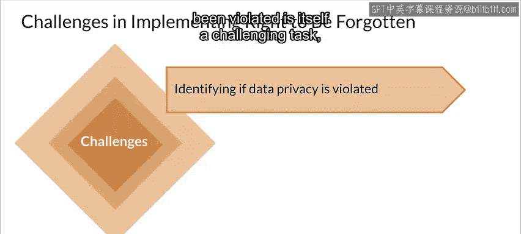

为了执行GDPR，需要进行一些组织变革，包括政策变更和培训员工如何执行被遗忘权。还有一个最后需要考虑的棘手问题。

---

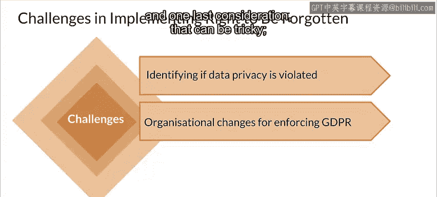

## 备份数据的处理

如果你的组织维护数据的多个备份（实际上你应该这样做），确保个人数据已从所有备份中删除是具有挑战性的。你可能需要改变数据存储和备份实施方案，以保持对GDPR的合规性。

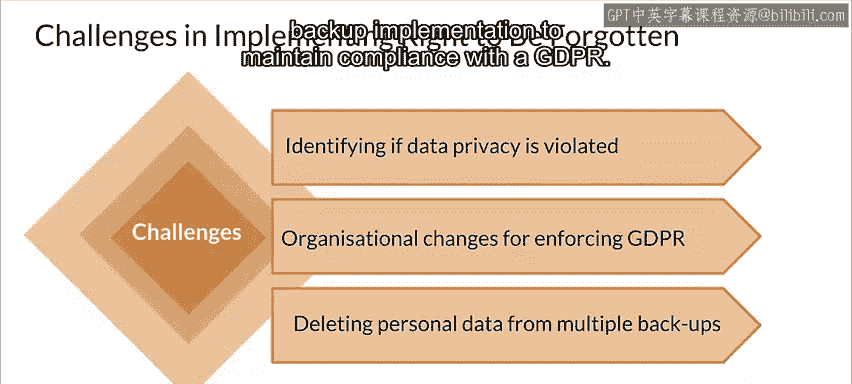

---

## 总结

本节课中，我们一起学习了GDPR中的“被遗忘权”。我们了解了它的定义、触发条件、例外情况以及其他相关的数据主体权利（如更正权）。我们还探讨了实施数据删除的两种主要方法（匿名化与硬删除）及其各自的考量，并指出了在数据库关系维护和备份处理中可能遇到的挑战。

像GDPR和被遗忘权这样的问题，在商业环境中运营已经至关重要。理解围绕它们的机器学习问题只会变得越来越重要。我们已经为你提供了该领域现状的基本理解，但我强烈建议你持续关注新的发展。同时，我认为尊重客户隐私、极其谨慎地对待你拥有的任何信息或PII始终是重要的，我强烈建议你这样做。