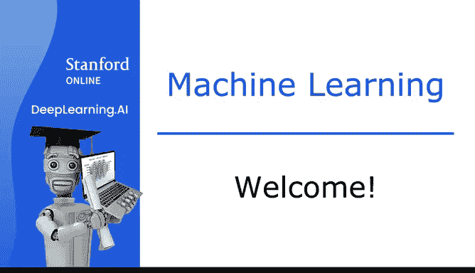
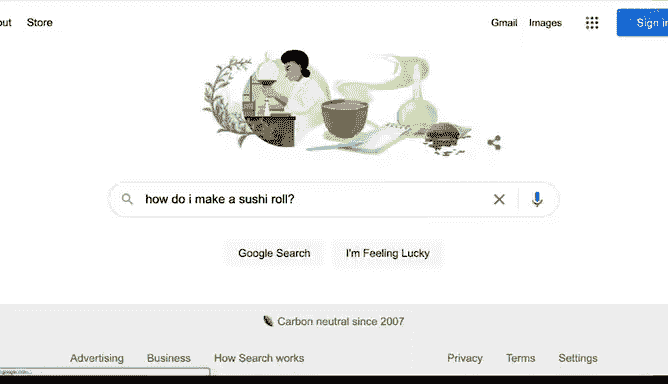

# 1：欢迎来到机器学习 🚀

在本节课中，我们将要学习什么是机器学习，并了解它在日常生活和工业中的广泛应用。

---

## 什么是机器学习？🤖

机器学习是计算机科学的一个分支。它的核心是让计算机系统能够从数据中“学习”并改进，而无需为每个特定任务进行明确的编程。

上一节我们介绍了机器学习的定义，本节中我们来看看它在现实世界中的具体应用。

## 机器学习的日常应用 📱

以下是机器学习在我们日常生活中的一些常见例子：

*   **网络搜索**：当你在谷歌、必应或百度上搜索“如何制作寿司卷”时，搜索引擎能快速找到相关网页。这是因为机器学习软件已经学会了如何对网页进行排序。
*   **图片识别**：当你在 Instagram 或 Snapchat 上传照片并想标记朋友时，这些应用可以识别照片中的朋友并为他们添加标签。这也是机器学习。
*   **内容推荐**：当你在视频流媒体平台看完一部《星球大战》电影后，平台可能会使用机器学习来推荐其他你可能喜欢的类似电影。
*   **语音与文本**：每次你在手机上使用语音输入发送短信（如“嘿，Andrew，最近怎么样？”），或者告诉手机“嘿 Siri，播放蕾哈娜的歌”，又或者询问“好的 Google，显示我附近的印度餐厅”，背后都有机器学习在运作。
*   **垃圾邮件过滤**：每当你收到一封标题为“恭喜你赢得一百万美元”的邮件时，你的邮件服务很可能会将其标记为垃圾邮件。这同样是机器学习的应用。

## 机器学习在工业与专业领域的应用 🏭

除了消费者应用，人工智能也正迅速进入大型公司和工业领域。

以下是几个关键领域的应用：

*   **应对气候变化**：机器学习正在帮助优化风力涡轮机的发电效率。
*   **医疗健康**：机器学习开始进入医院，帮助医生做出更准确的诊断。
*   **工业质检**：在 Landing AI，我们做了大量工作，将计算机视觉技术应用于工厂，以检测生产线下来的产品是否存在缺陷。

## 课程目标与展望 🎯

机器学习是一门让计算机无需明确编程就能学习的科学。

在本课程中，你将学习机器学习的知识，并亲自动手编写代码来实现机器学习算法。

数百万学习者已经学习了本课程的早期版本，这门课程也促成了 Coursera 的创立。许多学员最终构建了令人兴奋的机器学习系统，甚至在人工智能领域开启了成功的职业生涯。

我很高兴你能与我一同踏上这段旅程。欢迎加入，让我们开始吧！

---

本节课中我们一起学习了机器学习的核心定义，并探索了它在从日常消费电子产品到工业与环保等关键领域的广泛应用。我们了解到，机器学习是一门让计算机通过数据自我改进的科学，而本课程将为你打开亲手构建这类系统的大门。