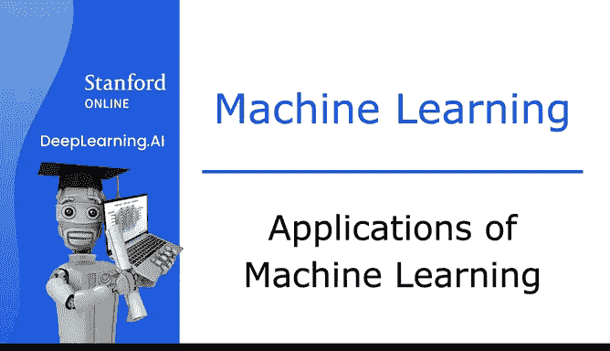
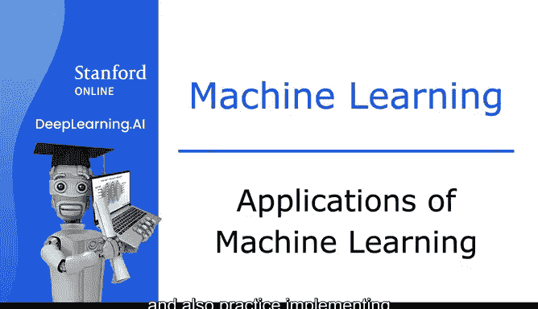

# 2：机器学习的应用 🚀

在本节课中，我们将学习机器学习的当前发展状况，并亲自动手实践实现机器学习算法。我们将了解最重要的机器学习算法，其中一些正是当今大型AI或科技公司正在使用的技术，并感受AI领域的最新进展。除了学习算法，我们还将掌握所有重要的实用技巧，以确保算法表现良好，并通过亲自实现来理解它们的工作原理。

## 什么是机器学习？🤖

上一节我们介绍了课程的整体目标，本节中我们来看看为什么机器学习在今天如此广泛应用。机器学习作为人工智能（AI）的一个子领域发展起来。我们曾希望构建智能机器，但事实证明，我们只能为机器编程完成一些基本任务，例如像GPS一样找到从A点到B点的最短路径。然而，对于大多数更有趣的任务，例如执行网络搜索、识别人声、诊断疾病、解读X光片或构建自动驾驶汽车，我们并不知道如何编写明确的程序来完成。

我们已知的实现这些任务的唯一方法，是让机器自己学习如何完成。

## 机器学习的实际应用案例 💡

以下是机器学习在现实世界中的一些关键应用领域，这些例子展示了其广泛的影响力：

*   **互联网与科技**：例如，在谷歌大脑团队工作时，我致力于语音识别、谷歌地图街景图像的计算机视觉以及广告优化等问题。
*   **前沿科技与安全**：在DeepMind工作期间，我的工作涉及从增强现实AI到打击支付欺诈，再到领导自动驾驶汽车团队等各个方面。
*   **传统行业转型**：最近，在Landing AI、AI Fund和斯坦福大学，我致力于将AI应用于制造业、大规模农业、医疗保健、电子商务等领域。

如今，有成千上万甚至数百万的人正在从事机器学习应用的工作。当你掌握了这些技能后，我希望你也能发现涉足这些激动人心的不同应用乃至不同行业是极大的乐趣。

事实上，我很难想象在不久的将来，有哪个行业不会受到机器学习的显著影响。😊

## 人工智能的未来与机遇 🌟

展望更远的未来，包括我在内的许多人都对AI的梦想感到兴奋：有朝一日能建造出像你我一样智能的机器。这有时被称为**人工通用智能（AGI）**。

我认为AGI被过度炒作了，我们距离那个目标仍然很遥远。我不知道实现它需要50年、500年还是更长时间，但大多数AI研究人员相信，最接近该目标的方法是使用学习算法，也许是那些从人脑工作原理中汲取了一些灵感的算法。在本课程后面，你也会听到更多关于追求AGI的内容。

根据麦肯锡的一项研究，预计到2030年，AI和机器学习每年将创造**额外的13万亿美元价值**。尽管机器学习已经在软件行业创造了巨大的价值，但我认为在软件行业之外的领域，如零售、旅游、交通、汽车、材料、制造业等，还有待创造更巨大的价值。

由于众多不同领域存在大量未开发的机会，目前市场对掌握机器学习技能的需求巨大且尚未得到满足。这就是为什么现在是学习机器学习的绝佳时机。

## 总结与预告 📚

本节课中我们一起学习了机器学习的广泛应用、其作为实现AI目标的核心方法的重要性，以及它在当前和未来创造巨大价值的潜力。如果你对机器学习的应用感到兴奋，我希望你能坚持学完这门课程。我几乎可以保证，你会发现掌握这些技能是值得的。

在下一个视频中，我们将探讨机器学习的更正式定义，并开始讨论机器学习问题和算法的主要类型。你将学习一些主要的机器学习术语，并开始了解不同算法的区别以及每种算法适用的场景。

让我们继续观看下一个视频。