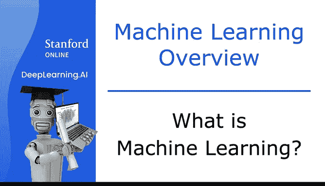
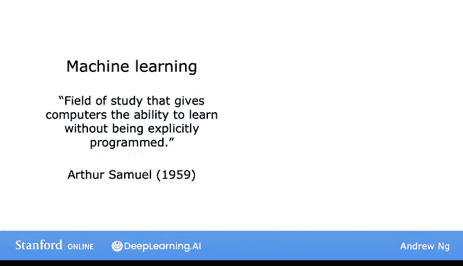
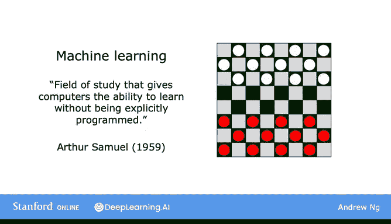
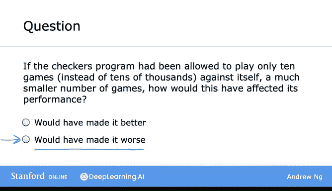
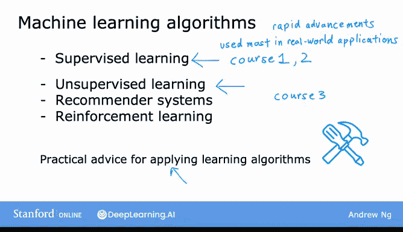

# 3：什么是机器学习？🤖

在本节课中，我们将学习机器学习的定义，并了解其适用场景。课程将介绍机器学习的基本概念、主要类型以及学习本课程你将获得的知识与技能。

---

## 什么是机器学习？

亚瑟·塞缪尔给出了一个关于机器学习的定义。他将机器学习定义为：**使计算机无需明确编程即可学习的研究领域**。

塞缪尔的成名之作是他在20世纪50年代编写的一个跳棋程序。这个程序的非凡之处在于，塞缪尔本人并非出色的跳棋玩家。

他编写了一个程序，让计算机与自己进行数万次对弈。通过观察哪些棋盘局势容易导致胜利，哪些容易导致失败，这个跳棋程序逐渐学会了识别棋盘局势的好坏。

通过努力走向有利局势并避开不利局势，他的程序在下跳棋方面变得越来越好。由于计算机有耐心与自己进行数万次对弈，它积累了大量的跳棋经验，最终其棋艺超过了塞缪尔本人。

---

## 一个关于学习机会的问题

在课程中，除了讲解，我偶尔会提出问题以确保你理解内容。这里有一个问题：如果计算机进行的对弈次数少得多，会发生什么？

以下是可能的结果：
*   如果对弈次数少得多，程序的表现会变差。
*   如果对弈次数少得多，程序的表现会更好。

感谢你查看这个测验。如果你选择了“表现会变差”这个答案，那么你是正确的。通常，你给学习算法提供的学习机会越多，它的表现就会越好。如果你第一次没有选对答案，那也完全没关系。这些测验问题的目的不是看你能否第一次就全部答对，而是帮助你练习正在学习的概念。

亚瑟·塞缪尔的定义是一个相当非正式的定义。在接下来的两个视频中，我们将一起深入探讨机器学习算法的主要类型。

---

## 机器学习的主要类型

在本课程中，你将学习许多不同的学习算法。机器学习的两种主要类型是**监督学习**和**无监督学习**。我们将在接下来的几个视频中更详细地定义这些术语。

在这两种类型中，监督学习是现实世界应用中使用最多的机器学习类型，并且在本系列课程中见证了最快速的发展和创新。本系列课程共有三门，第一门和第二门课程将重点介绍监督学习，第三门课程将重点介绍无监督学习、推荐系统和强化学习。

迄今为止，最常用的学习算法类型是监督学习、无监督学习和推荐系统。

---

## 本课程的核心：工具与实践建议

本课程我们将花费大量时间的另一个方面是**应用学习算法的实用建议**。我对此有强烈的感受：学习算法就像给人一套工具。确保你拥有出色的工具固然重要，但同样重要甚至更重要的是确保你知道如何应用这些工具。

试想，如果有人给你一把最先进的锤子或手锯，然后说“祝你好运，现在你拥有了建造三层楼所需的所有工具”，这显然行不通。机器学习也是如此，确保你拥有工具非常重要，确保你知道如何有效地应用机器学习工具也同样重要。

这就是你在本课程中将获得的内容：工具本身以及有效应用这些工具的**技能**。

---

## 避免常见陷阱

我经常拜访一些顶尖科技公司的朋友和团队。即使在今天，我仍然看到经验丰富的机器学习团队将机器学习算法应用于某些问题，有时他们努力了六个月却没有取得太大成功。

当我观察他们的做法时，我有时觉得我本可以在六个月前就告诉他们，当前的方法行不通，并且存在一种不同的使用这些工具的方法，能让他们有更大的成功机会。

因此，在本课程中，你将学到的一个相对独特的东西是，关于如何实际开发一个实用、有价值的机器学习系统的**最佳实践**。这样，你就不太可能成为那些花了六个月时间却走错方向的团队中的一员。

在本课程中，你将了解最熟练的机器学习工程师是如何构建系统的。我希望你完成本课程后，能成为当今世界上少数知道如何设计和构建严肃、强大的机器学习系统的人之一。

---

## 总结与预告

本节课我们一起学习了机器学习的定义，了解了其通过经验学习而非明确编程的核心思想，并初步认识了监督学习和无监督学习这两种主要类型。我们还明确了本课程不仅提供算法工具，更注重教授有效应用这些工具的实践技能。

在下一个视频中，让我们更深入地看看什么是监督学习，什么是无监督学习。此外，你还将学习何时可能想要使用它们。我们下个视频见。