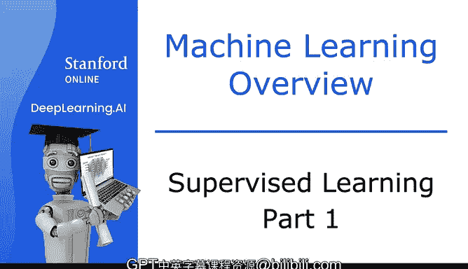
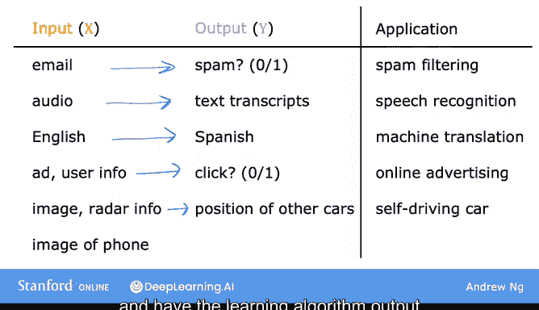
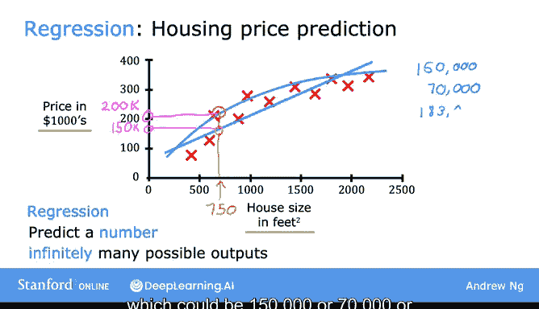

# 4：监督学习第一部分 🧠

在本节课中，我们将学习监督学习的基本概念。监督学习是目前创造绝大多数经济价值的机器学习类型。我们将了解其定义、核心思想，并通过具体例子来理解它的工作原理。

---

## 什么是监督学习？🎯

监督学习，或称监督式机器学习，指的是学习从输入 **X** 到输出 **Y** 的映射关系的算法。其关键特征是，你需要为学习算法提供包含“正确答案”的示例。这里的“正确答案”指的是给定输入 **X** 所对应的正确标签 **Y**。

通过观察大量正确的输入 **X** 和期望的输出标签 **Y** 配对，学习算法最终能够学会仅根据输入（无需输出标签）来做出相当准确的预测或猜测。

---

## 监督学习的应用实例 📧

以下是监督学习在不同领域的一些典型应用：

*   **垃圾邮件过滤**：输入 **X** 是一封电子邮件，输出 **Y** 是判断这封邮件是“垃圾邮件”还是“非垃圾邮件”。
*   **语音识别**：输入 **X** 是一段音频剪辑，算法的任务是输出对应的文本转录 **Y**。
*   **机器翻译**：输入 **X** 是英文句子，输出 **Y** 是对应的西班牙语、阿拉伯语、中文等其他语言的翻译。
*   **在线广告**：输入 **X** 包含广告信息和你的一些信息，算法尝试预测你是否会点击该广告 **Y**。这是目前最具盈利能力的监督学习应用之一。
*   **自动驾驶**：输入 **X** 是图像和其他传感器（如雷达）信息，输出 **Y** 是其他车辆的位置，以便自动驾驶汽车安全行驶。
*   **工业视觉检测**：输入 **X** 是刚下生产线的产品（如手机）图片，输出 **Y** 是判断产品是否存在划痕、凹痕或其他缺陷。

---

## 监督学习的工作流程 🔄

在所有上述应用中，监督学习都遵循一个通用流程：

1.  **训练模型**：首先，使用包含输入 **X** 和正确答案（即标签 **Y**）的示例数据集来训练模型。
2.  **进行预测**：模型从这些输入-输出配对（**X** 和 **Y**）中学习后，便可以接收一个全新的、从未见过的输入 **X**，并尝试生成相应的输出 **Y**。

---

## 深入案例：房价预测 🏠

为了更深入地理解，让我们看一个具体的例子：根据房屋面积预测房价。

假设你收集了一些数据，并将其绘制在图表上。横轴代表房屋面积（平方英尺），纵轴代表房屋价格（千美元）。

现在，如果你的朋友想知道他750平方英尺的房屋价格，学习算法如何帮助你呢？

一种方法是，算法可以尝试用一条**直线**来拟合数据。从这条直线上读取，你朋友的房子售价可能在15万美元左右。

然而，拟合直线并非唯一选择。对于这个应用，可能有其他方法效果更好。例如，你可能会决定用一条**曲线**（一个比直线更复杂的函数）来拟合数据。如果这样做并在此处进行预测，那么你朋友的房子售价可能接近20万美元。

在本课程后面，你将学习如何系统地决定是使用直线、曲线还是其他更复杂的函数来拟合数据。

---

## 回归问题 📈

这个房价预测的例子是监督学习的一个特定类型，称为**回归**。

所谓回归，我们指的是尝试从无限多的可能数字中预测出一个数字。在我们的例子中，房价可以是15万、7万、18.3万或介于其间的任何其他数字。

**核心公式**：在回归中，我们试图学习一个函数 **f**，使得 **Y ≈ f(X)**，其中 **Y** 是一个连续数值。

---

## 本节总结 ✨

本节课我们一起学习了监督学习的基础知识。我们了解到，监督学习是通过提供带标签的示例（输入 **X** 和正确答案 **Y**），让算法学会从输入到输出的映射关系。我们看到了它在垃圾邮件过滤、语音识别等多个领域的应用，并通过房价预测的案例，具体了解了**回归**这一种监督学习任务，其目标是预测一个连续的数值。

在下一节中，我们将探讨监督学习的另一种主要类型：**分类**问题。