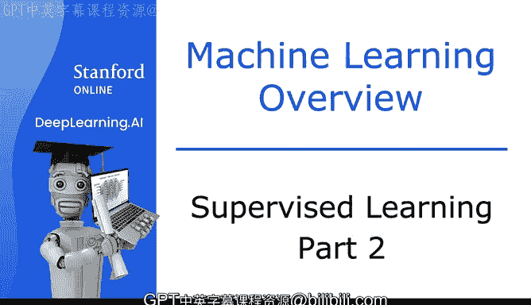
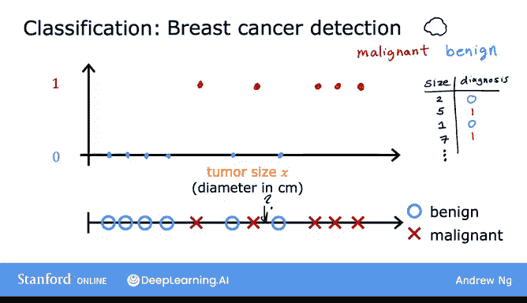
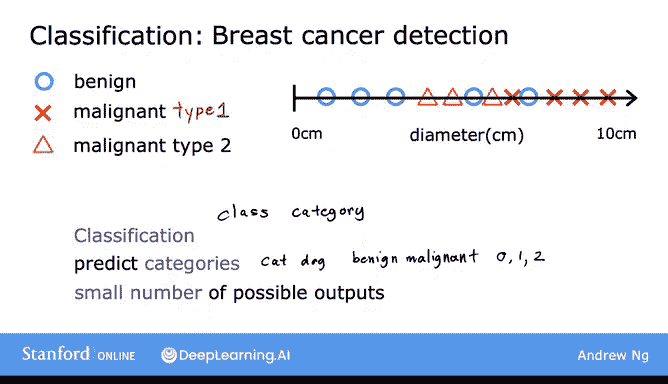
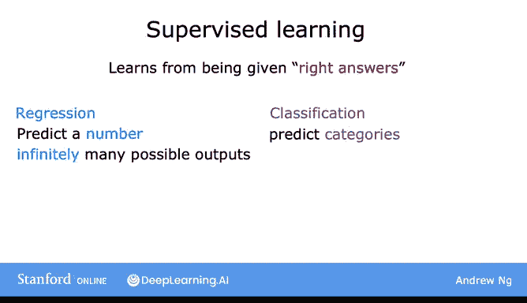

# 5：监督学习（第二部分）🔍

在本节课中，我们将要学习监督学习的第二种主要类型：**分类算法**。我们将了解分类与回归的区别，并通过具体的例子（如乳腺癌检测）来理解分类问题是如何工作的。

---

## 从回归到分类 🧠

上一节我们介绍了回归算法，它用于预测连续的数值。本节中我们来看看监督学习的另一个重要分支：**分类算法**。

监督学习算法学习从输入到输出（或从 X 到 Y）的映射关系。分类算法是监督学习的一种主要类型，它学习预测**类别**，而不是无限多的可能数字。

## 什么是分类问题？🎯

以乳腺癌检测为例。我们可以构建一个机器学习系统，作为医生的诊断工具来检测乳腺癌。早期检测可能挽救患者的生命。

系统利用患者的医疗记录，试图判断一个肿瘤（肿块）是**恶性**（即癌变的、危险的），还是**良性**（即非癌变的、不那么危险的）。

以下是该问题的一个简化数据集示例：
*   肿瘤大小作为输入特征。
*   标签为 **0**（代表良性）或 **1**（代表恶性）。

我们可以将数据绘制在图表上，横轴代表肿瘤大小，纵轴只取 0 或 1 两个值。

**核心概念**：分类与回归的关键区别在于，分类试图预测的只是**少量可能的输出或类别**（本例中为 0 和 1），而回归试图预测的是**无限多个可能数字中的任何一个**。

## 多类别分类 📊

分类问题中也可以有**两个以上**的可能输出类别。

例如，一个学习算法除了判断良性或恶性，还可能输出恶性肿瘤的具体类型（如类型1、类型2）。在这种情况下，算法可以预测三个可能的输出类别。

在分类中，术语“输出类”和“输出类别”经常互换使用。

**总结一下**：分类算法预测类别。类别不一定是数字，也可以是非数值的（例如，预测一张图片是猫还是狗）。类别也可以是数字（如 0, 1, 2），但分类与回归（当我们将输出解释为数字时）的区别在于，分类预测的是一个**小的、有限的、离散的**可能输出类别集合，而不是像 0.5 或 1.7 这样的中间所有可能数字。

## 使用多个输入特征 🧩

在我们之前看的例子中，我们只有一个输入值（肿瘤大小）。但实际上，我们可以使用**多个输入值**来预测输出。

以下是一个使用两个输入特征的例子：
*   **输入1**：肿瘤大小
*   **输入2**：患者年龄

现在，每个数据点由两个值定义。我们仍然用圆圈表示良性肿瘤患者，用叉号表示恶性肿瘤患者。

当一位新患者前来就诊时，医生可以测量其肿瘤大小并记录其年龄。给定这个新的数据点，我们如何预测肿瘤是良性还是恶性？

面对这样的数据集，学习算法可能会做的是找到一条**决策边界**，将恶性肿瘤与良性肿瘤区分开来。

**核心概念**：学习算法需要决定如何为这些数据拟合一条边界线。算法找到的这条边界线将帮助医生进行诊断。例如，如果新数据点落在边界线的某一侧，则肿瘤更可能是良性的。

在实际的机器学习问题中，通常需要**更多**的输入特征。例如，在乳腺癌检测中，可能还会使用肿瘤块的厚度、细胞大小的均匀性、细胞形状的均匀性等特征。

## 本节总结 📝

本节课中我们一起学习了监督学习的核心内容：

1.  **监督学习**：学习从输入 X 到输出 Y 的映射，算法从“正确答案”中学习。
2.  **两大类型**：
    *   **回归**：预测**数字**，来自无限多的可能输出数字（例如预测房价）。
    *   **分类**：预测**类别**，来自一个小的、有限的可能输出集合（例如判断肿瘤良性/恶性）。

你已经了解了什么是监督学习，包括回归和分类。接下来，机器学习还有第二种主要类型，称为**无监督学习**，我们将在下一个视频中探讨。