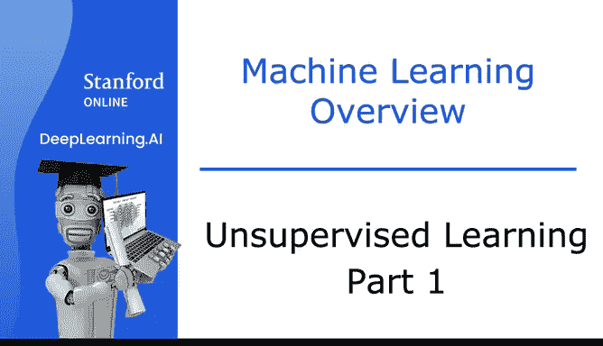
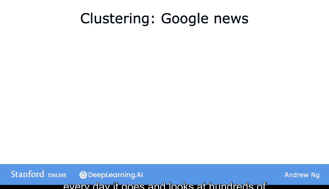
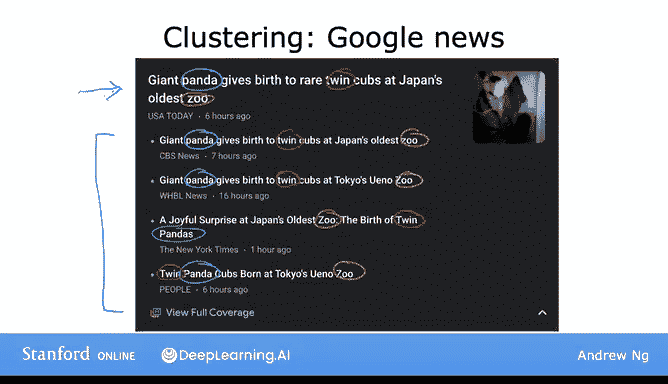
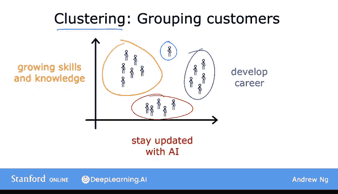

# 6：无监督学习第一部分 🧩

在本节课中，我们将要学习**无监督学习**。这是一种与监督学习不同的机器学习范式，其核心在于从**没有标签**的数据中自动发现结构或模式。

上一节我们介绍了监督学习，本节中我们来看看无监督学习。不要被“无监督”这个名字误导，无监督学习同样非常强大。

## 什么是无监督学习？ 🤔

在监督学习中，每个数据样本都对应一个输出标签 `Y`，例如在肿瘤分类问题中，标签是“良性”或“恶性”。其数据形式可表示为：
`(X, Y)`，其中 `X` 是特征，`Y` 是标签。

而在无监督学习中，我们只有输入数据 `X`，没有对应的标签 `Y`。我们的任务不是预测一个已知的答案，而是让算法自己从数据中找出有趣的结构、模式或分组。

例如，给定病人的年龄和肿瘤大小数据，但没有诊断标签。数据点可能如下图所示，我们的目标是发现数据中潜在的分组。

## 聚类算法：无监督学习的核心 🔍

聚类算法是无监督学习中最常见的类型之一。它的目标是将未标记的数据自动分组到不同的“簇”中。

以下是聚类算法的几个典型应用：

### 1. 谷歌新闻分组 📰

谷歌新闻每天会扫描互联网上的数十万篇文章，并自动将相关的故事聚集在一起。例如，所有关于“大熊猫产下双胞胎”的新闻会被归入同一个簇。

算法会自己发现哪些关键词（如“熊猫”、“双胞胎”、“动物园”）表明文章属于同一主题，而无需人工预先定义规则。这正体现了无监督学习的核心：**算法在没有“监督”（即没有正确答案）的情况下自行学习**。

### 2. DNA微阵列数据分析 🧬

DNA微阵列数据可以测量不同个体的基因表达水平。通过聚类算法，研究人员可以将个体自动分组到不同的类别中（例如Type 1, Type 2, Type 3），从而发现潜在的基因型分类，而无需预先知道存在哪些类型的人。

### 3. 客户市场细分 🛒

许多公司拥有庞大的客户数据库。无监督学习可以用于市场细分，自动将客户分成不同的群组，以便提供更高效、个性化的服务。

例如，DeepLearning.AI团队曾对社区成员进行聚类分析，发现了几个主要的学习动机群体：
*   寻求知识以提升技能的人。
*   寻求职业发展（如晋升、换工作）的人。
*   希望了解AI如何影响其工作领域的人。

## 总结与过渡 📝

本节课中我们一起学习了**无监督学习**，特别是**聚类算法**。我们了解到，聚类算法接收没有标签的数据，并尝试自动将它们分组到不同的簇中。

除了聚类，无监督学习还有其他类型。在下一节视频中，我们将继续探索其他类型的无监督学习算法。