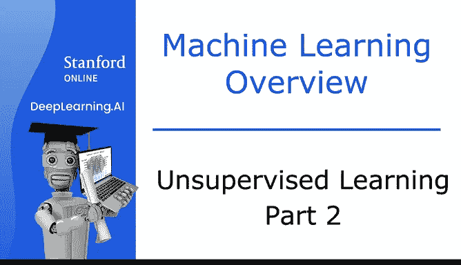
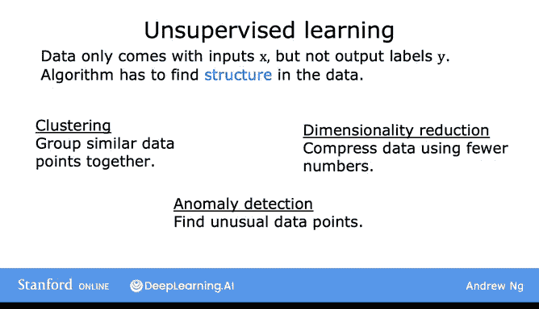
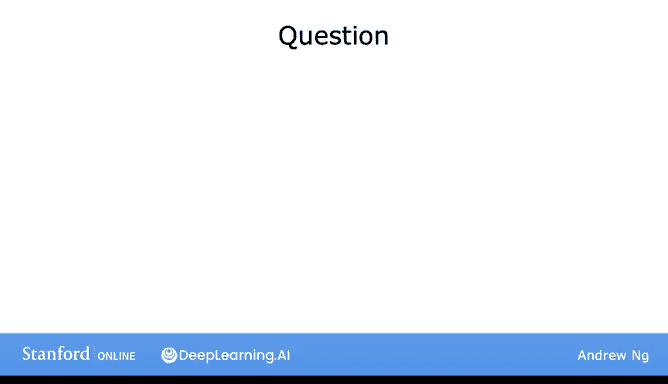

# 7：无监督学习第二部分 🧠

在本节课中，我们将学习无监督学习的正式定义，并简要了解聚类之外的其它无监督学习类型。

上一节我们介绍了什么是无监督学习以及一种称为“聚类”的无监督学习类型。本节中，我们将给出无监督学习一个更正式的定义，并快速浏览除聚类之外的一些其它无监督学习类型。

## 无监督学习的定义 📖

在监督学习中，数据同时包含输入 **X** 和输出标签 **Y**。而在无监督学习中，数据**仅包含输入 X，不包含输出标签 Y**。算法的任务是从数据中发现一些结构、模式或有趣的信息。

## 无监督学习的类型 🔍

以下是三种主要的无监督学习类型：

*   **聚类算法**：正如上一节所见，它将相似的数据点分组在一起。
*   **异常检测**：用于检测异常事件。这在金融系统的欺诈检测中非常重要，因为异常事件或交易可能是欺诈的迹象。
*   **降维**：它允许你将大数据集压缩成小得多的数据集，同时尽可能少地丢失信息。

如果你对异常检测和降维的概念还不太理解，请不要担心，我们将在后续课程中深入探讨。

## 理解检查 ✅

现在，我想请你回答一个问题，以检查你的理解。请不要有压力，第一次尝试没有答对也完全没关系。

请从以下选项中，选出你认为属于无监督学习的例子（其中两个是无监督学习例子，两个是监督学习例子）：

*   **垃圾邮件过滤**：如果你有标记为垃圾邮件或非垃圾邮件的数据，这可以作为一个监督学习问题来处理。
*   **新闻故事分组**：这正是上一节视频中提到的谷歌新闻例子，你可以使用聚类算法将新闻文章分组，因此这属于无监督学习。
*   **市场细分**：正如之前提到的，你可以将其作为一个无监督学习问题，因为你可以给算法一些数据，让它自动发现市场细分。
*   **糖尿病诊断**：这很像监督学习视频中的乳腺癌例子，只是将“良性/恶性肿瘤”换成了“是否患有糖尿病”。因此，你可以像处理乳腺肿瘤分类问题一样，将其作为监督学习问题来处理。

## 总结与展望 🚀

本节课中，我们一起学习了无监督学习的正式定义，并认识了聚类、异常检测和降维这三种主要类型。尽管本节主要讨论了聚类，但在本系列的后续课程中，我们将更深入地探讨异常检测和降维。

在结束本节之前，我想分享一个我认为非常令人兴奋且有用的工具——**Jupyter Notebook** 在机器学习中的应用。让我们在下一个视频中一探究竟。