# 8：Jupyter笔记本入门指南 🚀

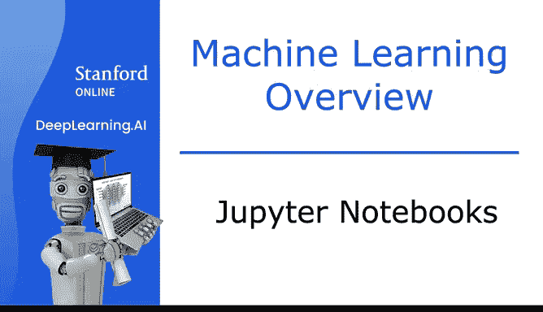

在本节课中，我们将学习机器学习领域最广泛使用的工具之一——Jupyter笔记本。我们将了解它的基本结构、两种核心单元格类型，并学习如何运行和修改代码。通过实际操作，你将能更直观地理解之前课程中介绍的监督学习和无监督学习概念。

---

## 概述

前面的视频介绍了监督学习和无监督学习，并展示了相关示例。

为了让你更深入地理解这些概念，本节课邀请你查看、运行代码，并在未来尝试自己编写代码来实现这些概念。

目前机器学习和数据科学从业者最广泛使用的工具是 **Jupyter Notebook**。这是一个默认的开发环境，许多人用它来编写实验代码和尝试新想法。在本节课中，你将直接在网页浏览器中使用Jupyter笔记本环境来亲自测试这些概念。

这不是一个简化或虚构的环境。这正是开发者在许多大型公司中使用的、完全相同的Jupyter笔记本工具。

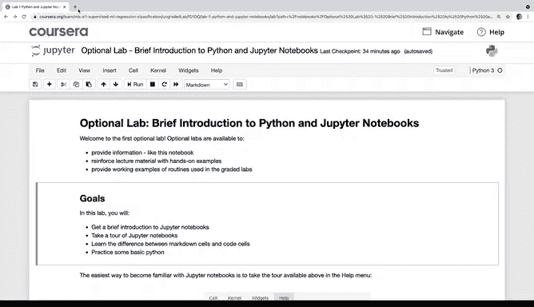

---

## 可选实验与实践实验

在本课程中，你会看到一类称为 **可选实验** 的练习。

以下是可选实验的特点：
*   它们设计得非常简单，我保证你能轻松完成每一个，因为它们不计分。
*   你只需要打开它，运行我们提供的代码即可。
*   通过阅读和运行可选实验中的代码，你将看到机器学习代码是如何运行的。
*   你应该能够相对快速地完成它们，只需从上到下逐行运行代码。

可选实验完全是可选的，如果你不想做，完全可以不做。但我希望你能看一看，因为运行它们会让你对机器学习算法和代码有更深的体会和更多经验。

从下周开始，还会有一些 **实践实验**，它们将为你提供自己编写部分代码的机会。但我们下周再讨论这个，现在不用担心。我希望你先完成下一个可选实验，并学完本周的其余内容。

---

## Jupyter笔记本界面初览

让我们看一个笔记本的例子。这是你打开第一个可选实验时会看到的界面。

你可以自由地上下滚动、浏览、将鼠标悬停在不同的菜单上，并查看这里的各种选项。

你可能会注意到笔记本中有两种类型的块，它们也被称为 **单元格**。

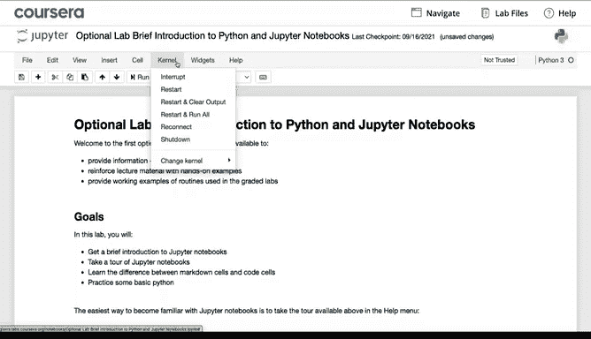

---

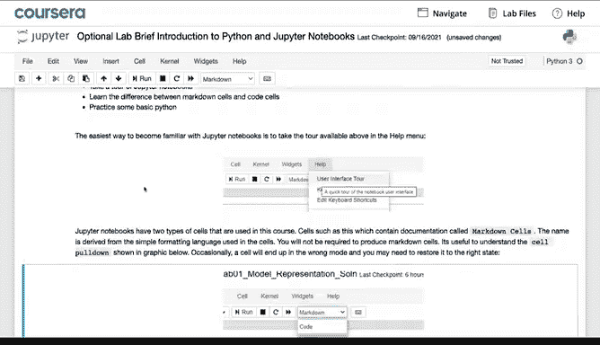

## 两种核心单元格类型

笔记本中有两种类型的单元格。

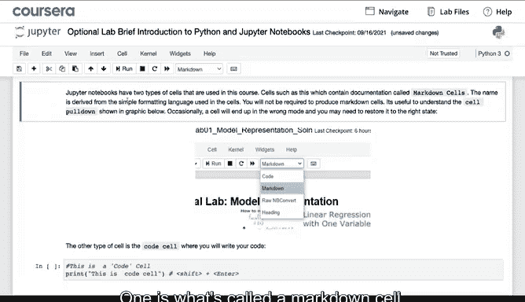

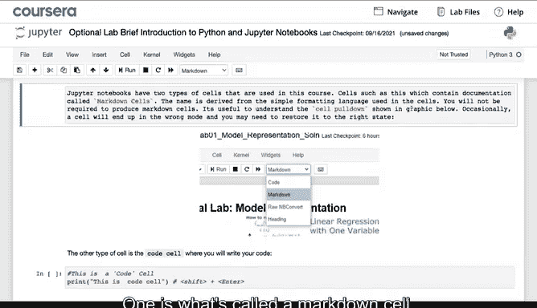

第一种是 **Markdown单元格**，它基本上是一堆文本。在这里，如果你不喜欢我们写的文本，实际上可以编辑它。这些文本用于描述代码。

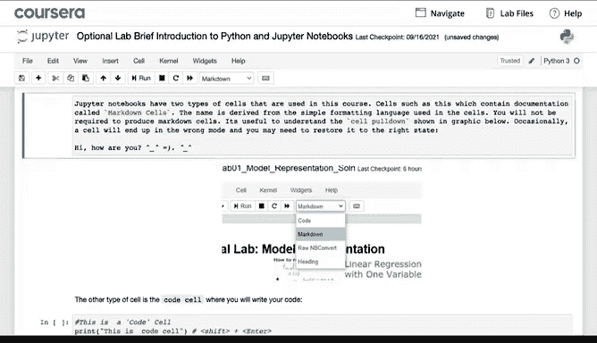

第二种类型的块或单元格看起来像这样，它是一个 **代码单元格**。

这里我们已经提供了代码。如果你想运行这个代码单元格，按 `Shift + Enter` 将会运行此代码单元格中的代码。

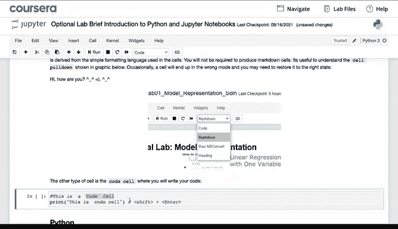

顺便说一下，如果你点击一个Markdown单元格（它显示所有这些格式化标记），也可以在键盘上按 `Shift + Enter`，这也会将其转换回格式美观的文本。

这个可选实验展示了一些常见的Python代码，之后你可以在自己的Jupyter笔记本中运行它们。

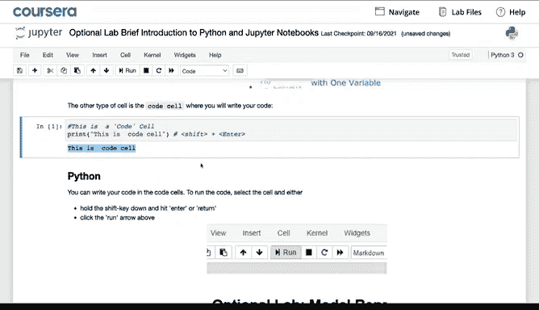

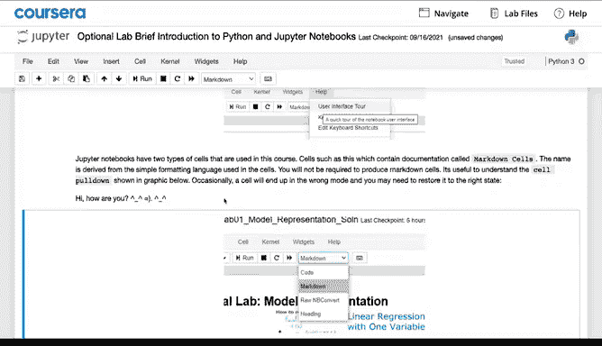

---

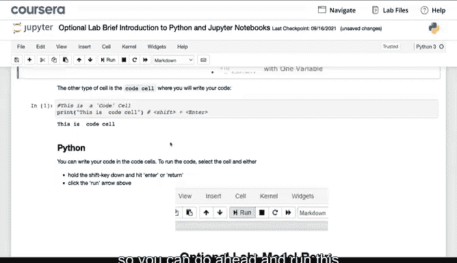

## 如何操作与练习

当你自己进入这个笔记本时，我希望你做的是：**选择单元格并按 `Shift + Enter`**。

阅读代码，看看它是否有意义，尝试预测你认为这段代码会做什么，然后按 `Shift + Enter`。

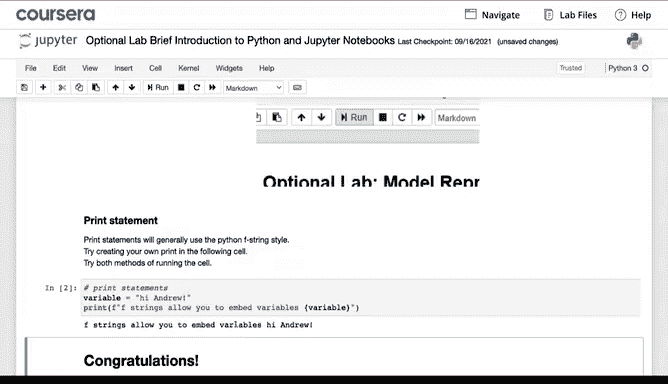

接着看看代码实际做了什么。如果你愿意，可以随意进入并编辑代码，更改代码，然后运行它，看看会发生什么。

如果你以前没有在Jupyter笔记本环境中操作过，我希望你能更加熟悉Python和Jupyter笔记本。我花了大量时间在Jupyter笔记本中探索，因此我也希望你能从中获得乐趣。

---

## 总结

本节课中，我们一起学习了Jupyter笔记本的基本使用。我们了解了它是机器学习实践的核心工具，区分了**可选实验**和**实践实验**，并重点掌握了笔记本中两种核心单元格：**Markdown单元格**（用于文本描述）和**代码单元格**（用于编写和执行代码）。关键的操作是使用 `Shift + Enter` 来运行单元格。

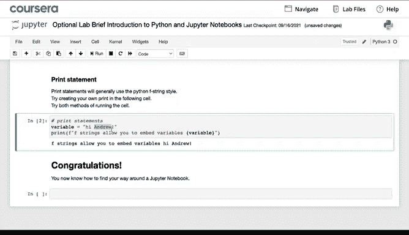

完成这些后，我期待在下一个视频中与你再见。在那里，我们将选取一个监督学习问题，并开始构建我们的第一个监督学习算法。我希望那也会很有趣，期待在那里见到你。😊