# 9：线性回归模型（第一部分）🏠📈

在本节课中，我们将学习监督学习的整体流程，并介绍本课程的第一个模型——线性回归模型。线性回归模型通过拟合一条直线来预测数据，是当今世界上应用最广泛的学习算法之一。熟悉线性回归后，这里涉及的许多概念也将适用于本专业后续课程中介绍的其他机器学习模型。

## 监督学习与线性回归简介

上一节我们概述了课程内容，本节中我们来看看如何应用线性回归解决一个具体问题。假设你想根据房屋面积来预测其价格，这是我们本周早些时候看到的一个例子。我们将使用美国波特兰市的房屋面积和价格数据。下图展示了这些数据，其中横轴代表房屋面积（平方英尺），纵轴代表房屋价格（千美元）。

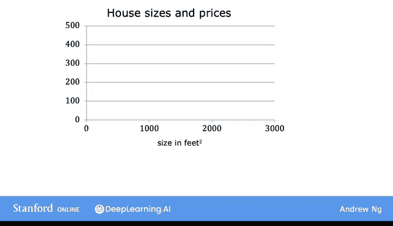

我们在图中绘制了数据集中各个房屋的数据点。每个数据点（这些小叉号）代表一栋房屋，包含其面积和最近的售价。

现在，假设你是波特兰的一名房地产经纪人，正在帮助一位客户出售她的房屋。她问你：“你认为这栋房子能卖多少钱？”这个数据集可以帮助你估算她可能获得的价格。你首先测量了房屋的面积，结果是1250平方英尺。你认为这栋房子能卖多少钱？一种方法是根据数据集构建一个线性回归模型。你的模型将为数据拟合一条直线，可能如下图所示。

基于这条拟合数据的直线，你可以看到，如果一栋房屋的面积是1250平方英尺，它将在此处与拟合线相交。如果你将其追踪到左侧的纵轴，可以看到价格大约在22万美元左右。这就是一个监督学习模型的例子。

我们称之为监督学习，因为你首先通过提供包含正确答案的数据来训练模型。你为模型提供了房屋面积以及模型应为每栋房屋预测的价格的示例。

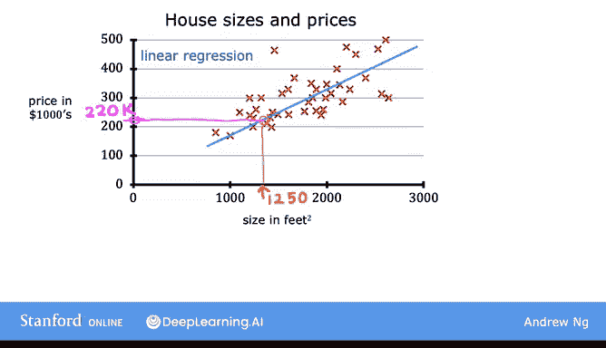
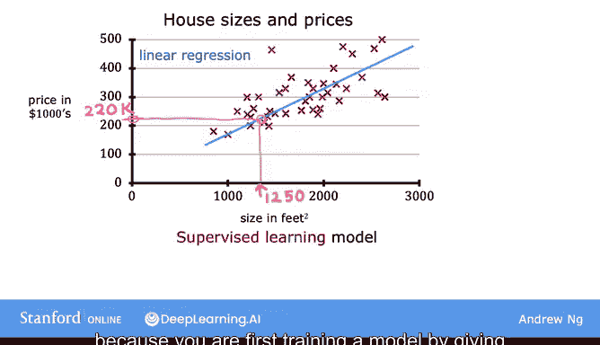

在这里，数据集中每栋房屋的价格（即正确答案）是已知的。这个线性回归模型是一种特定类型的监督学习模型，被称为回归模型，因为它预测数字作为输出，例如以美元计的价格。任何预测数字（如220000、1.5或-33.2）的监督学习模型都在解决所谓的回归问题。因此，线性回归是回归模型的一个例子，但还有其他模型用于解决回归问题，我们将在本专业的第二门课程中看到其中一些。

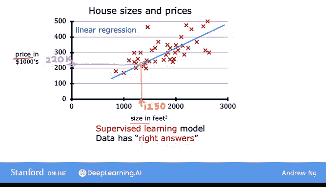
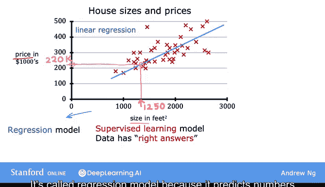

提醒一下，与回归模型相对，另一种最常见的监督学习模型称为分类模型。分类模型预测类别或离散类别，例如预测一张图片是猫（喵）还是狗（汪）。

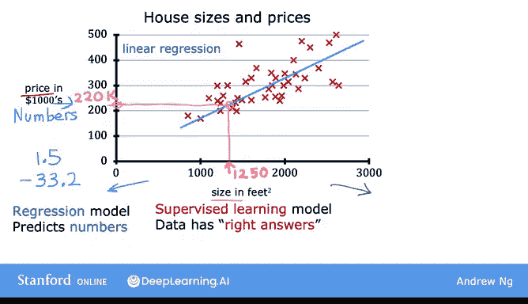
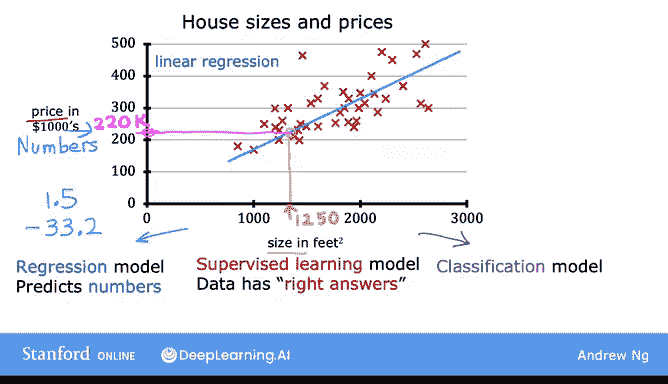
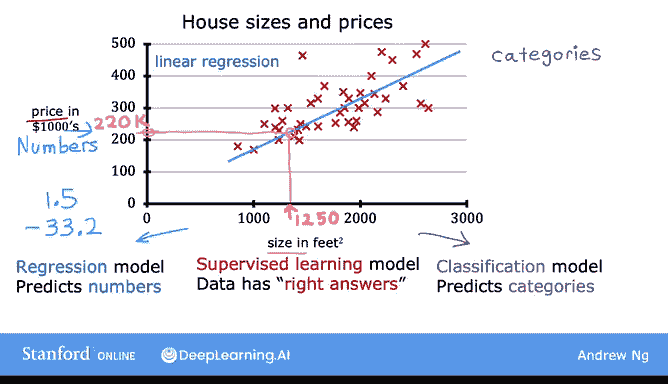

或者，给定医疗记录，预测患者是否患有特定疾病。你将在本课程后面了解更多关于分类模型的内容。

因此，关于分类和回归的区别，需要记住的是：在分类中，只有少量可能的输出。如果你的模型识别猫与狗，那就是两种可能的输出；或者你可能试图识别患者10种可能的医疗状况中的任何一种。所以，如果存在一个离散的、有限的可能输出集合，我们称之为分类问题。而在回归中，模型可以输出的数字有无限多种可能。

## 数据的两种表示方式

除了将数据可视化为左侧的图表外，还有另一种查看数据的有用方式，那就是右侧的数据表。数据包含一组输入（这是房屋面积，即此列）和输出（你试图预测的价格，即此列）。

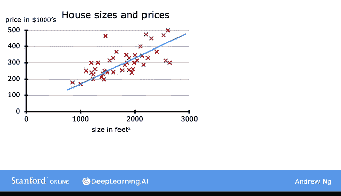

注意，横轴和纵轴对应于这两列：面积和价格。

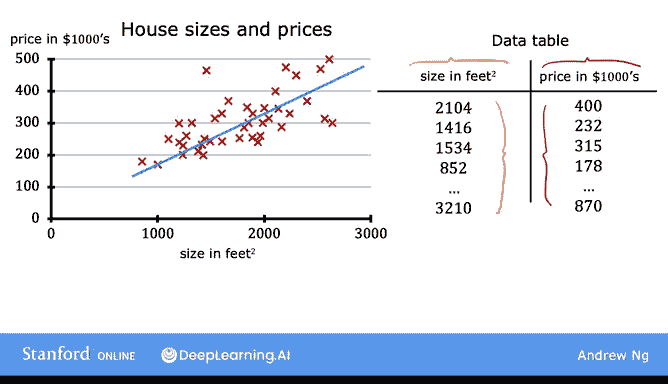
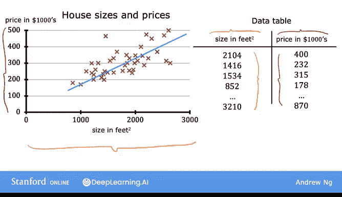

因此，如果数据表中有47行，那么左侧图表上就有47个这样的叉号，每个叉号对应表中的一行。

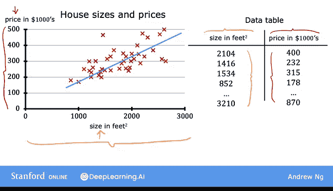

例如，表的第一行是一栋面积为2104平方英尺的房屋。所以，它大约在这里。这栋房屋以40万美元售出，大约在这里。因此，表的第一行被绘制为此处的数据点。

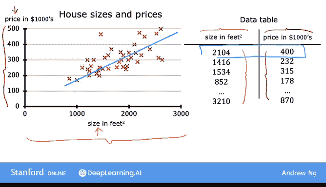
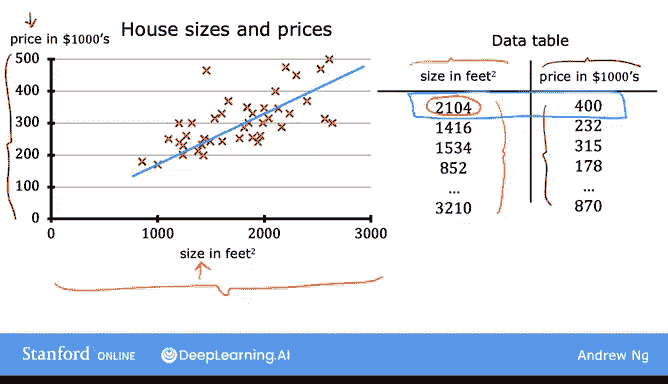
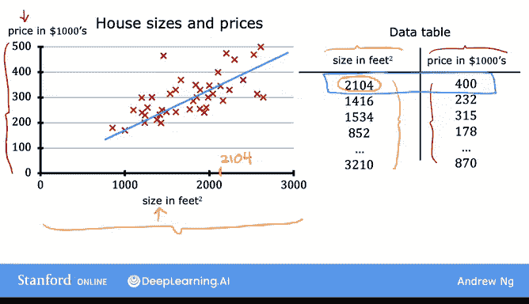
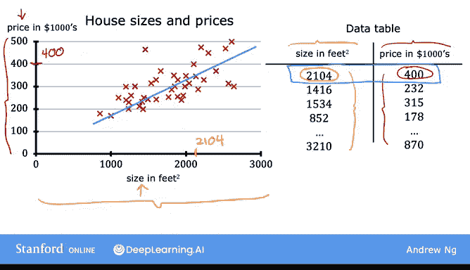

## 机器学习标准符号

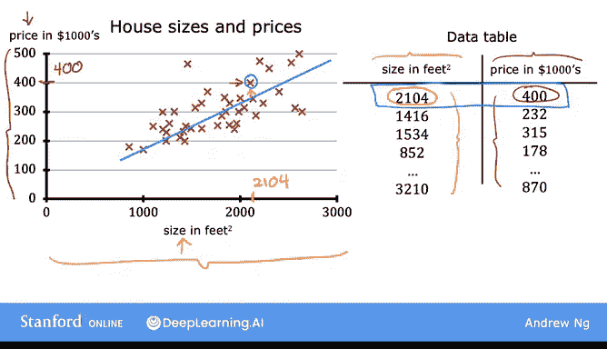

现在，让我们看看描述数据的一些符号。这些符号在你整个机器学习旅程中都会很有用。随着你对机器学习术语越来越熟悉，这些术语也将用于你与他人讨论机器学习概念，因为其中很多在人工智能领域是相当标准的。你将在本专业中多次看到这些符号，所以第一次看时记不住所有内容也没关系，随着时间的推移自然会更加熟悉。

你刚刚看到的、用于训练模型的数据称为**训练集**。

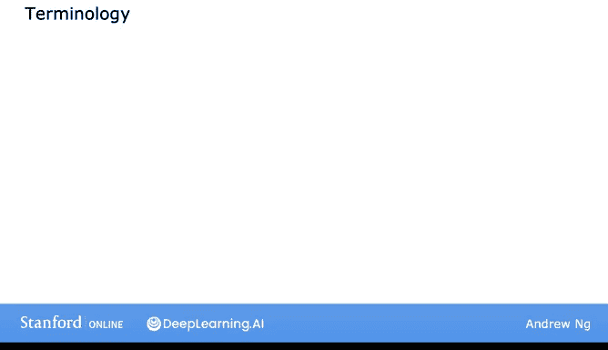

注意，你客户的房屋不在此数据集中，因为它尚未售出，所以没有人知道它的价格。因此，要预测你客户房屋的价格，你首先训练模型从训练集中学习，然后该模型可以预测你客户房屋的价格。

在机器学习中，表示输入的标准符号是小写字母 **x**，我们称之为**输入变量**，也称为**特征**或**输入特征**。例如，对于训练集中的第一栋房屋，x 是房屋的面积，所以 **x = 2104**。

表示输出变量（即你试图预测的变量，有时也称为**目标变量**）的标准符号是小写字母 **y**。因此，这里 **y** 是房屋的价格。对于第一个训练示例，**y = 400**。

数据中每栋房屋对应一行，在这个训练集中，有47行，每行代表一个不同的**训练示例**。

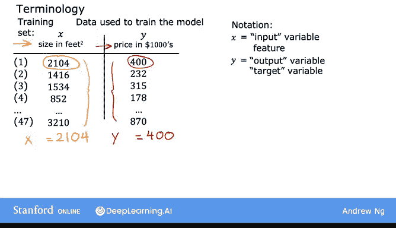
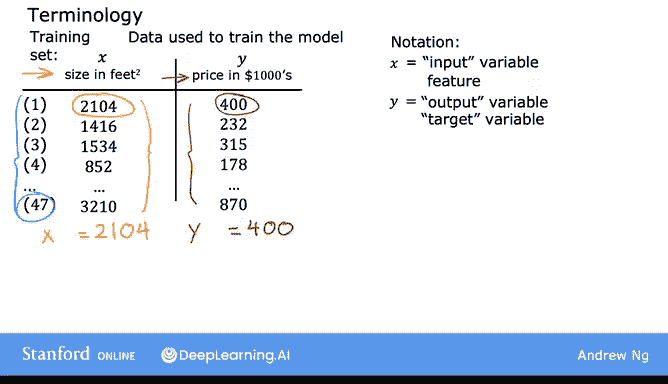

我们将使用小写字母 **m** 来指代训练示例的总数，因此这里 **m = 47**。

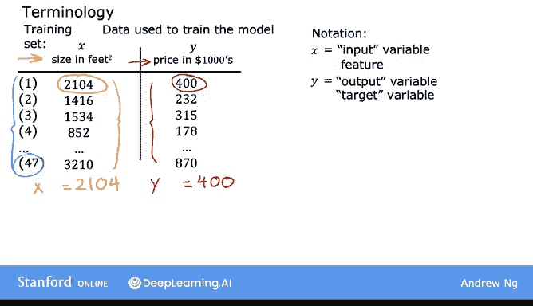

为了表示单个训练示例，我们将使用符号 **(x, y)**。因此，对于第一个训练示例，**(x, y)** 这对数字是 **(2104, 400)**。

现在我们有很多不同的训练示例，实际上有47个。为了指代特定的训练示例（这对应于左侧表中的特定行），我将使用符号 **x⁽ⁱ⁾, y⁽ⁱ⁾**。

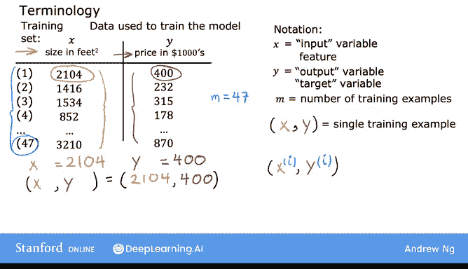

上标告诉我们这是第 **i** 个训练示例，例如第一个、第二个或第三个，直到第47个训练示例。这里的 **i** 指的是表中的特定行。

例如，这是第一个示例。当训练集中 **i = 1** 时，**x⁽¹⁾ = 2104**，**y⁽¹⁾ = 400**。我们在这里也添加上标¹。请注意，这个带括号的上标 **i** 不是指数运算。所以当我写这个时，这不是 x²，也不是 x 的 2 次方。它只是指第二个训练示例。因此，这个 **i** 只是训练集中的一个索引，指的是表中的第 **i** 行。

## 总结

本节课中我们一起学习了监督学习的基本流程，并深入探讨了线性回归模型。我们通过一个预测房屋价格的例子，了解了如何用训练集数据拟合一条直线来进行预测。我们还学习了机器学习中的标准符号，包括训练集、输入变量 **x**、输出变量 **y**、训练示例数量 **m** 以及表示单个训练示例的 **(x⁽ⁱ⁾, y⁽ⁱ⁾)**。这些概念和符号是理解更复杂机器学习模型的基础。在下一个视频中，我们将探讨如何将这个训练集输入学习算法，以便算法能从这些数据中学习。