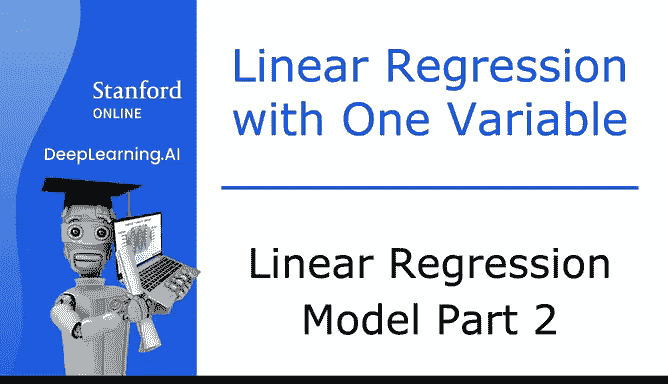
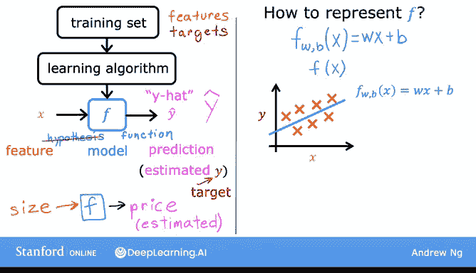
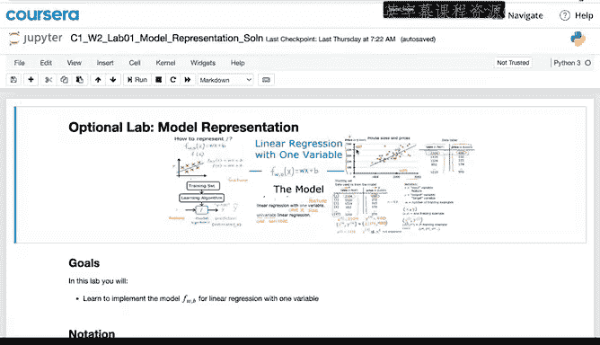
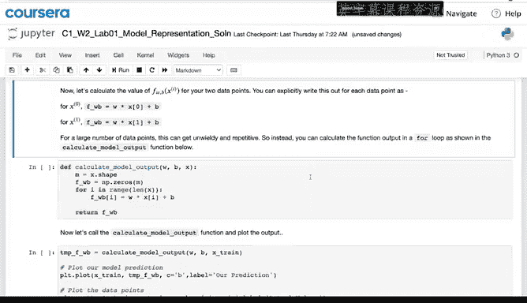
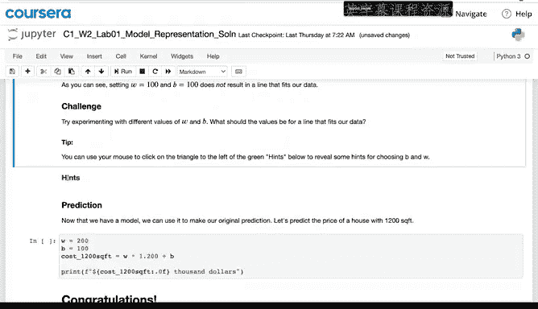
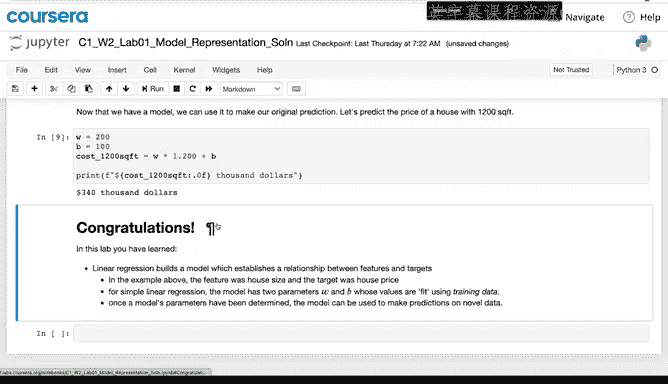

# 10：线性回归模型第二部分 🏠➡️💰

在本节课中，我们将要学习监督学习算法是如何工作的。具体来说，我们将了解算法如何处理数据集，以及它最终会输出什么。通过这个过程，我们将建立起对线性回归模型的直观理解。

## 监督学习的工作流程

上一节我们介绍了监督学习的基本概念。本节中我们来看看一个监督学习算法的具体工作流程。

监督学习中的训练集同时包含输入特征（例如房屋面积）和输出目标（例如房屋价格）。输出目标是模型将要学习的正确答案。

为了训练模型，你需要将训练集（包括输入特征和输出目标）输入到你的学习算法中。然后，你的监督学习算法会产生一个函数。

我们将这个函数写作小写的 **f**，其中 **f** 代表函数。这个函数过去常被称为“假设”，但在本课程中，我将其称为函数 **f**。函数 **f** 的任务是接收一个新的输入 **x**，并输出一个估计值或预测值，我将其称为 **ŷ**（读作“y hat”）。

在机器学习中，惯例是 **ŷ** 代表对 **y** 的估计或预测。函数 **f** 被称为**模型**。**x** 被称为**输入**或**输入特征**，模型的输出是预测值 **ŷ**。模型的预测是 **y** 的估计值。当符号只是字母 **y** 时，它指的是**目标**，即训练集中的实际真实值。相比之下，**ŷ** 是一个估计值，它可能等于也可能不等于实际真实值。

例如，如果你在帮助客户卖房，那么房屋的真实价格在他们售出之前是未知的。因此，你的模型 **f** 根据面积输出一个价格，这个价格是对真实价格的估计或预测。

## 如何表示函数 f

当我们设计学习算法时，一个关键问题是：我们将如何表示函数 **f**？换句话说，我们将使用什么数学公式来计算 **f**？

目前，我们假设 **f** 是一条直线。因此，你的函数可以写成：
`f_{w,b}(x) = w * x + b`

我稍后会定义 **w** 和 **b**。现在你只需要知道 **w** 和 **b** 是数字，为 **w** 和 **b** 选择的值将根据输入特征 **x** 决定预测值 **ŷ**。所以，`f_{w,b}(x)` 表示 **f** 是一个以 **x** 为输入的函数，根据 **w** 和 **b** 的值，**f** 将输出某个预测值 **ŷ**。

有时，为了简化，我会直接写成 `f(x)`，而不显式地在下标中包含 **w** 和 **b**。这只是一种简化的表示法，其含义与 `f_{w,b}(x)` 完全相同。

## 可视化线性回归模型

让我们将训练集绘制在图表上，其中输入特征 **x** 在横轴上，输出目标 **y** 在纵轴上。算法从这些数据中学习，并生成一条最佳拟合线，可能就像这里显示的这条。

这条直线就是线性函数：`f_{w,b}(x) = w * x + b`，或者更简单地写作 `f(x) = w * x + b`。这个函数的作用是使用 **x** 的直线函数来预测 **y** 的值。

你可能会问，为什么我们选择线性函数（直线）而不是像曲线或抛物线那样的非线性函数呢？有时，你确实希望拟合更复杂的非线性函数，比如一条曲线。但由于线性函数相对简单且易于处理，我们将其作为基础，这最终将帮助你理解更复杂的非线性模型。

## 模型名称：线性回归

这个特定的模型有一个名称，叫做**线性回归**。更具体地说，这是**单变量线性回归**，其中“单变量”意味着只有一个输入变量或特征 **x**，即房屋的面积。单输入变量线性模型的另一个名称是**一元线性回归**，其中“uni”在拉丁语中意为“一”，“variate”意为“变量”，所以“univariate”只是“一个变量”的一种花哨说法。

在后面的视频中，你还会看到回归的另一种形式，即你希望基于不止房屋面积，而是基于你可能知道的关于房屋的其他一系列信息（如卧室数量和其他特征）来进行预测。

顺便提一下，看完这个视频后，还有一个可选的实验。你不需要编写任何代码，只需查看并运行代码，看看它做了什么。这个实验将向你展示如何在 Python 中定义一个直线函数，并让你尝试选择 **w** 和 **b** 的值来拟合训练数据。如果你不想做这个实验，可以不做，但我希望你在看完这个视频后能尝试一下。

## 引入成本函数

以上就是线性回归的基本概念。为了让这个模型真正工作，你必须做的最重要的事情之一就是构建一个**成本函数**。成本函数的概念是机器学习中最普遍和最重要的思想之一，它既用于线性回归，也用于训练世界上许多最先进的人工智能模型。

本节课中我们一起学习了监督学习算法的工作流程，特别是线性回归模型的表示方法。我们了解到，模型 `f` 是一个以 `w` 和 `b` 为参数的线性函数，用于根据输入 `x` 预测输出 `ŷ`。我们还介绍了线性回归（特别是单变量线性回归）的基本概念。为了评估和优化模型，我们需要一个关键工具——成本函数，这将是下一节的重点。