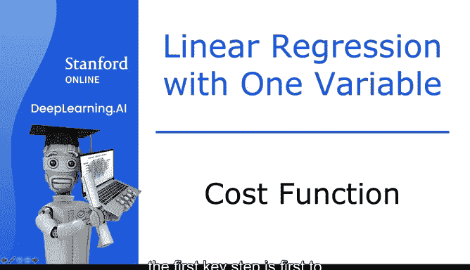
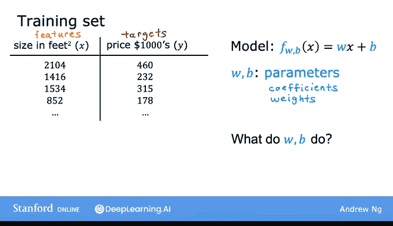
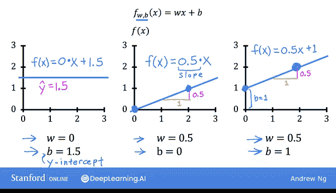
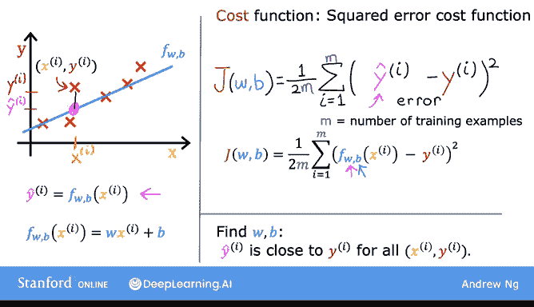

# 11：成本函数公式 📊

在本节课中，我们将学习线性回归中的一个核心概念：成本函数。成本函数用于衡量模型预测的准确性，帮助我们找到最优的模型参数。



## 概述

为了实施线性回归，首要关键步骤是定义成本函数。成本函数能够告诉我们模型的性能，从而指导我们改进模型。接下来，我们将详细探讨成本函数的含义及其计算方法。

## 模型与参数



回忆一下，我们有一个训练集，包含输入特征 **X** 和输出目标 **Y**。


用于拟合该训练集的模型是线性函数：
```
f_wb(x) = w * x + b
```
其中，**w** 和 **b** 被称为模型的参数。

在机器学习中，模型参数是可以在训练过程中调整以改进模型的变量。有时，参数 **w** 和 **b** 也被称为系数或权重。

## 参数的作用

现在，让我们看看参数 **w** 和 **b** 的作用。


根据为 **w** 和 **b** 选择的不同值，会得到不同的函数 **f(x)**，从而在图上生成不同的直线。记住，我们可以将 **f(x)** 写作 **f_wb(x)** 的简写。



我们将查看一些 **f(x)** 在图表上的示例。也许你已经熟悉在图表上绘制直线，但即使这对你来说是复习，也希望这能帮助你建立关于参数 **w** 和 **b** 如何决定 **f** 的直觉。

*   当 **w = 0** 且 **b = 1.5** 时，**f** 看起来像一条水平线。在这种情况下，函数 `f(x) = 0 * x + 1.5`，所以 **f** 始终是一个常数值，它总是预测 **y** 的估计值为 1.5。因此，`ŷ` 总是等于 **b**。在这里，**b** 也被称为 **y 轴截距**，因为这是它与垂直轴（即图上的 y 轴）相交的地方。
*   第二个例子：如果 **w = 0.5** 且 **b = 0**，那么 `f(x) = 0.5 * x`。当 **x = 0** 时，预测值也是 0；当 **x = 2** 时，预测值是 `0.5 * 2 = 1`。这样就得到一条看起来像这样的线。注意，斜率是 0.5。所以，**w** 的值给出了直线的斜率。
*   最后，如果 **w = 0.5** 且 **b = 1**，那么 `f(x) = 0.5 * x + 1`。当 **x = 0** 时，`f(x) = b = 1`，所以直线在 **b**（y 轴截距）处与垂直轴相交。同时，当 **x = 2** 时，`f(x) = 2`，所以直线看起来像这样。同样，斜率是 0.5，由 **w** 的值给出。

## 拟合数据的目标


回忆一下，你有一个如上图所示的训练集。在线性回归中，我们希望选择参数 **w** 和 **b** 的值，使得函数 **f** 得到的直线能够很好地拟合数据，例如图中所示的这条线。

当我说直线在视觉上拟合数据时，你可以理解为：与其他可能的、离这些点不那么近的直线相比，由 **f** 定义的直线大致穿过或接近这些训练样本。

提醒一下符号表示：一个训练样本（例如这里的这个点）由 `(xⁱ, yⁱ)` 定义，其中 **yⁱ** 是给定输入 **xⁱ** 的目标值。

函数 **f** 也会为 **y** 生成一个预测值，它预测的 **y** 值是 `ŷⁱ`。对于我们选择的模型，`f(xⁱ) = w * xⁱ + b`。换句话说，预测值 `ŷⁱ = f_wb(xⁱ)`，其中对于我们的模型，`f(xⁱ) = w * xⁱ + b`。

那么现在的问题是：如何找到 **w** 和 **b** 的值，使得对于许多（甚至所有）训练样本 `(xⁱ, yⁱ)`，预测值 `ŷⁱ` 都接近真实目标值 **yⁱ**？

## 定义成本函数

为了回答这个问题，我们首先看看如何衡量一条直线对训练数据的拟合程度。为此，我们将构建成本函数。

成本函数接收预测值 `ŷ` 并将其与目标值 **y** 进行比较，计算 `ŷ - y`。这个差值称为**误差**，我们用它来衡量预测值与目标值之间的差距。

接下来，我们计算这个误差的平方。同时，我们希望为训练集中的不同训练样本 **i** 计算这个平方误差项。例如，在测量样本 **i** 的误差时，我们会计算这个平方误差项。

最后，我们希望衡量整个训练集上的误差。具体来说，我们像这样对平方误差求和：
```
从 i = 1 到 M 求和 (ŷⁱ - yⁱ)²
```
记住，**M** 是训练样本的数量（对于这个数据集是 47）。注意，当训练样本更多（**M** 更大）时，你的成本函数会计算出一个更大的数字，因为它对更多样本求和。

因此，为了构建一个不会随着训练集规模增大而自动变大的成本函数，按照惯例，我们将计算平均平方误差，而不是总平方误差。我们通过除以 **M** 来实现这一点。

我们快完成了。还有最后一件事：按照惯例，机器学习人员使用的成本函数实际上会除以 **2M**。额外的除以 2 只是为了让我们后续的一些计算更简洁，但无论是否包含这个除以 2，成本函数仍然有效。

所以，这里的这个表达式就是成本函数，我们将用 **J(w, b)** 来指代它。这也被称为**平方误差成本函数**，之所以这样命名，是因为你对这些误差项取了平方。

在机器学习中，不同的人会为不同的应用使用不同的成本函数，但平方误差成本函数是线性回归（以及所有回归问题）中最常用的一个，因为它似乎能为许多应用提供良好的结果。

提醒一下，预测值 `ŷ = f(x)`。因此，我们可以将成本函数 **J(w, b)** 重写为：
```
J(w, b) = (1 / (2M)) * Σ (f(xⁱ) - yⁱ)²
```
其中求和从 i = 1 到 M。

最终，我们希望找到能使成本函数 **J(w, b)** 值较小的 **w** 和 **b**。

## 总结



本节课中，我们一起学习了线性回归成本函数的核心概念。我们了解到，成本函数 **J(w, b)** 通过计算预测值与真实值之间的平均平方误差，来量化模型对训练数据的拟合程度。其公式为：
```
J(w, b) = (1 / (2M)) * Σ (ŷⁱ - yⁱ)²
```
其中 `ŷⁱ = w * xⁱ + b`。成本函数的值越小，表示模型的预测越准确。在接下来的课程中，我们将探讨如何利用成本函数来寻找最优的参数 **w** 和 **b**。