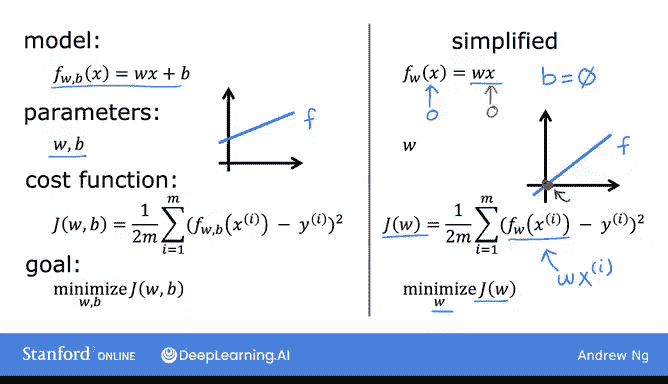
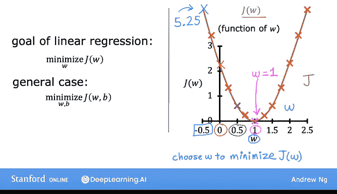

# 12：成本函数直观理解 📊

在本节课中，我们将学习成本函数的直观理解。我们将通过一个简化示例，展示成本函数如何帮助找到模型的最佳参数。我们将看到，通过调整参数，成本函数如何变化，并最终找到使成本最小的参数值。

---

## 成本函数回顾

上一节我们介绍了成本函数的数学定义。本节中，我们来看看成本函数在实际中是如何工作的。

成本函数 **J** 用于衡量模型预测值与实际值之间的差异。线性回归的目标是找到参数 **W** 和 **B**，使得成本函数 **J(W, B)** 最小化。数学上表示为：

\[
\min_{W, B} J(W, B)
\]

---

## 简化模型：仅使用参数 W

为了更好地可视化成本函数，我们使用一个简化模型：**F_W(x) = W * x**。这个模型去掉了参数 **B**（即设 **B = 0**），因此只包含一个参数 **W**。此时，成本函数 **J** 仅依赖于 **W**：

\[
J(W) = \frac{1}{2m} \sum_{i=1}^{m} (W \cdot x^{(i)} - y^{(i)})^2
\]

我们的目标是找到使 **J(W)** 最小的 **W** 值。

---

## 可视化模型与成本函数

我们将并排绘制模型 **F_W(x)** 和成本函数 **J(W)** 的图形，以展示它们之间的关系。

### 训练数据
假设训练集包含三个点：(1,1), (2,2), (3,3)。

### 当 W = 1 时
模型 **F_W(x)** 是一条斜率为 1 的直线，完美穿过所有数据点。此时，每个数据点的预测误差为 0，因此成本函数 **J(1) = 0**。

### 当 W = 0.5 时
模型 **F_W(x)** 是一条斜率为 0.5 的直线。此时，预测值与实际值之间存在误差。通过计算，我们得到 **J(0.5) ≈ 0.58**。

### 当 W = 0 时
模型 **F_W(x)** 是一条水平线（斜率为 0）。此时，预测误差较大，计算得 **J(0) ≈ 2.33**。

### 当 W = -0.5 时
模型 **F_W(x)** 是一条向下倾斜的直线。此时，预测误差更大，计算得 **J(-0.5) ≈ 5.25**。

---

## 成本函数图形

通过计算不同 **W** 值对应的成本，我们可以绘制出成本函数 **J(W)** 的图形。以下是不同 **W** 值对应的成本点：

- **W = 1** → **J = 0**
- **W = 0.5** → **J ≈ 0.58**
- **W = 0** → **J ≈ 2.33**
- **W = -0.5** → **J ≈ 5.25**

将这些点连接起来，我们可以看到成本函数 **J(W)** 是一个开口向上的抛物线，最小值出现在 **W = 1** 处。

---

## 如何选择最佳参数

成本函数 **J(W)** 的最小值对应着使模型拟合数据最好的 **W** 值。在这个例子中，**W = 1** 使得成本最小，因此是最佳选择。

对于完整的线性回归模型（包含参数 **W** 和 **B**），目标同样是找到使成本函数 **J(W, B)** 最小的参数值。

---

## 总结

本节课中，我们一起学习了成本函数的直观理解。通过简化模型，我们看到了不同参数值如何影响模型拟合和成本函数。成本函数的最小值对应着最佳参数，从而使模型能够最好地拟合数据。

在下一节课中，我们将可视化包含两个参数 **W** 和 **B** 的完整线性回归模型的成本函数，并探索其三维图形。让我们继续前进！