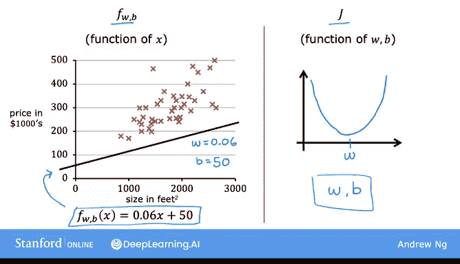
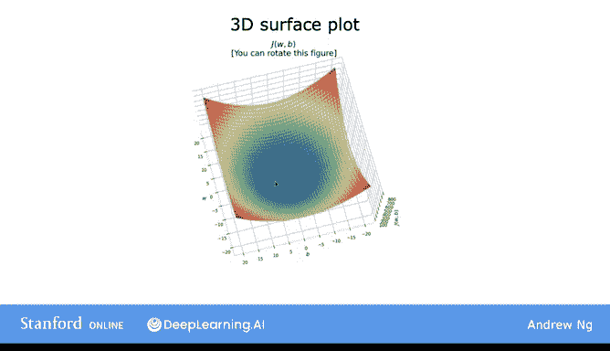
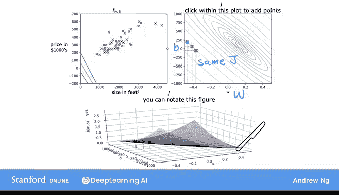

# 13：可视化成本函数 🎯


在本节课中，我们将学习如何可视化线性回归中的成本函数。通过直观的图形，你将更好地理解成本函数如何随模型参数变化，以及如何找到使成本最小化的参数值。

---

## 成本函数回顾

上一节我们介绍了成本函数 **J(W, B)** 的基本概念。成本函数用于衡量模型预测值与实际值之间的差异，我们的目标是通过调整参数 **W** 和 **B** 来最小化这个差异。

在上一节中，为了简化可视化，我们暂时将 **B** 设为 0。本节中，我们将回到包含两个参数的原始模型，并探索成本函数的更丰富可视化形式。

---

## 模型与成本函数

以下是我们的线性回归模型：



**模型公式：**
```
f(x) = W * x + B
```

**成本函数公式（均方误差）：**
```
J(W, B) = (1/2m) * Σ (f(x_i) - y_i)^2
```

其中：
- **W** 和 **B** 是模型参数
- **m** 是训练样本数量
- **x_i** 是第 i 个输入特征
- **y_i** 是第 i 个真实标签

我们的目标是找到使 **J(W, B)** 最小化的 **W** 和 **B** 值。

---

## 三维曲面图

当模型有两个参数 **W** 和 **B** 时，成本函数 **J(W, B)** 可以表示为一个三维曲面。这个曲面通常呈碗状（或吊床状），其最低点对应成本函数的最小值。


在这个三维图中：
- **水平轴**：参数 **W**
- **垂直轴**：参数 **B**
- **高度轴**：成本函数值 **J(W, B)**

曲面上每个点代表一对特定的 **W** 和 **B** 值，以及对应的成本函数值。例如，当 **W = -10** 且 **B = -15** 时，曲面上对应点的高度就是 **J(-10, -15)** 的值。



---

## 等高线图

为了更清晰地观察成本函数的细节，我们常用等高线图来替代三维曲面图。等高线图通过水平切片展示三维曲面，每个椭圆（或等高线）代表成本函数值相同的点集合。


在等高线图中：
- **水平轴**：参数 **W**
- **垂直轴**：参数 **B**
- **每个椭圆**：所有具有相同 **J(W, B)** 值的点

例如，图中三个标记点虽然对应不同的 **W** 和 **B** 值，但它们的成本函数值相同。这三个点对应的线性函数（见左上图）在预测房价时表现都不佳。



---

## 理解等高线图

如果你不熟悉等高线图，可以想象自己正从高空俯视一个碗形曲面。碗的底部（成本函数最小值）位于最小椭圆的中心。随着椭圆向外扩展，成本函数值逐渐增加。


等高线图是一种在二维平面上可视化三维成本函数的便捷方式。通过观察椭圆分布，我们可以直观判断参数调整方向，从而更快地找到成本函数的最小值。

---

## 总结

本节课中，我们一起学习了成本函数的两种可视化方法：

1. **三维曲面图**：直观展示成本函数随两个参数变化的整体形状。
2. **等高线图**：通过水平切片展示相同成本值的点，便于定位最小值。

这些可视化工具帮助我们理解线性回归中参数调整如何影响成本函数，并为后续的优化算法（如梯度下降）奠定基础。下一节中，我们将观察不同 **W** 和 **B** 值如何影响拟合直线，进一步巩固对成本函数的理解。