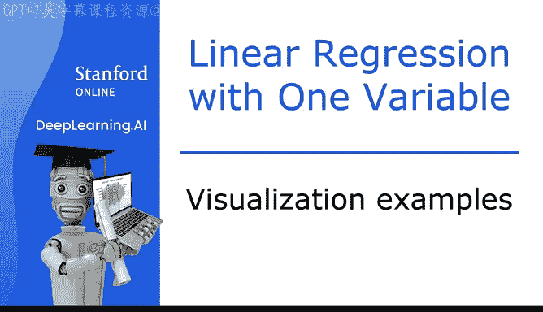
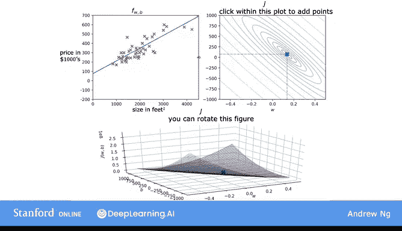
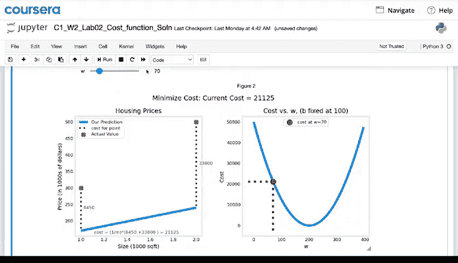
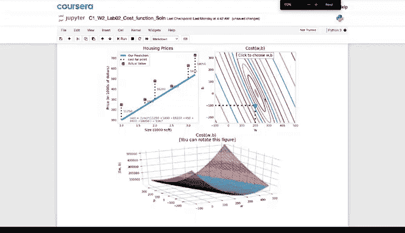
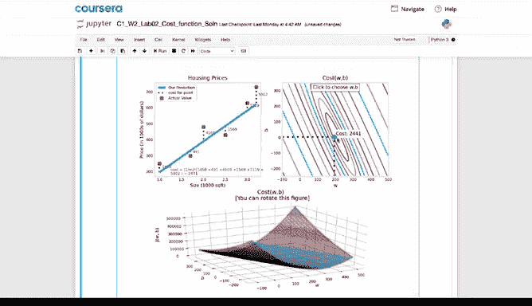
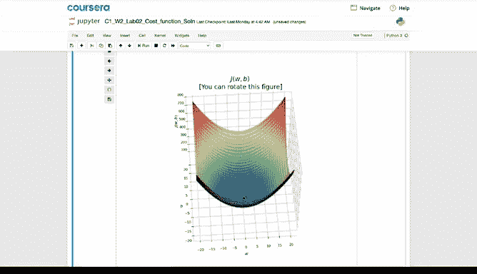

# 14：可视化理解成本函数与模型拟合 📊

在本节课中，我们将通过一系列可视化示例，直观地理解线性回归模型中参数 `w` 和 `b` 的选择如何影响模型对数据的拟合程度，以及这些选择如何反映在成本函数 `J(w, b)` 的图形上。我们将看到，寻找最佳拟合直线的过程，本质上就是寻找使成本函数最小化的参数值。

---

## 示例一：较差的拟合

上一节我们介绍了成本函数的概念，本节中我们来看看具体的可视化示例。首先，我们观察一个拟合效果较差的例子。

在成本函数 `J(w, b)` 的等高线图中，有一个特定的点。对于这个点，`w` 约等于 -0.15，`b` 约等于 800。这对 `(w, b)` 值对应着一个特定的成本 `J`。

事实上，这对 `(w, b)` 值对应着左侧的函数 `f(x)`，即图中的这条直线。这条直线在纵轴上的截距是 800，因为 `b = 800`；直线的斜率是 -0.15，因为 `w = -0.15`。

现在，观察训练集中的数据点，可以发现这条直线对数据的拟合效果不佳。对于这个 `f(x)` 函数，其预测的 `y` 值与训练数据中实际的 `y` 值相差甚远。

由于这条直线拟合效果差，在成本函数 `J` 的图形上，其对应的成本值位于此处，距离最小值相当远。这是一个相当高的成本，因为这对 `(w, b)` 的选择对训练集的拟合效果不好。

---

## 示例二：稍好但仍不理想的拟合

接下来，我们看另一个不同的 `(w, b)` 选择示例。

这是另一个函数，它仍然不是数据的理想拟合，但可能比上一个例子稍好一些。因此，图中这个点代表了产生那条直线的 `(w, b)` 参数对对应的成本。

此时，`w` 的值等于 0，`b` 的值约为 360。这对参数对应着这个函数，它是一条水平直线，因为 `f(x) = 0 * x + 360`。

---

## 示例三：更差的拟合

让我们再看一个例子。这是 `(w, b)` 的另一个选择，使用这些值，最终得到这条直线 `f(x)`。

同样，它对数据的拟合效果不佳，实际上，与上一个例子相比，它距离最小值更远。请记住，最小值位于最小椭圆的中心。

---

## 示例四：较好的拟合

最后一个例子，观察左侧的 `f(x)`，这看起来是对训练集的一个相当好的拟合。你可以在右侧看到，代表成本的点非常接近小椭圆的中心，虽然不是精确的最小值，但已经非常接近。

对于这对 `(w, b)` 值，你得到了这条直线 `f(x)`。可以看到，如果测量数据点与直线上预测值之间的垂直距离，就得到了每个数据点的误差。所有这些数据点的误差平方和，在所有可能的直线拟合中，已经非常接近可能的最小误差平方和。

---

## 可视化总结

希望通过观察这些图形，你能更好地理解参数的不同选择如何影响直线 `f(x)`，以及这如何对应于成本函数 `J` 的不同值。同时，希望你能看到，拟合效果更好的直线对应于成本函数 `J` 图形上更接近可能的最小成本的点。

---

## 可选实验：动手探索

在本视频之后的可选实验中，你将运行一些代码（所有代码都已提供，你只需按 Shift+Enter 运行并查看）。实验将向你展示成本函数在代码中是如何实现的。给定一个小型训练集和不同的参数选择，你将能够看到成本如何根据模型对数据的拟合程度而变化。

在可选实验中，你还可以操作一个交互式等高线图。你可以使用鼠标光标点击等高线图上的任意位置，然后会看到由你选择的参数 `w` 和 `b` 的值定义的直线。

你还会看到一个点出现在显示成本的 3D 曲面图上。最后，可选实验还有一个 3D 曲面图，你可以使用鼠标光标手动旋转和环绕，以便更好地观察成本函数的样子。

希望你能享受操作可选实验的乐趣。

---

## 从可视化到算法

在线性回归中，与其手动尝试从等高线图中读取 `w` 和 `b` 的最佳值（这并非一个好方法，并且一旦我们遇到更复杂的机器学习模型，这种方法将不再适用），我们真正需要的是一个高效的算法，可以编写成代码，自动找到使成本函数 `J` 最小化的参数 `w` 和 `b`，从而得到最佳拟合直线。

存在一种用于实现此目的的算法，称为**梯度下降**。该算法是机器学习中最重要的算法之一。梯度下降及其变体不仅用于训练线性回归，还用于训练人工智能中一些最大、最复杂的模型。

---

## 本节课总结

本节课中，我们一起学习了如何通过可视化图形，将参数 `(w, b)`、预测函数 `f(x)` 和成本函数 `J(w, b)` 联系起来。我们看到了不同的参数选择会导致不同的拟合直线和成本值，而最佳拟合对应于成本函数的最小值附近。这为我们理解后续将学习的、用于自动寻找这些最优参数的**梯度下降算法**奠定了直观的基础。