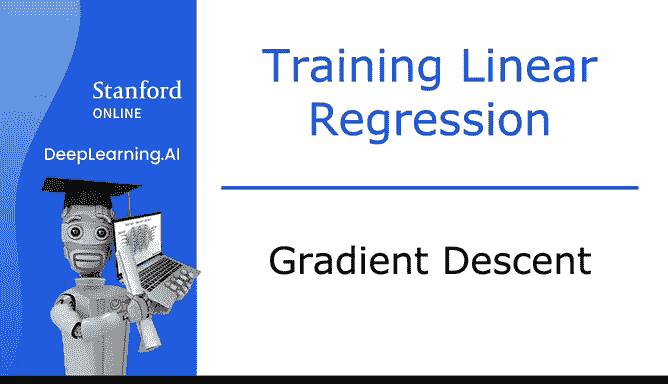
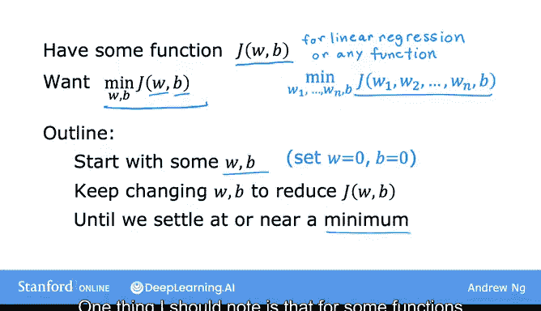

# 15：梯度下降法 🧭

在本节课中，我们将要学习一种名为“梯度下降”的算法。这是一种用于寻找函数最小值的系统化方法，在机器学习中应用广泛，不仅是线性回归，也是训练高级神经网络模型（深度学习）的基础。

## 概述

上一节我们介绍了成本函数 J 的可视化，以及如何通过尝试不同的参数 W 和 B 来获得不同的成本值。我们希望能有一种更系统的方法，来找到使成本函数 J(W, B) 值最小的 W 和 B。

事实证明，有一种叫做“梯度下降”的算法可以用来实现这个目标。梯度下降在机器学习中无处不在，不仅用于线性回归，也用于训练最先进的神经网络模型（即深度学习模型）。深度学习模型是你在第二门课程中会学习的内容。因此，学习梯度下降将为你奠定机器学习中最重要的基石之一。

以下是梯度下降的概述：你有一个想要最小化的成本函数 J(W, B)。在我们目前看到的例子中，这是线性回归的成本函数。但事实证明，梯度下降是一种可以用来尝试最小化任何函数的算法，而不仅仅是线性回归的成本函数。

为了使关于梯度下降的讨论更具一般性，梯度下降适用于更一般的函数，包括那些具有两个以上参数的模型所使用的其他成本函数。

例如，如果你有一个成本函数 J，它是参数 W1, W2, ..., WN 和 B 的函数。你的目标是在参数 W1 到 WN 和 B 上最小化 J。换句话说，你想为 W1 到 WN 和 B 选择一组值，使 J 的值尽可能小。事实证明，梯度下降也是一种可以用来尝试最小化这个成本函数 J 的算法。

## 梯度下降的工作原理

你要做的是，从对 W 和 B 的某个初始猜测开始。在线性回归中，初始值是什么通常不太重要，所以一个常见的选择是将它们都设为 0。例如，你可以设 W=0 和 B=0 作为初始猜测。

使用梯度下降算法，你将不断一点点地改变参数 W 和 B，试图降低成本 J(W, B)，直到 J 稳定在或接近一个最小值。

需要说明的一点是，对于某些函数 J，其形状可能不是“碗状”或“吊床状”，可能存在不止一个可能的最小值。

## 可视化梯度下降过程

让我们看一个更复杂的曲面图 J 的例子，来了解梯度下降在做什么。这个函数不是线性回归的平方误差成本函数。对于平方误差成本函数，你总是会得到一个碗状或吊床状的图形。但如果你在训练神经网络模型，你可能会得到这种类型的成本函数。

请注意坐标轴。底部坐标轴是 W 和 B。对于 W 和 B 的不同值，你在曲面 J(W, B) 上得到不同的点，而曲面在某点的高度就是成本函数的值。

现在，让我们想象这个曲面图实际上是一个略有起伏的户外公园或高尔夫球场的视图，高点是小山，低点是山谷。

请你想象一下，你正物理地站在这座山上的这个点。为了帮助你放松，想象这里有非常漂亮的绿草、蝴蝶和鲜花，是一座非常漂亮的山。你的目标是从这里出发，尽可能高效地到达其中一个山谷的底部。

梯度下降算法的作用是：你将原地旋转 360 度，环顾四周。如果我要朝某个方向迈出非常小的一步，并且我希望尽快下山，走向其中一个山谷。我应该选择哪个方向来迈出这一小步？

事实证明，如果你想尽可能高效地下山，如果你站在山上的这个点并环顾四周，你可能会注意到，下山的最佳方向大致是那个方向。在数学上，这是**最陡下降**的方向。这意味着，当你迈出一小步时，这一步带你下山的速度，比你朝任何其他方向迈出的一小步都要快。

所以，在迈出这第一步之后，你现在到了山上的这个点。

现在让我们重复这个过程。站在这个新点上，你将再次旋转 360 度，问自己：为了向下移动，我应该朝哪个方向迈出下一小步？如果你这样做并迈出另一步，你会朝那个方向移动一点，然后可以继续前进。

从这个新点，你可以再次环顾四周，决定哪个方向能让你最快地下山。再迈一步，又一步，如此继续，直到你发现自己位于这个山谷的底部，也就是这里的这个局部最小值。

你刚才所做的就是进行了多步梯度下降。

## 梯度下降的一个有趣特性

请记住，你可以通过选择参数 W 和 B 的起始值来选择曲面上的一个起始点。刚才你执行梯度下降时，是从这里的这个点开始的，对吧？

现在，想象一下，如果你再次尝试梯度下降，但这次你通过选择参数将起始点设置在右边几步远的地方。

如果你然后重复梯度下降过程，这意味着你环顾四周，朝最陡下降的方向迈出一小步。所以你最终到达这里，然后你再次环顾四周，再迈一步，依此类推。如果你第二次运行梯度下降，从我们第一次运行的位置向右几步远的地方开始，那么你最终会到达一个完全不同的山谷，即右边这个不同的最小值。

第一个和第二个山谷的底部都被称为**局部最小值**。因为如果你开始下第一个山谷，梯度下降不会引导你到第二个山谷；同样，如果你开始下第二个山谷，你会停留在那个最小值中，而不会找到进入第一个局部最小值的路径。

所以这是梯度下降算法的一个有趣特性，你将在后面看到更多相关内容。

在本视频中，你看到了梯度下降如何帮助你下山。在下一个视频中，让我们看看可以实现梯度下降工作的数学表达式。让我们继续下一个视频。

## 总结

本节课中我们一起学习了梯度下降算法的基本概念。它是一种通过迭代调整参数（如 W 和 B）来最小化成本函数 J 的系统方法。我们从初始猜测出发，反复计算最陡下降方向并迈出一小步，从而逐步逼近函数的最小值。我们还了解到，对于非凸函数，可能存在多个局部最小值，梯度下降的最终结果可能取决于起始点的选择。这为我们后续学习其数学实现奠定了基础。