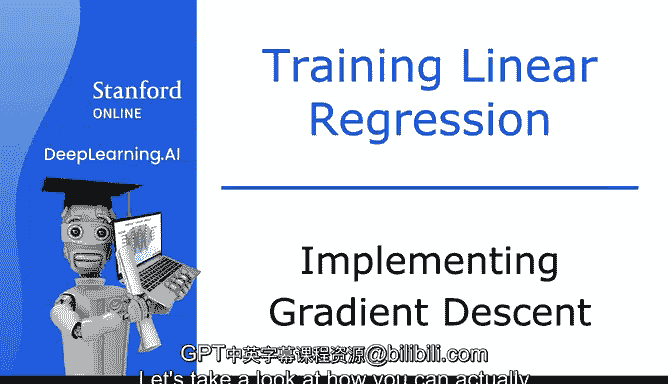
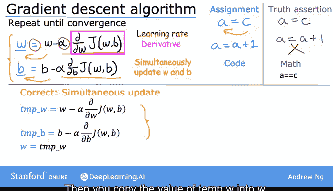

# 16：实现梯度下降法 🧠

在本节课中，我们将学习如何实际实现梯度下降算法。我们将详细拆解算法的每一步，理解其核心概念，并确保以正确的方式更新参数。

---

## 梯度下降算法公式

梯度下降算法的核心公式如下：

在每一步中，参数 **w** 都会根据以下规则更新：新的 **w** 等于旧的 **w** 减去学习率 **α** 乘以成本函数 **J(w, b)** 对 **w** 的偏导数。

这个表达式的含义是：通过取 **w** 的当前值，并减去右侧的表达式（**α** 乘以导数项）来调整参数 **w**。

如果你觉得这个公式包含很多内容，不用担心，我们将一起逐步解析它。

---

## 理解等号的含义

首先，我们需要注意这里的等号。

在这个上下文中，等号是**赋值运算符**。具体来说，在编程中，`a = c` 意味着将 **c** 的值存储到变量 **a** 中。而 `a = a + 1` 意味着将 **a** 的值增加 1。

这与数学中的**真值断言**不同。在数学中，`a = c` 是断言 **a** 和 **c** 的值相等。在编程语言（如Python）中，真值断言通常写作 `a == c`。

在本课程中，我会尽量明确等号是用于赋值还是断言。

---

## 学习率 α 的作用

公式中的符号 **α** 是希腊字母，在这里被称为**学习率**。

学习率通常是一个介于 0 和 1 之间的小正数，例如 0.01。

**α** 的作用是控制你下山（即向成本函数最小值移动）的步长大小。

*   如果 **α** 很大，意味着你采取激进的梯度下降步骤，试图大步下山。
*   如果 **α** 很小，意味着你采取微小的婴儿步下山。

我们将在后续课程中更深入地探讨如何选择合适的学习率 **α**。

---

## 导数项的作用

最后，公式中的这一项是成本函数 **J** 的**导数项**。

现在我们先不深入导数的细节，你可以暂时将这个用洋红色框标出的导数项理解为：它告诉你想朝哪个方向迈出婴儿步。结合学习率 **α**，它也决定了你下山步长的大小。

需要说明的是，导数源于微积分。但即使你不熟悉微积分，也完全不用担心。在本课程中，你无需任何微积分知识就能理解并实现梯度下降。

---

## 同时更新两个参数

记住，你的模型有两个参数：**w** 和 **b**。

因此，你还需要一个类似的赋值操作来更新参数 **b**：

`b := b - α * (∂/∂b) J(w, b)`

在梯度下降算法中，你将重复这两个更新步骤，直到算法**收敛**。收敛意味着你到达了一个局部最低点，此时参数 **w** 和 **b** 在每一步后不再发生显著变化。

关于如何正确实现梯度下降，还有一个重要的细节。

以下是正确实现梯度下降的方法，它执行**同步更新**：

1.  计算右侧表达式，将 `w - α * (∂/∂w) J(w, b)` 存入临时变量 `temp_w`。
2.  计算右侧表达式，将 `b - α * (∂/∂b) J(w, b)` 存入临时变量 `temp_b`。
3.  将 `temp_w` 的值赋给 `w`。
4.  将 `temp_b` 的值赋给 `b`。

请注意，在计算导数项时，使用的 **w** 和 **b** 是更新前的旧值。

---

## 错误的更新方式

相比之下，以下是一种不正确的梯度下降实现，它没有进行同步更新：

1.  计算 `temp_w = w - α * (∂/∂w) J(w, b)`。
2.  **立即**将 `w` 更新为 `temp_w` 的值。
3.  然后计算 `temp_b = b - α * (∂/∂b) J(w, b)`。**注意**：此时计算导数项使用的 `w` 已经是新值。
4.  最后将 `b` 更新为 `temp_b` 的值。

这种非同步更新的方式，其右侧的导数项与同步更新中的导数项不同，导致最终更新的参数值也不同。

在代码中实现梯度下降时，更自然的方式是采用正确的同步更新。当人们谈论梯度下降时，总是指的是参数同步更新的版本。

虽然非同步更新可能也能工作，但这并不是正确的实现方式，它实际上是具有不同属性的另一种算法。因此，建议你坚持使用正确的同步更新方法。

---

## 总结与预告

本节课中，我们一起学习了梯度下降算法的实现细节，包括其核心公式、学习率的作用、导数项的意义，以及**同步更新参数**这一关键步骤。

在下一个视频中，我们将深入探讨导数项。即使你不熟悉微积分，也完全不用担心。我们将一起建立对导数的直观理解，并获得实现和应用梯度下降所需的所有知识。掌握如何自己实现它将是一件令人兴奋的事情，让我们进入下一个视频继续学习。