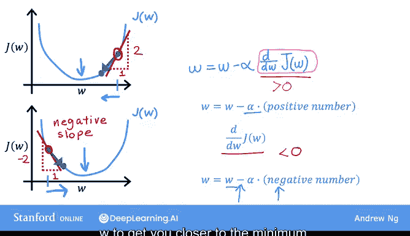

# 17：梯度下降法直观理解 🧠


在本节课中，我们将深入学习梯度下降法，以更好地理解其工作原理和背后的逻辑。

## 概述

上一节我们介绍了梯度下降算法的基本形式。本节中，我们将通过更直观的示例，深入探讨梯度下降如何通过调整参数来最小化成本函数。

## 梯度下降算法回顾

以下是上一节视频中展示的梯度下降算法：

```python
w = w - α * (d/dw) J(w)
b = b - α * (d/db) J(w, b)
```

其中，希腊字母 **α** 代表学习率，它控制着更新参数 **w** 和 **b** 时的步长大小。而 **d/dw** 是导数项，在数学中通常用特殊字体表示。对于多变量微积分专家来说，这实际上是偏导数，但为了机器学习算法的实现，我们简称为导数。

## 单参数简化示例

为了更直观地理解学习率和导数的作用，我们使用一个更简单的例子：只优化一个参数 **w**。

假设我们有一个成本函数 **J(w)**，其中 **w** 是一个数值。这意味着梯度下降现在简化为：

```python
w = w - α * (d/dw) J(w)
```

我们的目标是通过调整参数 **w** 来最小化成本 **J(w)**。这类似于之前将 **b** 暂时设为零的例子。通过单参数 **w**，我们可以用二维图形表示成本函数 **J(w)**，而不是三维图形。

## 梯度下降的直观运作

让我们看看梯度下降在这个 **J(w)** 函数上是如何工作的。

以下是梯度下降在成本函数 **J(w)** 上的运作示意图：


在图中，横轴代表参数 **w**，纵轴代表成本 **J(w)**。我们首先初始化梯度下降，为 **w** 选择一个起始值。假设我们从函数 **J** 上的这个点开始。

梯度下降将按照以下公式更新 **w**：

```python
w = w - α * (d/dw) J(w)
```

现在，让我们看看这里的导数项意味着什么。

## 导数项的理解

在曲线上某一点的导数，可以理解为在该点绘制一条切线。这条切线是一条直线，恰好在该点接触曲线。在数学上，这条线的斜率就是函数 **J** 在该点的导数。

为了计算斜率，可以绘制一个小三角形。例如，如果三角形的高度为2，宽度为1，那么斜率就是2除以1，等于2。当切线向右上方倾斜时，斜率为正，这意味着导数是正数，大于0。

因此，更新后的 **w** 将是 **w** 减去学习率乘以某个正数。由于学习率总是正数，所以 **w** 减去一个正数会导致 **w** 的新值变小。在图上，这意味着向左移动，减小 **w** 的值。

您可能会注意到，如果目标是减小成本 **J**，那么这是正确的做法。因为当我们沿着曲线向左移动时，成本 **J** 减小，并且我们更接近 **J** 的最小值，即这里。到目前为止，梯度下降似乎在做正确的事情。

## 另一个示例

现在，让我们看另一个例子。假设我们使用相同的函数 **J(w)**，但这次我们在不同的位置初始化梯度下降。

例如，选择一个在左侧的起始值 **w**，即函数 **J** 的这个点。

导数项仍然是 **d/dw J(w)**。当我们在这里绘制切线时，这条线向右下方倾斜，因此斜率为负。换句话说，**J** 在这一点的导数是负数。

例如，如果绘制一个三角形，高度为-2，宽度为1，那么斜率就是-2除以1，等于-2，这是一个负数。

当更新 **w** 时，我们得到 **w** 减去学习率乘以一个负数。这意味着我们从 **w** 中减去一个负数，但减去负数等同于加上一个正数，因此 **w** 最终会增加。

梯度下降的这一步导致 **w** 增加，这意味着在图上向右移动，并且成本 **J** 减小到这里。再次，梯度下降似乎在合理地工作，使您更接近最小值。

## 学习率 α 的重要性

希望以上两个示例展示了导数项的作用以及它如何帮助梯度下降改变 **w** 以使您更接近最小值。我希望这个视频让您对梯度下降中导数项的意义有了一些了解。

梯度下降算法中另一个关键量是学习率 **α**。如何选择 **α**？如果它太小会发生什么？如果太大又会发生什么？在下一节视频中，我们将更深入地探讨参数 **α**，以帮助建立对其作用的直观理解，以及如何为梯度下降的实现选择一个合适的 **α** 值。

以下是关于学习率选择的示意图：



## 总结


本节课中，我们一起学习了梯度下降法的直观理解。通过单参数示例，我们深入探讨了导数项如何指导参数更新方向，以及学习率在控制更新步长中的关键作用。下一节，我们将进一步研究学习率的选择及其对算法性能的影响。