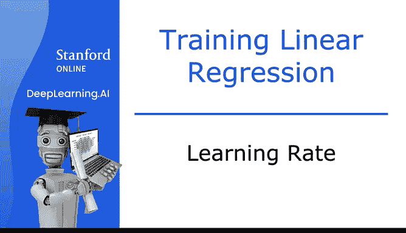
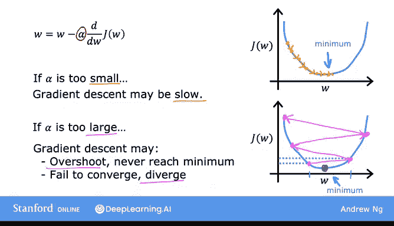
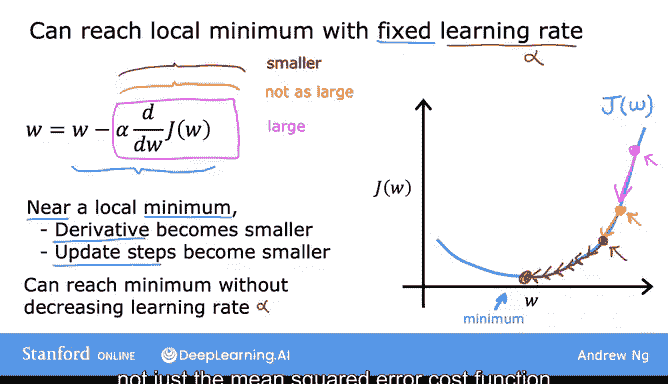

# 18：学习率的选择与影响 📈



在本节课中，我们将深入探讨梯度下降算法中的关键参数——**学习率**。学习率的选择对梯度下降的效率有巨大影响，甚至决定了算法能否成功收敛。我们将分析学习率过小或过大时会发生什么，并解释梯度下降在接近最小值时的行为。

## 学习率的作用

上一节我们介绍了梯度下降的基本概念，本节中我们来看看学习率的具体作用。梯度下降的更新规则由以下公式表示：

**W := W - α * (dJ/dW)**

其中 **α** 就是学习率。它控制了我们在每次迭代中沿着梯度方向移动的步长。

## 学习率过小的情况

以下是学习率过小时可能出现的问题：

*   **更新步长极小**：由于 α 值非常小（例如 0.0000001），每次参数更新只能移动微小的距离。
*   **收敛速度极慢**：虽然成本函数 J 的值在下降，但下降过程非常缓慢。
*   **需要大量迭代**：算法需要执行非常多的步骤才能接近最小值。

总结来说，如果学习率太小，梯度下降**仍然有效，但会异常缓慢**，需要很长的计算时间。

## 学习率过大的情况

现在，让我们看看如果学习率设置得太大，会发生什么情况：



*   **更新步长过大**：参数更新会从一个点“跳跃”到很远的另一个点。
*   **可能越过最小值**：巨大的步长可能导致算法跳过最小值，到达成本函数值更高的点。
*   **发散风险**：在极端情况下，每次迭代都可能使成本 J 变得更大，导致算法**无法收敛甚至发散**，永远找不到最小值。

因此，过大的学习率会导致梯度下降**失效**。

## 梯度下降在局部最小值处的行为

你可能会好奇，如果参数 W 已经位于一个局部最小值，梯度下降会怎么做？让我们通过一个例子来分析。

假设成本函数 J 有两个局部最小值。经过若干次梯度下降迭代后，参数 W 到达了其中一个最小值点（例如 W=5）。在这一点上，函数切线的斜率为 0，因此导数项 **dJ/dW = 0**。

此时，梯度下降更新公式变为：
**W := W - α * 0**
这相当于 **W := W**。

这意味着，**当参数到达局部最小值时，梯度下降会保持参数不变**，这正是我们期望的结果——算法稳定在解上。

## 固定学习率下的自动步长调整

这也解释了为什么即使使用固定的学习率 α，梯度下降也能收敛到局部最小值。其原理如下：

1.  **初始阶段步长大**：在远离最小值的地方，斜率（导数）的绝对值较大，因此更新步长也较大。
2.  **接近时步长变小**：随着参数接近最小值，斜率逐渐趋近于 0。
3.  **自动减速**：即使 α 保持不变，由于导数项变小，更新步长也会自动减小，最终以微小的步伐稳定在最小值附近。

这个过程可以用以下伪代码概念来理解：
```python
while not converged:
    slope = compute_gradient(w)  # 计算当前点的梯度（导数）
    w = w - alpha * slope        # 更新参数，步长 = alpha * |slope|
```

## 总结与预告



本节课中我们一起学习了：
1.  **学习率（α）** 是梯度下降中的关键超参数，控制更新步长。
2.  **学习率太小**会导致收敛速度过慢。
3.  **学习率太大**可能导致算法越过最小值甚至发散。
4.  在**局部最小值**处，导数为零，梯度下降会停止更新。
5.  即使学习率固定，由于导数在接近最小值时会变小，更新步长也会**自动减小**，这有助于算法稳定收敛。

在接下来的视频中，我们将把梯度下降算法应用到线性回归的**均方误差成本函数**上。结合这两者，我们将得到第一个完整的学习算法——**线性回归算法**。