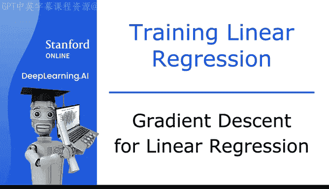
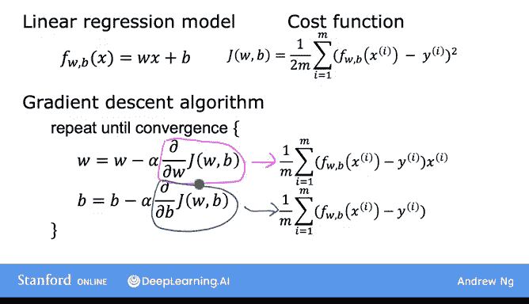
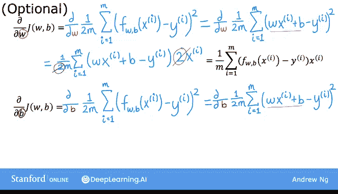
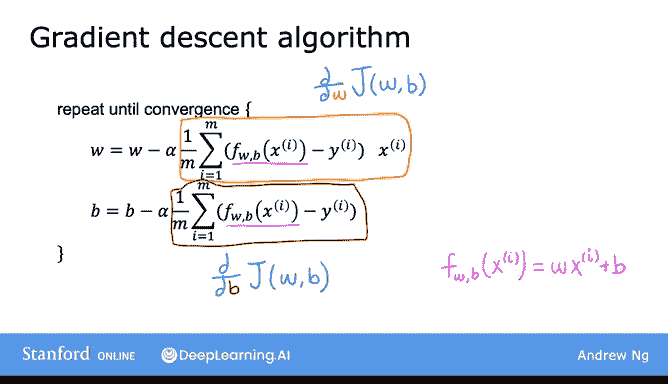

# 19：线性回归的梯度下降法 🎯



在本节课中，我们将学习如何将线性回归模型、平方误差成本函数以及梯度下降算法结合起来，训练模型以拟合训练数据中的直线。

---

## 概述 📋

上一节我们介绍了线性回归模型、成本函数以及梯度下降算法。本节中，我们将把这些概念整合起来，使用平方误差成本函数和梯度下降算法来训练线性回归模型。

---

## 模型、成本函数与算法回顾 🔄

线性回归模型为：
```
f(x) = w * x + b
```



其平方误差成本函数为：
```
J(w, b) = (1/(2m)) * Σ (f(x_i) - y_i)²
```

梯度下降算法通过以下公式迭代更新参数 `w` 和 `b`：
```
w = w - α * (∂J/∂w)
b = b - α * (∂J/∂b)
```

---

## 计算梯度 📐

以下是计算成本函数 `J` 关于参数 `w` 和 `b` 的偏导数的公式。

关于 `w` 的偏导数为：
```
∂J/∂w = (1/m) * Σ (f(x_i) - y_i) * x_i
```

关于 `b` 的偏导数为：
```
∂J/∂b = (1/m) * Σ (f(x_i) - y_i)
```

使用这些公式计算梯度并实现梯度下降，算法将有效运行。

---

## 公式推导（可选）🧮

你可能会好奇这些公式从何而来。它们是通过微积分推导得出的。如果你想了解完整的推导过程，本部分将简要说明。如果你不记得或不感兴趣，可以完全跳过，这不会影响你实现梯度下降和完成本课程。

首先，计算 `J` 关于 `w` 的偏导数。我们从成本函数 `J` 的定义开始，并代入 `f(x_i) = w * x_i + b`。根据微积分规则，求导后公式中的系数 `2` 会与成本函数定义中的 `1/2` 相抵消，从而得到上述简洁的公式。这正是我们在成本函数中预先定义 `1/2` 的原因。

对于 `b` 的偏导数，推导过程类似。代入模型定义后，根据微积分规则求导，同样会抵消系数 `2`，最终得到不含 `x_i` 项的导数表达式。



---

## 线性回归的梯度下降算法 ⚙️

现在，我们可以将导数公式代入梯度下降算法。

线性回归的梯度下降算法如下：反复执行以下更新，直到参数收敛。
```
w = w - α * [(1/m) * Σ (f(x_i) - y_i) * x_i]
b = b - α * [(1/m) * Σ (f(x_i) - y_i)]
```

记住，`f(x)` 是线性回归模型 `w*x + b`。每次迭代需要同时更新 `w` 和 `b`。

---

## 梯度下降与凸函数特性 🏔️



我们之前了解到，梯度下降可能会收敛到局部最小值而非全局最小值。全局最小值是成本函数 `J` 在所有可能点中值最小的点。

然而，当对线性回归使用平方误差成本函数时，情况有所不同。该成本函数呈碗状，只有一个全局最小值，没有其他局部最小值。这种函数的专业术语是“凸函数”。

凸函数是碗形函数，除了单一的全局最小值外，没有其他局部最小值。因此，只要学习率 `α` 选择得当，在凸函数上实现梯度下降总能收敛到全局最小值。

---

## 总结 ✨

本节课中，我们一起学习了如何实现线性回归的梯度下降。我们整合了模型、成本函数和算法，推导了关键的梯度公式，并了解了平方误差成本函数作为凸函数的优良特性，这保证了梯度下降能收敛到最优解。

恭喜你掌握了线性回归梯度下降的实现方法！本周还有一个视频，我们将看到这个算法的实际运行效果。