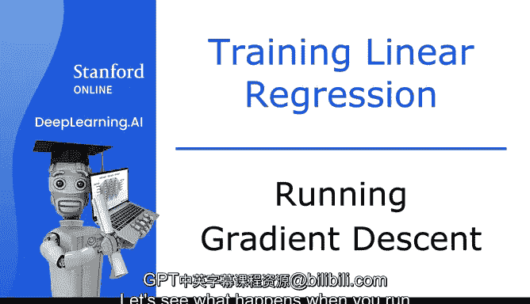
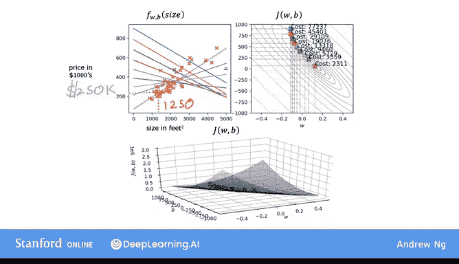
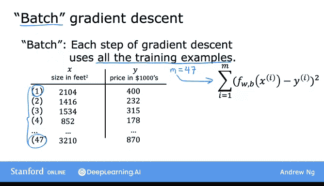
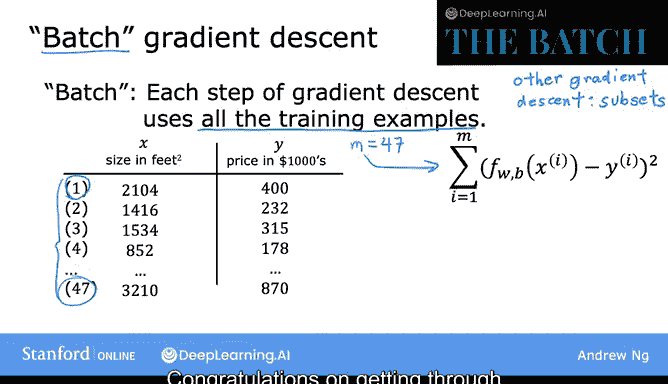
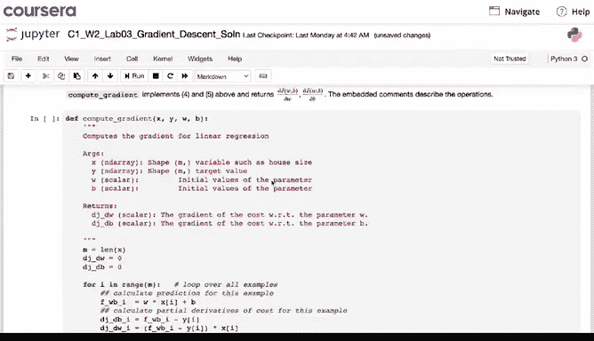
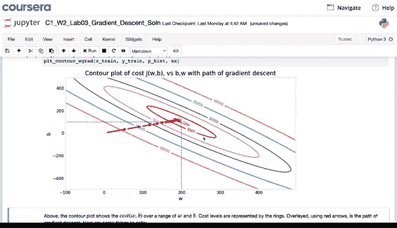
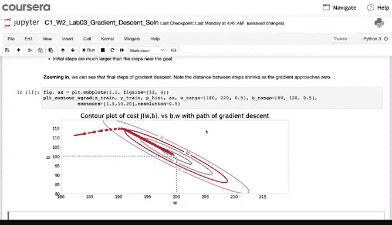
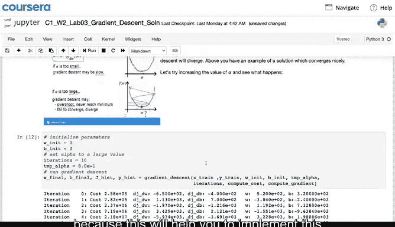

# 20：运行梯度下降法 🚀

在本节课中，我们将学习如何运行梯度下降算法来训练线性回归模型。我们将看到算法如何逐步调整参数，使模型更好地拟合数据，并理解“批量梯度下降”这一核心概念。

---

## 运行梯度下降法

上一节我们介绍了梯度下降的基本思想，本节中我们来看看当它应用于线性回归时会发生什么。让我们观察算法的实际运行过程。

左上角是模型与数据的拟合图，右上角是成本函数的等高线图。底部则是同一成本函数的三维曲面图。

通常，参数 **w** 和 **b** 会被初始化为0。但为了演示，我们将 **w** 初始化为 -0.1，**b** 初始化为 900。这对应于初始模型：
**f(x) = -0.1x + 900**

现在，如果我们使用梯度下降法执行一步更新，成本函数的值会从初始点移动到另一个点，即向右下方移动。同时，拟合的直线也会发生轻微变化。

再执行一步更新，成本函数移动到第三个点，函数 **f(x)** 也再次调整。随着我们执行更多步骤，每次更新后成本都在下降，参数 **w** 和 **b** 沿着一条轨迹移动。

观察左侧，对应的直线拟合效果越来越好，直到我们达到全局最小值。全局最小值对应着这条最终的拟合直线，它对数据有相对较好的拟合效果。这就是梯度下降法。我们将使用它来为房价数据拟合模型。

现在，你可以使用这个训练好的 **f(x)** 模型来预测客户或其他人的房屋价格。例如，如果你朋友的房子面积为1250平方英尺，你可以根据模型读出预测值，比如可能是25万美元。

---

## 批量梯度下降

更准确地说，这个梯度下降过程被称为**批量梯度下降**。

术语“批量梯度下降”指的是，在梯度下降的每一步中，我们都会查看**全部**训练样本，而不是训练数据的一个子集。

在计算梯度下降的导数时，我们计算的是从 **i=1** 到 **m** 的总和。批量梯度下降在每次更新时都会查看整个批次的训练样本。

我知道“批量梯度下降”可能不是最直观的名称，但这是机器学习社区的通用叫法。如果你听说过DeepLearning.AI发布的新闻通讯《The Batch》，它的命名也源于机器学习中的这个概念。

事实证明，还有其他版本的梯度下降法，它们不在每次更新时查看整个训练集，而是查看训练数据的较小子集。但对于线性回归，我们使用批量梯度下降。

---

## 课程总结与后续

以上就是线性回归的全部内容。恭喜你完成了第一个机器学习模型的学习。

在本视频随后的可选实验部分，你将回顾梯度下降算法，并学习如何在代码中实现它。

你将看到一个图表，展示成本如何随着训练迭代次数的增加而下降。你还将看到一个等高线图，观察随着梯度下降为参数 **w** 和 **b** 找到越来越好的值，成本如何接近全局最小值。

请记住，完成可选实验只需阅读并运行提供的代码，无需自己编写代码。希望你花些时间去做，并熟悉梯度下降的代码，因为这将有助于你在未来自己实现这个以及其他算法。

感谢你坚持学完第一周的最后一个视频，恭喜你一路走到这里，你正在成为一名机器学习实践者的道路上。

除了可选实验，如果你还没有尝试，希望你也完成练习测验。这是检验你对概念理解程度的好方法。第一次没有全部答对也没关系，你可以多次参加测验，直到获得满意的分数。

现在你已经知道如何实现单变量线性回归，这标志着本周课程的结束。

下周，我们将学习如何让线性回归变得更强大。你将学习如何处理多个特征，而不仅仅是像房屋面积这样的单一特征。你还将学习如何拟合非线性曲线。这些改进将使算法更有用、更有价值。😊

最后，我们还将介绍一些实用技巧，这些技巧对于让线性回归在实际应用中真正发挥作用至关重要。

很高兴你能和我一起学习这门课程，期待下周与你再见。😊

---

**本节课中我们一起学习了：**
1.  如何运行梯度下降算法来优化线性回归模型。
2.  批量梯度下降的定义，即每次更新使用全部训练数据计算梯度。
3.  通过可视化观察成本下降和参数优化的过程。
4.  训练好的模型可用于进行预测。
5.  了解了后续课程将学习多特征和非线性拟合等更强大的技术。