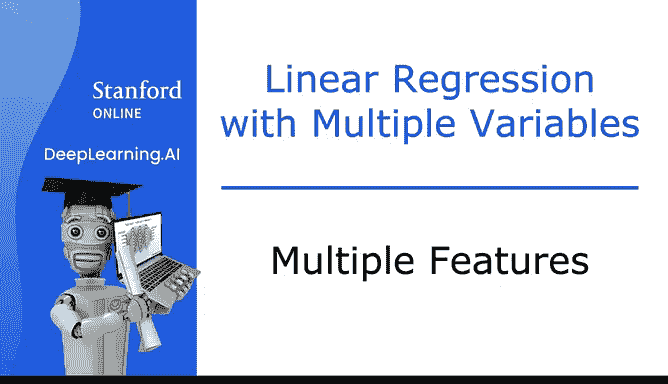
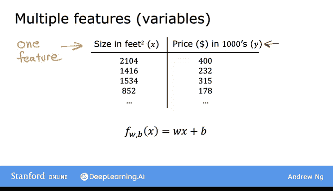
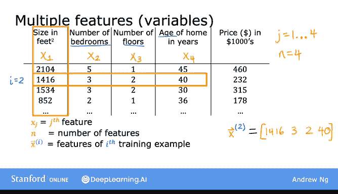
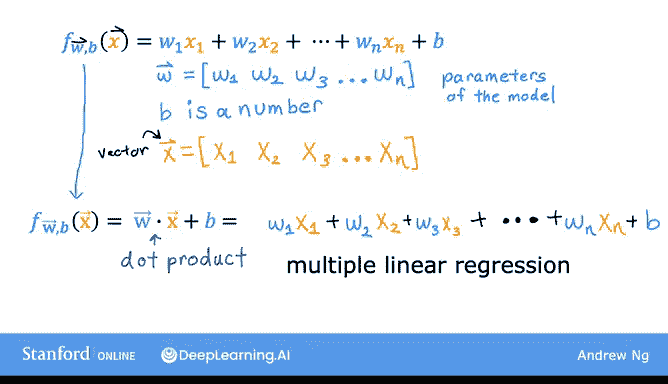

# 21：多特征线性回归 🏠



在本节课中，我们将学习如何扩展线性回归模型，使其能够处理多个特征，而不仅仅是单一特征。这将使我们的模型更加强大，能够利用更多信息进行预测。



---

## 从单特征到多特征

上一节我们介绍了基于单一特征（如房屋面积）的线性回归模型。本节中，我们来看看当模型拥有多个特征时，会是什么样子。

在最初的线性回归版本中，我们有一个单一特征 **X**（房屋面积），用于预测目标值 **y**（房屋价格）。模型为：
```
f_wb(x) = w * x + b
```

但是，如果我们不仅知道房屋面积，还知道卧室数量、楼层数和房屋年龄，我们就能获得更多信息来预测价格。

为了引入新特征，我们使用变量 **x₁, x₂, x₃, x₄** 来表示这四个特征。为简化起见，我们引入更多符号：
*   我们用 **xⱼ** 或简写为 **x_subj** 来表示特征列表。在本例中，**j** 从 1 到 4。
*   我们用小写字母 **n** 表示特征总数。本例中 **n = 4**。
*   和之前一样，我们用 **x⁽ⁱ⁾** 表示第 **i** 个训练样本。现在，**x⁽ⁱ⁾** 是一个包含四个数字的列表（或称为**向量**），它包含了第 **i** 个训练样本的所有特征。

例如，**x⁽²⁾** 是第二个训练样本的特征向量，可能等于 `[1416, 3, 2, 40]`。
要引用第 **i** 个训练样本中的第 **j** 个特征，我们写作 **x⁽ⁱ⁾ⱼ**。例如，**x⁽²⁾₃** 表示第二个训练样本的第三个特征（楼层数），其值为 `2`。



有时，为了强调 **x** 是一个向量而非单个数字，我们会在其上方画一个箭头（如 **→x**），但这在书写时是可选的。

---

## 多特征模型定义

现在我们已经有了多个特征，让我们看看模型会如何变化。

之前，模型定义为 `f_wb(x) = w * x + b`，其中 **x** 是单个数字。现在，对于多个特征，模型将定义为：
```
f_wb(x) = w₁ * x₁ + w₂ * x₂ + w₃ * x₃ + w₄ * x₄ + b
```

具体到房价预测，一个可能的模型可能是：
```
预测价格 = 0.1 * x₁ + 4 * x₂ + 10 * x₃ - 2 * x₄ + 80
```

我们可以这样理解这些参数：
*   **b = 80**：可以理解为房屋的基准价格是 8 万美元（假设房屋没有面积、卧室、楼层和年龄）。
*   **w₁ = 0.1**：每增加一平方英尺，价格增加 0.1（千美元），即 100 美元。
*   **w₂ = 4**：每增加一间卧室，价格增加 4（千美元），即 4000 美元。
*   **w₃ = 10**：每增加一层楼，价格增加 10（千美元），即 1 万美元。
*   **w₄ = -2**：房龄每增加一年，价格减少 2（千美元），即 2000 美元。

---

## 向量化表示法

一般来说，如果我们有 **n** 个特征，模型如下所示：
```
f_wb(x) = w₁ * x₁ + w₂ * x₂ + ... + w_n * x_n + b
```

接下来，我们将引入一种新的表示法，用更简洁但等价的方式重写这个表达式。

我们定义：
*   **→w** 为一个向量，包含所有参数 `[w₁, w₂, ..., w_n]`。
*   **→x** 为一个向量，包含所有特征 `[x₁, x₂, ..., x_n]`。
*   **b** 仍然是一个单独的数字（标量）。

使用这种表示法，模型可以更简洁地重写为：
```
f_wb(x) = →w · →x + b
```
这里的 **·** 代表线性代数中的**点积**运算。

那么，什么是点积呢？两个向量 **→w** 和 **→x** 的点积计算方式如下：
1.  将对应位置的元素相乘：`w₁*x₁`, `w₂*x₂`, ..., `w_n*x_n`。
2.  将所有乘积结果相加。

写出来就是：
```
→w · →x = w₁*x₁ + w₂*x₂ + ... + w_n*x_n
```
然后再加上 **b**，就得到了和上面完全相同的表达式。因此，点积表示法让我们能用更少的字符、更紧凑的形式来表达模型。

---

## 模型命名与总结

这种具有多个输入特征的线性回归模型，被称为**多元线性回归**。这与只有一个特征的**单变量回归**形成对比。

请注意，虽然你可能认为它叫“多元回归”，但该术语在统计学中通常指代其他概念（涉及多个因变量），因此我们这里称其为**多元线性回归**。

本节课中，我们一起学习了如何将线性回归扩展到多个特征，即多元线性回归。我们引入了新的符号来表示特征和参数向量，并学习了如何使用向量点积来简洁地定义模型。



为了高效地实现这个模型，有一个非常巧妙的技巧叫做**向量化**，它能让实现此模型以及其他许多学习算法变得简单得多。让我们在下一节视频中看看什么是向量化。