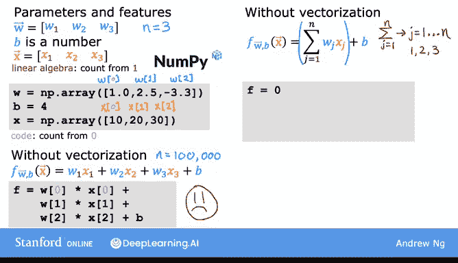

# 22：向量化（第一部分）🚀


在本节课中，我们将学习一个在实现机器学习算法时非常有用的概念——**向量化**。使用向量化不仅能让你的代码更简洁，还能显著提升其运行效率。

## 概述 📋

向量化是一种编程技术，它允许我们利用现代数值线性代数库，甚至GPU（图形处理器）硬件来加速计算。GPU最初是为加速计算机图形而设计的，但事实证明，当你编写向量化代码时，它也能帮助你更快地执行代码。

接下来，我们通过一个具体例子来看看向量化的含义。

## 非向量化实现示例

假设我们有一个参数向量 **W** 和一个特征向量 **x**，其中 **W** 和 **x** 都包含三个数字（即 n=3）。

在数学表示中，索引通常从1开始，因此第一个值记为 W₁ 和 x₁。

在Python代码中，我们可以使用NumPy库（Python中最广泛使用的数值线性代数库）来定义这些变量。需要注意的是，Python中数组的索引是从0开始的。

```python
import numpy as np
w = np.array([...]) # 假设w有三个值
x = np.array([...]) # 假设x有三个值
b = ... # 偏置项
```

### 第一种非向量化方法

一种不使用向量化的实现方式是手动将每个参数与其对应的特征相乘并相加。

```python
f = w[0] * x[0] + w[1] * x[1] + w[2] * x[2] + b
```

这种方法在n=3时可行，但如果n是100或100,000，无论是编写代码还是计算机执行计算，效率都非常低下。

### 第二种非向量化方法（使用循环）

另一种方法，虽然仍不使用向量化，但通过for循环来改进。数学上，这对应于一个求和公式：



**f = b + Σ (wⱼ * xⱼ)**， 其中 j 从 1 到 n。

在代码中，我们可以这样实现：

```python
f = 0
for j in range(n): # 在Python中，range(n)使j从0遍历到n-1
    f = f + w[j] * x[j]
f = f + b
```

虽然这种实现比第一种稍好，但它仍然没有使用向量化，效率不高。

## 向量化实现 🚄

现在，让我们看看如何使用向量化来实现相同的计算。

上述函数的数学表达式本质上是向量 **W** 和 **x** 的**点积**，再加上偏置项 **b**。

使用NumPy，我们可以用一行代码实现：

```python
f = np.dot(w, x) + b
```

这行代码 `np.dot(w, x)` 实现了向量 **W** 和 **x** 之间的数学点积运算。当n很大时，这种向量化实现将比前面两种非向量化代码运行得快得多。

## 向量化的双重优势 ✨

向量化主要带来两个显著的好处：
1.  **代码更简洁**：现在只需一行代码，编写和阅读都更容易。
2.  **运行速度更快**：向量化实现比之前两种不使用向量化的实现要快得多。

向量化代码运行更快的原因是，在幕后，像 `np.dot` 这样的函数能够利用计算机中的**并行硬件**。无论你是在普通的计算机CPU上运行，还是在使用常用于加速机器学习任务的GPU上运行，这一点都成立。`np.dot` 函数利用并行硬件的能力，使其比我们之前看到的for循环或顺序计算要高效得多。

当n很大时，向量化版本变得非常实用。你不再需要像第一个非向量化版本那样，手动输入 `w[0]*x[0] + w[1]*x[1] + ...` 等大量项。

## 总结 🎯

本节课我们一起学习了**向量化**的核心概念。我们了解到：
*   向量化是一种利用现代硬件并行计算能力来提升代码效率的技术。
*   通过使用像NumPy这样的库，我们可以用简洁的代码（如 `np.dot(w, x) + b`）替代冗长的循环。
*   向量化具有**代码简洁**和**执行高效**的双重优势，是机器学习实践中不可或缺的技能。

在下一节中，我们将更深入地探讨向量化背后的原理，看看计算机是如何在幕后执行这些快速计算的。