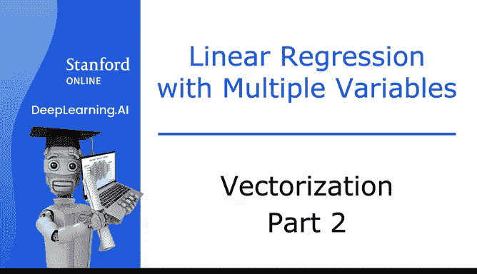
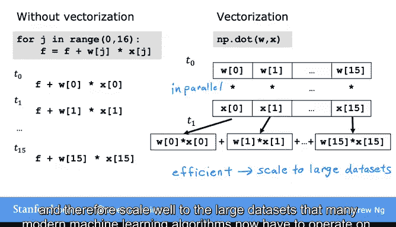
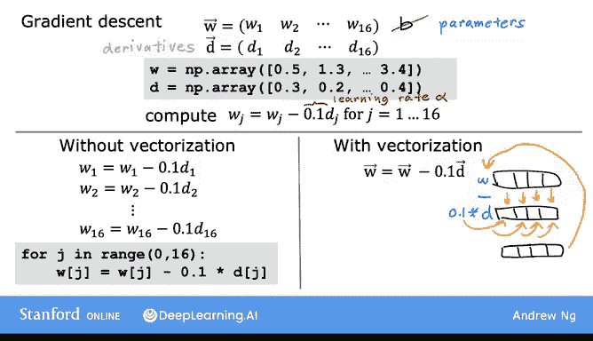
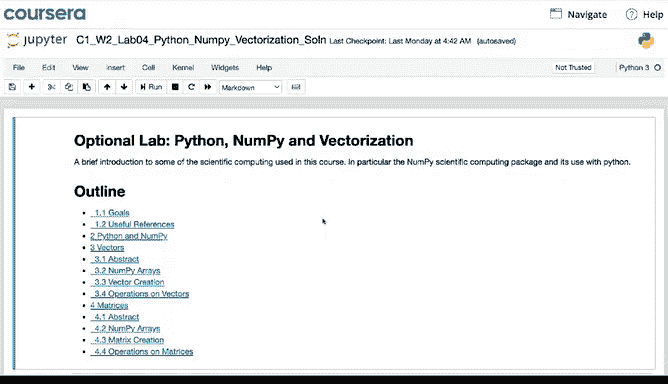
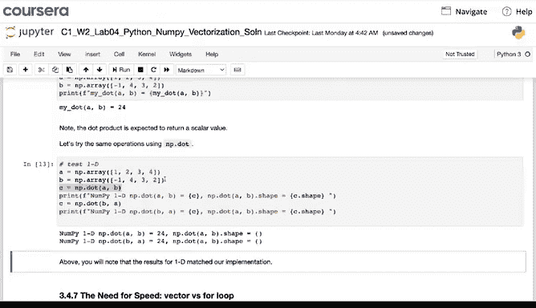
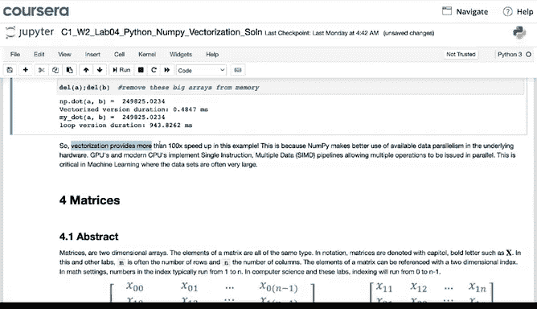
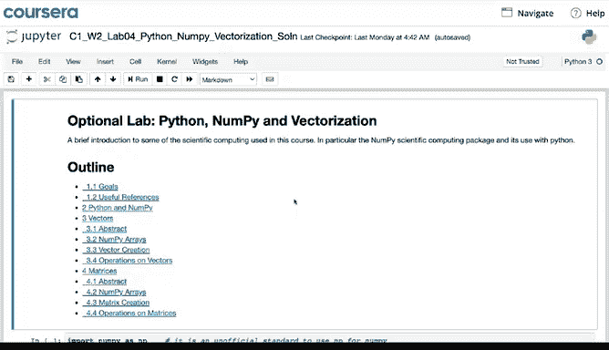

# 23：向量化第二部分 🚀

在本节课中，我们将要学习向量化（Vectorization）的工作原理，以及它如何显著提升机器学习算法的运行效率。我们将深入探讨向量化在计算机硬件层面是如何实现的，并通过一个具体的多元线性回归例子，对比向量化和非向量化代码的区别。

---



## 概述

向量化是一种利用计算机并行处理能力，一次性对多个数据执行相同操作的技术。在机器学习中，处理大量数据和特征时，向量化能极大地减少计算时间。

---

## 向量化的“魔法”原理 ✨

上一节我们介绍了向量化的概念，本节中我们来看看这背后的“魔法”是如何实现的。

我记得当我第一次学习向量化时，我在电脑上花费了很多小时。我运行一个未向量化的算法版本，观察其运行时间，然后再运行向量化的代码版本，看看它能快多少。坦白说，相同的算法经过向量化后运行速度如此之快，这让我感到震惊，感觉几乎像变魔术一样。


让我们来弄清楚这个“魔术”的真正原理。让我们更深入地看看向量化实现在你的计算机幕后是如何工作的。

以下是一个未向量化的完整循环示例：

```python
for j in range(0, 16):
    # 执行某些操作
```

像这样的完整循环在没有向量化的情况下运行。如果 `j` 的范围从 0 到 15，这段代码会一个接一个地执行操作。在第一个时间步（我写作 T0），它首先对索引 0 的值进行操作。在下一个时间步，它计算与索引 1 对应的值，依此类推，直到第 15 步。换句话说，它一步一步地、一个接一个地计算这些运算。

相比之下，计算机硬件通过向量化来实现类似 `np.dot(w, x)` 这样的函数。因此，计算机可以**在单个步骤中**获取向量 `w` 和 `x` 的所有值，并**同时并行地**将每一对 `w` 和 `x` 相乘。然后，计算机使用专门的硬件非常高效地将这 60 个数字全部相加，而不是需要一个接一个地进行不同的加法运算来累加这 60 个数字。

这意味着，使用向量化的代码可以在比非向量化代码少得多的时间内执行计算。当你在大型数据集上运行学习算法或尝试训练大型模型时（这在机器学习中很常见），这一点尤为重要。

因此，为学习算法实现正确的向量化版本，是使其高效运行并从而能够扩展到许多现代机器学习算法必须处理的大型数据集的关键一步。



---

## 多元线性回归中的向量化应用 📈

现在，让我们看一个具体的例子，了解向量化如何帮助实现多元线性回归（即具有多个输入特征的线性回归）。

假设你有一个问题，有 16 个特征和 16 个参数 `w1` 到 `w16`，此外还有参数 `b`。你为这 16 个权重计算了 16 个导数项。在代码中，你可能将 `w` 和导数 `d` 的值存储在 NumPy 数组中。对于这个例子，我将暂时忽略参数 `b`。

现在你想计算这 16 个参数中每一个的更新，即：
`w_j := w_j - α * d_j`，其中 `j` 从 1 到 16，`α` 是学习率（例如 0.1）。

在未向量化的代码中，你会这样做：

```python
w1 = w1 - 0.1 * d1
w2 = w2 - 0.1 * d2
...
w16 = w16 - 0.1 * d16
```

或者使用一个完整的循环：

```python
for j in range(0, 16):
    w[j] = w[j] - 0.1 * d[j]
```

相比之下，通过向量化，你可以想象计算机的并行处理硬件是这样的：它**同时**获取向量 `w` 中的所有 16 个值，**并行地**减去 `0.1` 乘以向量 `d` 中的所有 16 个值，并**在一个步骤内**将所有 16 个计算结果赋值回 `w`。



在代码中，你可以这样实现：

```python
w = w - 0.1 * d
```

在幕后，计算机获取这些 NumPy 数组 `w` 和 `d`，并使用并行处理硬件来高效地执行所有 16 个计算。因此，使用向量化实现，你应该能得到一个高效得多的线性回归实现。

如果你的特征只有 16 个，速度差异可能不会很大。但如果你有数千个特征，并且可能有非常大的训练集，这种向量化实现将对你的学习算法的运行时间产生巨大影响。它可能意味着代码在一两分钟内完成，而不是需要许多小时才能完成同样的事情。

---

## NumPy 与向量化实践 🛠️

在本视频之后的可选实验中，你将看到对机器学习中最常用的 Python 库之一的介绍，我们在本视频中已经提到过它，叫做 **NumPy**。




你将看到如何在代码中表示向量，这些数字列表被称为 **NumPy 数组**。你还将看到如何使用名为 `np.dot` 的 NumPy 函数来计算两个向量的点积。




你还将看到向量化代码（例如使用 `dot` 函数）如何比完整循环运行得快得多。实际上，你可以自己计时，并希望看到它运行得更快。

这个可选实验介绍了相当多的新 NumPy 语法。因此，当你阅读可选实验时，请不要觉得你必须立即理解所有代码。你可以保存这个笔记本，并将其作为参考资料，以便在处理 NumPy 数组中的数据时查阅。

---

## 总结

恭喜你完成了这个关于向量化的视频！你已经学习了在实现机器学习算法中最重要和最有用的技术之一。

在下一个视频中，我们将把多元线性回归的数学与向量化结合起来，这样你就可以用向量化实现多元线性回归的梯度下降。让我们继续下一个视频。






