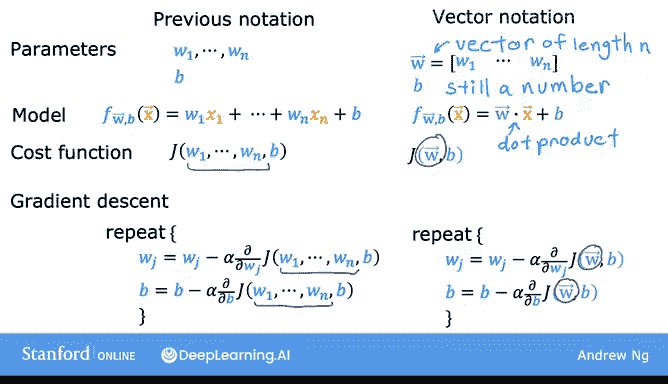
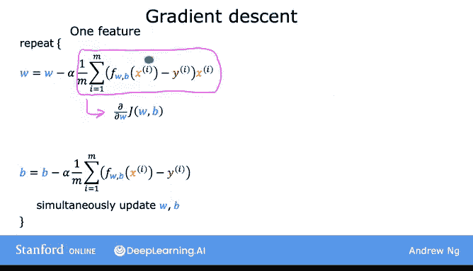
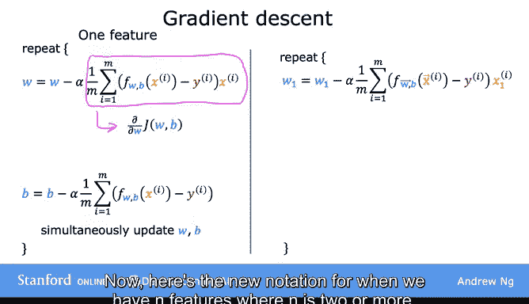
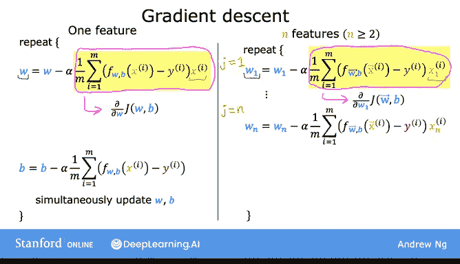
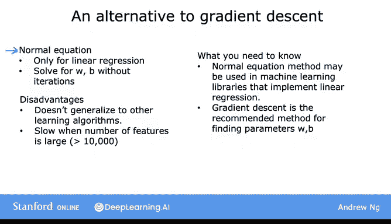
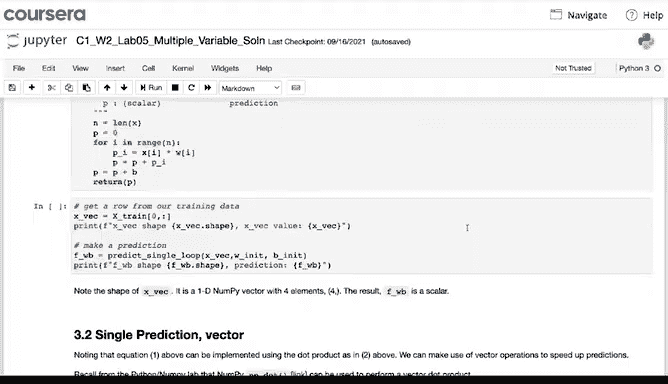
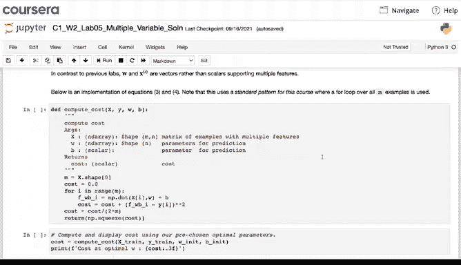
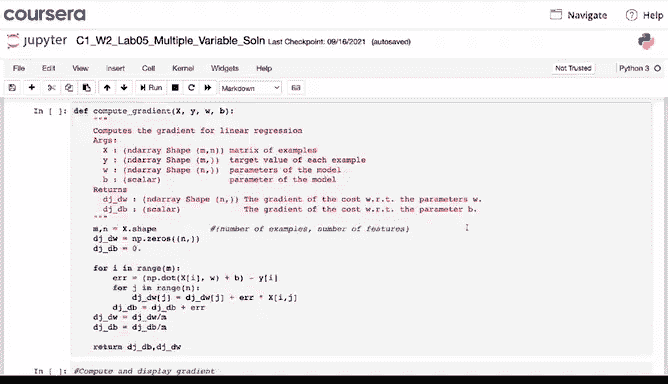
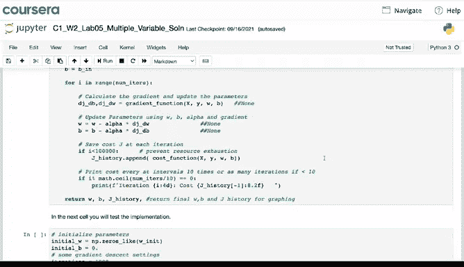
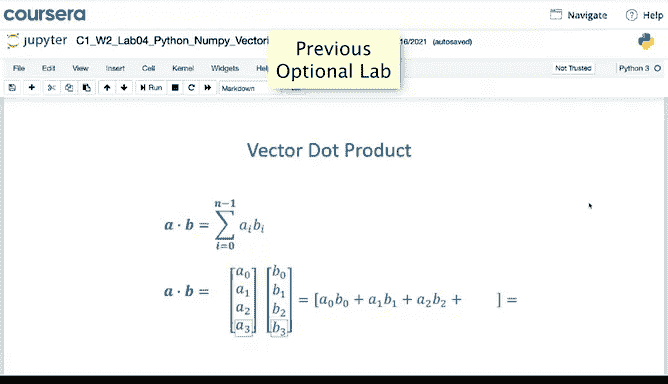

# 24：多元线性回归的梯度下降法 🧮

在本节课中，我们将学习如何将梯度下降法、多元线性回归和向量化的知识结合起来，实现多元线性回归的向量化梯度下降。我们将从模型和代价函数的向量化表示开始，逐步推导出参数更新规则，并简要介绍另一种求解方法——正规方程。

---

## 模型与代价函数的向量化表示

上一节我们介绍了多元线性回归的基本概念。本节中，我们来看看如何使用向量化表示来简化模型。

之前，我们将多元线性回归模型定义为多个特征的加权和。现在，我们可以使用向量点积来更简洁地表示它。

*   将参数 `w1` 到 `wn` 收集到一个向量 **w** 中。
*   模型可以写为：**f(x) = w · x + b**，其中 “·” 表示点积运算。

同样，代价函数 `J` 也从接受多个参数 `w1...wn` 和 `b`，转变为接受一个参数向量 **w** 和一个标量 `b`：**J(w, b)**。

---

## 梯度下降的参数更新规则

了解了模型的向量化表示后，我们来看看梯度下降的更新过程如何应用于多元线性回归。

梯度下降的核心是重复更新每个参数，使其减去学习率乘以代价函数对该参数的偏导数。

对于单变量线性回归，更新规则如下：
*   **w = w - α * (∂J/∂w)**
*   **b = b - α * (∂J/∂b)**

对于具有 `n` 个特征的多元线性回归，我们需要更新 `n+1` 个参数（`w1` 到 `wn` 以及 `b`）。以下是更新规则：

关键点在于，对于每个 `wj` 的更新，其偏导数公式与单变量情况形式相似，但需要对应使用第 `j` 个特征值 `x_j`。

---

## 正规方程法简介

在结束梯度下降的讨论前，我们简要了解一下求解线性回归参数的另一种方法——正规方程。

与迭代的梯度下降法不同，正规方程是一种基于线性代数的解析解法，可以直接一次性求解出最优的 **w** 和 `b`，无需迭代。

以下是关于正规方程需要了解的几点：

*   **局限性**：该方法仅适用于线性回归，无法推广到逻辑回归、神经网络等其他学习算法。
*   **计算效率**：当特征数量 `n` 非常大时，该方法的计算速度可能较慢。
*   **实际应用**：成熟的机器学习库在背后可能会使用此方法求解线性回归。对于大多数情况，尤其是自己实现算法时，梯度下降通常是更合适的选择。

---

## 代码实现与后续步骤

在紧随本视频的实践环节中，你将看到如何用代码实现多元线性回归模型。

以下是实现的关键步骤：
1.  使用 NumPy 库定义模型并进行预测：**`f = np.dot(X, w) + b`**
2.  计算代价函数。
3.  实现多元线性回归的梯度下降算法。

你现在已经掌握了多元线性回归，这可能是当今世界上应用最广泛的学习算法之一。

为了使算法工作得更好，我们还需要掌握一些小技巧，例如**恰当选择和缩放特征**，以及**选择合适的学习率 α**。在接下来的视频中，我们将学习这些能显著提升多元线性回归性能的技巧。

---

**本节课总结**：我们一起学习了如何用向量化形式表示多元线性回归模型及其代价函数，推导了多元情况下的梯度下降参数更新规则，并简要了解了另一种直接求解法——正规方程。最后，我们指出了通过特征工程和学习率调优可以进一步优化模型性能。