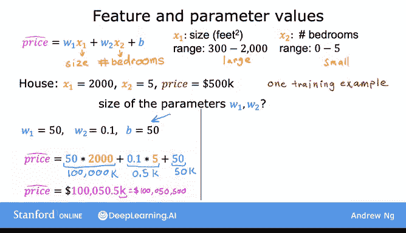
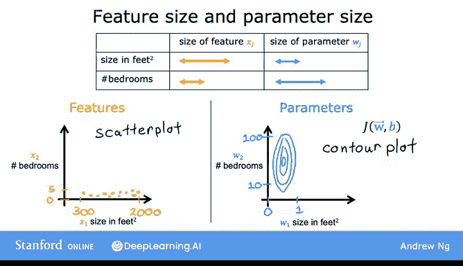
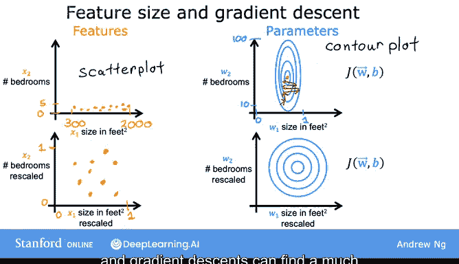

# 25：特征缩放（第一部分）🚀

在本节课中，我们将学习一种称为**特征缩放**的技术。这项技术能显著提升梯度下降算法的运行效率，使其更快地找到模型的最优参数。

## 概述：特征大小与参数的关系

上一节我们讨论了梯度下降的基本原理。本节中，我们来看看特征取值范围的大小与其对应参数值大小之间的关系。

为了具体说明，我们用一个预测房价的例子。假设我们使用两个特征：
*   **x₁**：房屋面积（平方英尺）
*   **x₂**：卧室数量

在数据集中，房屋面积（x₁）的取值范围可能在300到2000平方英尺之间，而卧室数量（x₂）的取值范围可能在0到5间之间。显然，x₁的取值范围远大于x₂。

现在，考虑一个具体的房屋样本：面积2000平方英尺，5间卧室，售价50万美元。

以下是两种可能的参数组合：

**组合一：**
*   w₁ = 50
*   w₂ = 0.1
*   b = 50

预测价格（单位：千美元）为：`50 * 2000 + 0.1 * 5 + 50 = 100,000 + 0.5 + 50 ≈ 100,050.5`。这远高于实际的50万美元，不是一个好的参数组合。

**组合二：**
*   w₁ = 0.1
*   w₂ = 50
*   b = 50

预测价格为：`0.1 * 2000 + 50 * 5 + 50 = 200 + 250 + 50 = 500`。这个预测值（50万美元）与实际价格相符，是一个合理的参数组合。

通过这个例子，我们可以观察到一个规律：
*   当某个特征（如房屋面积）的取值范围**很大**时，一个良好的模型往往会为其学习到一个**相对较小**的参数值（如0.1）。
*   当某个特征（如卧室数量）的取值范围**很小**时，一个合理的参数值往往会**相对较大**（如50）。

## 特征范围对梯度下降的影响

理解了特征与参数的关系后，我们来看看这如何影响梯度下降。

如果将训练数据绘制在散点图上，以x₁（面积）为横轴，x₂（卧室数）为纵轴，你会发现横轴的范围远大于纵轴。

这种差异会反映在代价函数（J）的等高线图上。由于w₁的微小变化会乘以很大的x₁值，从而对预测结果和代价J产生巨大影响；而w₂需要更大的变化才能显著影响预测。因此，代价函数的等高线通常会呈现**又高又瘦的椭圆形**。

在这种情况下运行梯度下降，算法可能会在峡谷状的等高线之间反复“弹跳”，需要很长时间才能曲折地找到全局最小值。

## 解决方案：特征缩放

为了解决上述问题，加速梯度下降，我们可以对特征进行**缩放**。这意味着对训练数据进行某种变换，使所有特征都处于**可比**的数值范围内。

例如，我们可以将x₁和x₂都缩放至0到1之间。经过缩放后，数据点的分布会变得更加“均匀”。

最关键的是，缩放后的特征x₁和x₂拥有了可比的价值范围。此时，基于缩放后数据定义的代价函数，其等高线图会变得更接近**圆形**，而非又高又瘦的椭圆形。

在这样的代价函数上运行梯度下降，算法能够找到一条更直接的路径快速收敛到全局最小值。

## 总结

本节课我们一起学习了特征缩放的第一部分核心思想。我们了解到，当不同特征具有差异巨大的取值范围时，会导致梯度下降运行缓慢。通过**缩放特征**，使它们处于可比的范围，可以显著**加速梯度下降**的收敛过程。

在下一节课中，我们将具体介绍几种实施特征缩放的常用方法。