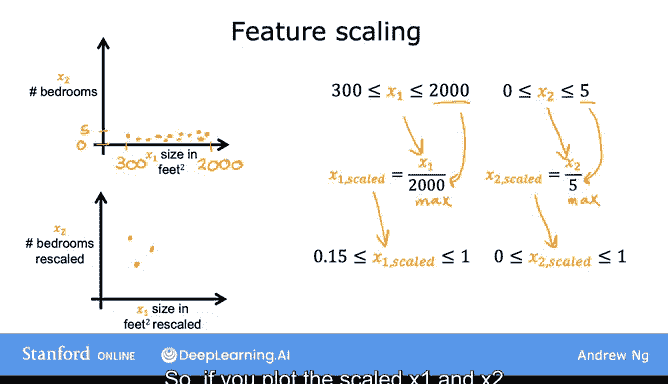
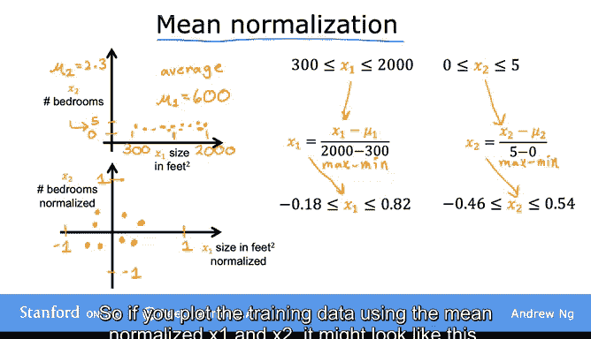
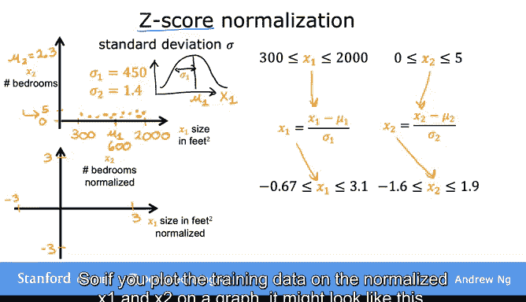
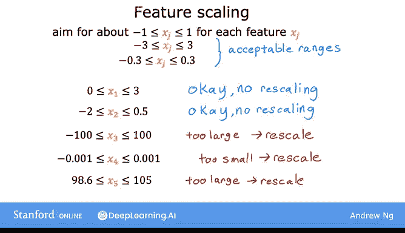

# 26：特征缩放第二部分 🎯

在本节课中，我们将学习如何实现特征缩放。特征缩放是一种技术，用于将取值范围差异很大的特征，调整到彼此可比的范围，从而加速梯度下降算法的收敛。

上一节我们介绍了特征缩放的必要性，本节中我们来看看具体的实现方法。

## 1. 除以最大值法 📏

一种简单的特征缩放方法是除以每个特征的最大值。

假设特征 `x1` 的取值范围是 3 到 2000。我们可以通过将每个原始的 `x1` 值除以 2000（该范围的最大值）来获得缩放后的版本。缩放后的 `x1` 将落在 0.0015 到 1 之间。

**公式：**
`x1_scaled = x1 / max(x1)`

类似地，如果特征 `x2` 的取值范围是 0 到 5，我们可以将每个原始的 `x2` 值除以 5（最大值）。缩放后的 `x2` 将落在 0 到 1 之间。

**公式：**
`x2_scaled = x2 / max(x2)`

使用缩放后的 `x1` 和 `x2` 绘制数据图，可能呈现如下分布：

## 2. 均值归一化法 ⚖️

除了除以最大值，另一种常见方法是均值归一化。这种方法将特征重新缩放，使其以零为中心。归一化后的特征值通常分布在 -1 到 +1 之间。

以下是实现步骤：

首先，计算训练集中特征 `x1` 的平均值（均值），记为 `μ1`。例如，`μ1` 可能是 600。

然后，对每个 `x1` 值，先减去均值 `μ1`，再除以取值范围（最大值减最小值）。

**公式：**
`x1_normalized = (x1 - μ1) / (max(x1) - min(x1))`

通过计算，归一化后的 `x1` 可能落在 -0.18 到 0.82 之间。

对于特征 `x2`，同样计算其均值 `μ2`（例如 2.3），然后进行归一化。

**公式：**
`x2_normalized = (x2 - μ2) / (max(x2) - min(x2))`

归一化后的 `x2` 可能落在 -0.46 到 0.54 之间。

使用均值归一化后的特征绘制数据图，可能呈现如下分布：

## 3. Z-score 标准化法 📊

最后一种常见的缩放方法是 Z-score 标准化。这种方法需要用到每个特征的标准差。

如果你不了解标准差，不必担心，本课程不要求你掌握其数学细节。简单来说，标准差衡量了数据分布的离散程度。

以下是实现步骤：

首先，计算每个特征的均值 `μ` 和标准差 `σ`。例如，特征 `x1` 的均值 `μ1` 为 600，标准差 `σ1` 为 450。

然后，对每个 `x1` 值，减去均值 `μ1`，再除以标准差 `σ1`。

**公式：**
`x1_zscore = (x1 - μ1) / σ1`

经过计算，Z-score 标准化后的 `x1` 可能落在 -0.67 到 3.1 之间。

对于特征 `x2`，同样计算其均值 `μ2` 和标准差 `σ2`（例如 2.3 和 1.4），然后进行标准化。

**公式：**
`x2_zscore = (x2 - μ2) / σ2`

标准化后的 `x2` 可能落在 -1.6 到 1.9 之间。

使用 Z-score 标准化后的特征绘制数据图，可能呈现如下分布：

## 4. 特征缩放的经验法则 ✅

在进行特征缩放时，一个经验法则是尽量让每个特征 `x` 的取值范围大致在 -1 到 +1 之间。

但这个范围可以比较宽松。以下是几种常见情况：

*   如果特征值在 -3 到 +3 或 -0.3 到 +0.3 之间，通常没有问题。
*   如果特征值在 0 到 3 之间，你可以选择缩放它，但不缩放通常也能正常工作。
*   如果特征值在 -2 到 +0.5 之间，同样，缩放与否均可。

然而，在以下情况下，进行特征缩放通常更有益：

*   如果某个特征（如 `x3`）的取值范围非常大（例如 -100 到 +100），与 -1 到 +1 的范围差异巨大，那么最好将其缩放到更接近 -1 到 +1 的范围。
*   如果某个特征（如 `x4`）的取值范围非常小（例如 -0.001 到 +0.001），这些值太小，也可能需要缩放。
*   如果某个特征（如 `x5`，代表病人体温）的取值范围围绕一个较大值（例如 98.6 到 105 华氏度），与其他缩放后的特征相比数值较大，这会导致梯度下降运行变慢，此时进行特征缩放很可能会有帮助。

进行特征缩放几乎没有任何坏处。因此，如果你不确定，我鼓励你实施特征缩放。这个简单的技巧通常能让梯度下降运行得更快。

## 总结 📝

本节课中我们一起学习了三种特征缩放的具体方法：除以最大值法、均值归一化法和 Z-score 标准化法。我们还了解了特征缩放的经验法则，知道何时缩放特征以及缩放的目标范围。通过特征缩放，我们可以显著提高梯度下降算法的效率。

那么，在运行梯度下降时，如何判断它是否正常工作并找到了全局最小值或接近它的解呢？在下一个视频中，我们将学习如何判断梯度下降是否收敛，并随后讨论如何为梯度下降选择一个合适的学习率。

