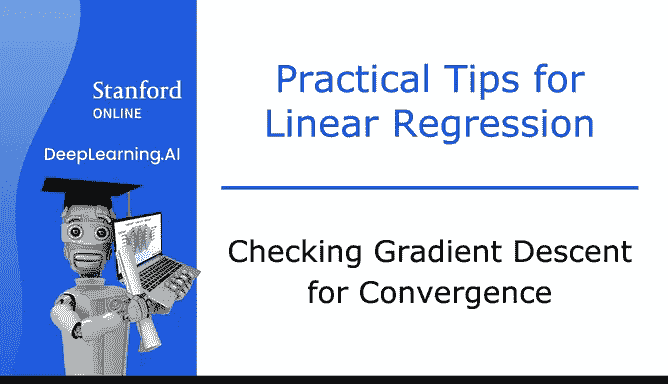
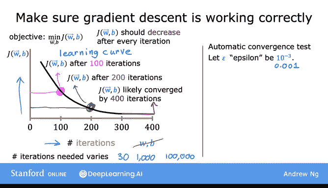

# 27：检查梯度下降法的收敛性 📉

在本节课中，我们将学习如何判断梯度下降法是否正在收敛，即它是否正在帮助我们找到接近成本函数全局最小值的参数。通过识别梯度下降法正常运行时的表现，我们也能为后续课程中选择合适的学习率 **α** 打下基础。

---

## 梯度下降法回顾

上一节我们介绍了梯度下降法的基本概念。本节中，我们来看看如何监控其运行过程。首先，让我们回顾一下梯度下降法的更新规则：

**公式：**
`w = w - α * (∂J/∂w)`
`b = b - α * (∂J/∂b)`

其中，**α** 是学习率，这是一个关键的选择。

---

## 绘制学习曲线

为了确保梯度下降法工作正常，我通常会绘制成本函数 **J** 的变化曲线。**J** 是在训练集上计算得出的。我会在梯度下降的每次迭代后，记录并绘制 **J** 的值。

这里需要注意，每次迭代指的是参数 **w** 和 **b** 完成一次同步更新后。因此，在这张图中，横轴是已运行的梯度下降迭代次数，纵轴是成本 **J** 的值。这与之前以参数（如 **w**）为横轴的图不同。

这种曲线也被称为**学习曲线**。机器学习中有几种不同类型的学习曲线，在本课程后续部分你还会看到其他类型。

具体来说，曲线上的一点，例如横坐标为100的点，表示在运行了100次迭代（即参数更新了100次）后，你得到了当前的 **w** 和 **b** 值。此时计算出的成本 **J** 值，就对应着纵轴上的这个点。

观察这张图有助于你了解成本 **J** 在每次梯度下降迭代后的变化情况。

---

## 判断收敛的迹象

以下是判断梯度下降是否正常工作的关键观察点：

**成本应持续下降**：如果梯度下降运行正常，成本 **J** 应该在每次迭代后都下降。如果 **J** 在某次迭代后反而增加了，这通常意味着学习率 **α** 选择不当（通常是过大），或者代码中存在错误。

**曲线趋于平缓**：观察学习曲线，例如在迭代到300次左右时，成本 **J** 可能开始趋于平缓，下降幅度变小。到了400次迭代，曲线可能已经完全平坦。这表明梯度下降已经大致收敛，因为成本不再显著下降。

通过观察学习曲线，你可以尝试判断梯度下降是否正在收敛。

---

## 迭代次数的差异

顺便提一下，梯度下降达到收敛所需的迭代次数在不同应用之间差异很大。对于一个应用，可能30次迭代就收敛了；而对于另一个应用，可能需要1000次甚至10万次迭代。事先很难预测梯度下降需要多少次迭代才能收敛，这就是为什么你需要绘制这样的学习曲线图，以确定何时可以停止训练你的特定模型。

---

## 自动收敛测试

另一种决定模型何时训练完成的方法是使用**自动收敛测试**。

我们设 **ε**（希腊字母 Epsilon）为一个很小的数，例如 0.001 或 10⁻³。

**公式：**
`ε = 0.001`

**判断逻辑**：如果成本 **J** 在一次迭代中的减少量小于这个阈值 **ε**，那么你很可能处于曲线左侧所示的平坦部分，此时可以宣布收敛。

请记住，收敛（希望如此）表明你已经找到了接近 **J** 最小可能值的参数 **w** 和 **b**。

不过，我发现选择合适的阈值 **ε** 相当困难。因此，我实际上更倾向于查看左侧这样的图表，而不是依赖自动收敛测试。观察这个小图还能提前给你一些警告，告诉你梯度下降可能没有正确工作。

---

## 总结与过渡

本节课中，我们一起学习了梯度下降法正常运行时学习曲线应有的样子，以及如何通过观察曲线判断其是否收敛。你已经看到了当梯度下降运行良好时，学习曲线应该呈现的趋势。

掌握了这些洞察后，在下一节视频中，我们将利用这些知识，来看看如何选择一个合适的学习率 **α**。