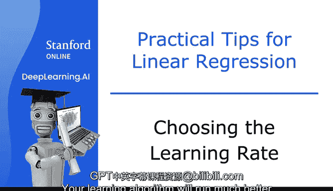
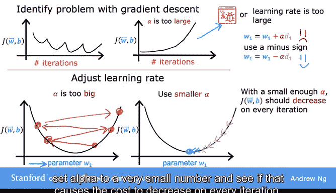
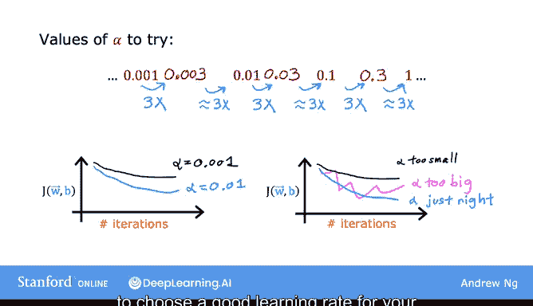
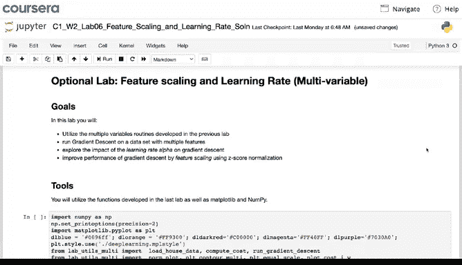
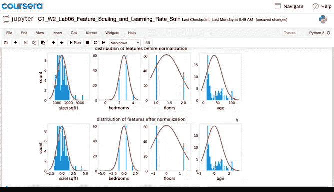

# 28：如何选择学习率 📈

在本节课中，我们将学习如何为梯度下降算法选择一个合适的学习率。学习率是影响模型训练效率和效果的关键超参数。我们将探讨学习率过大或过小带来的问题，并介绍一种系统化的方法来选择有效的学习率。

## 学习率的重要性

上一节我们介绍了梯度下降的基本原理，本节中我们来看看如何优化其核心参数——学习率。

一个合适的学习率能让你的学习算法运行得更好。如果学习率太小，算法收敛会非常缓慢。如果学习率太大，算法甚至可能无法收敛。

## 学习率过大的表现

以下是判断学习率是否过大的关键迹象。

如果你绘制了多次迭代的成本函数曲线，并发现成本有时上升有时下降，这应被视为梯度下降未正常工作的明确信号。这可能意味着代码中存在错误，或者有时仅意味着你的学习率太大了。

这是一个可能发生情况的示意图。

图中纵轴是成本函数 **J**，横轴代表一个参数，例如 **w1**。

如果学习率太大，假设你从这里开始，你的更新步骤可能会越过最小值点，最终到达这里。在下一个更新步骤中，你再次越过，最终到达这里，依此类推。这就是为什么成本有时会上升而不是下降。

要解决这个问题，你可以使用一个更小的学习率。这样，你的更新可能从这里开始，下降一点，再下降一点，并有望持续下降直到达到全局最小值。

有时你可能会看到成本在每次迭代后持续增加，就像这条曲线一样。这也可能是由于学习率过大造成的，可以通过选择更小的学习率来解决。

## 代码错误的可能性

但像这样的学习率问题也可能是代码存在错误的信号。

例如，如果我的代码错误地将 **w1** 更新为 `w1 + α * (dJ/dw1)`，这可能导致成本在每次迭代中持续增加。这是因为加上导数项会使你的成本 **J** 远离全局最小值，而不是接近它。

请记住，你应该使用减号。正确的代码更新应为：`w1 := w1 - α * (dJ/dw1)`。

## 一个调试技巧

梯度下降正确实现的一个调试技巧是：只要学习率足够小，成本函数应该在每一次迭代中都下降。

如果梯度下降不工作，我经常做的一件事（希望这个技巧对你也同样有用）就是将 **α** 设置为一个非常非常小的数字，看看这是否会导致成本在每次迭代中下降。

即使将 **α** 设置为一个非常小的数字，如果 **J** 没有在每次迭代中下降，反而有时增加，那么这通常意味着代码中存在错误。

请注意，将 **α** 设置得非常小在这里是作为一个调试步骤。对于实际训练你的学习算法来说，一个非常小的 **α** 值并不是最高效的选择。

## 权衡与选择方法

一个重要的权衡是：如果你的学习率太小，梯度下降可能需要很多次迭代才能收敛。

当我运行梯度下降时，我通常会尝试一系列的学习率 **α** 值。

以下是选择学习率的具体步骤。

1.  我会从尝试学习率 **0.001** 开始。
2.  我也会尝试比它大10倍的值，比如 **0.01** 和 **0.1**，等等。
3.  对于每个 **α** 的选择，你可能只需要运行梯度下降少数几次迭代，并绘制成本函数 **J** 随迭代次数变化的曲线。
4.  在尝试了几个不同的值之后，你可能会选择那个看起来能使成本快速且持续下降的 **α** 值。

实际上，我通常这样做：尝试一个像这样的数值范围。在尝试了 **0.001** 之后，我会将学习率增加到 **0.003**（大约是3倍），之后我会尝试 **0.01**（这又大约是 **0.003** 的3倍）。这些尝试基本上是让每个 **α** 值大约是前一个值的3倍。

所以，我的做法是尝试一系列的值，直到我找到一个太小的值，同时也确保我找到了一个太大的值。然后我会尝试选择我能找到的最大可能的学习率，或者比找到的最大合理值稍小一点的值。当我这样做时，它通常能为我的模型提供一个良好的学习率。

我希望这个技巧也能帮助你为你的梯度下降实现选择一个好的学习率。

## 实践与后续内容

在接下来的可选实验中。

你也可以查看在代码中如何进行特征缩放，并观察学习率 **α** 的不同选择如何导致模型训练效果更好或更差。我希望你能愉快地尝试不同的 **α** 值，并观察不同选择的结果。请查看并运行可选实验中的代码，以获得关于特征缩放以及学习率 **α** 的更深入直觉。

选择学习率是训练许多学习算法的重要组成部分。我希望这个视频能让你对不同选择有直观的理解，并知道如何为 **α** 选择一个好的值。

现在，还有几个想法可以用来使多元线性回归更强大，那就是选择自定义特征，这也将允许你拟合曲线，而不仅仅是直线。让我们在下一个视频中看看这个内容。

## 总结

本节课中我们一起学习了如何为梯度下降算法选择学习率。我们了解到学习率过大会导致成本震荡或不收敛，而过小则会使收敛速度过慢。我们学习了一个实用的调试技巧——使用极小的学习率验证代码正确性，以及一个系统化的选择方法——尝试一系列按比例（如3倍）增长的值，并观察成本下降曲线，从而选取一个接近最大有效值的合适学习率。正确选择学习率是高效训练模型的关键一步。