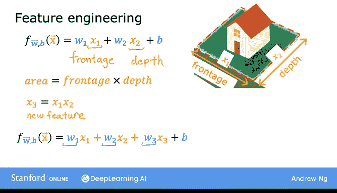

# 29：特征工程 🛠️

在本节课中，我们将要学习**特征工程**。特征的选择对学习算法的性能有巨大影响。事实上，对于许多实际应用，选择或设计正确的特征是使算法良好工作的关键步骤。

接下来，让我们通过一个例子来看看如何为你的学习算法选择或设计最合适的特征。

---

## 特征工程示例：预测房价 🏠

我们通过回顾预测房价的例子来了解特征工程。

假设每个房子有两个特征：
*   **x1** 是地块的宽度（在房地产中也称为临街面）。
*   **x2** 是地块的深度（假设房屋建在矩形地块上）。

给定这两个特征 x1 和 x2，你可能会建立一个这样的模型：
`f(x) = w1 * x1 + w2 * x2 + b`
其中，x1 是临街面（宽度），x2 是深度。这个模型可能效果尚可。

但是，这里还有另一种在模型中使用这些特征的方式，可能会更有效。

---

## 创造新特征：面积的计算 📐

你可能会注意到，土地面积可以通过临街面（宽度）乘以深度来计算。你可能有一种直觉：土地面积比单独的临街面和深度更能预测房价。

因此，你可以定义一个新特征 **x3**：
`x3 = x1 * x2`
这个新特征 x3 就等于地块的面积。

有了这个特征，你的模型可以变为：
`f_wb(x) = w1*x1 + w2*x2 + w3*x3 + b`
现在，模型可以根据数据选择参数 w1、w2 和 w3，以判断临街面、深度还是地块面积 x3 对预测房价最重要。

---

## 什么是特征工程？💡

我们刚才所做的——创造一个新特征——就是**特征工程**的一个例子。在特征工程中，你可以利用对问题的知识或直觉来设计新特征，通常是通过转换或组合问题的原始特征，以使学习算法更容易做出准确的预测。

因此，根据你对应用场景的洞察，有时通过定义新特征，而不是仅仅使用你最初拥有的特征，你可能会得到一个好得多的模型。这就是特征工程。

---

## 特征工程的扩展：拟合曲线 🔄

事实证明，有一种特征工程的方法不仅能让你拟合直线，还能拟合曲线（非线性函数）到你的数据上。

上一节我们介绍了通过组合特征（如面积）来改进模型的基本概念。在下一节中，我们来看看如何实现这一点，让模型能够学习更复杂的数据模式。

---

## 总结 📝

本节课中我们一起学习了：
1.  **特征的重要性**：特征的选择对算法性能有巨大影响。
2.  **特征工程的定义**：通过转换或组合原始特征，利用领域知识设计新特征的过程。
3.  **一个具体例子**：在房价预测中，将“宽度”和“深度”两个特征相乘，创造出更具预测力的“面积”特征。
4.  **特征工程的目标**：使学习算法能更轻松、更准确地进行预测。
5.  **后续方向**：特征工程可以进一步扩展，使模型能够拟合非线性关系。