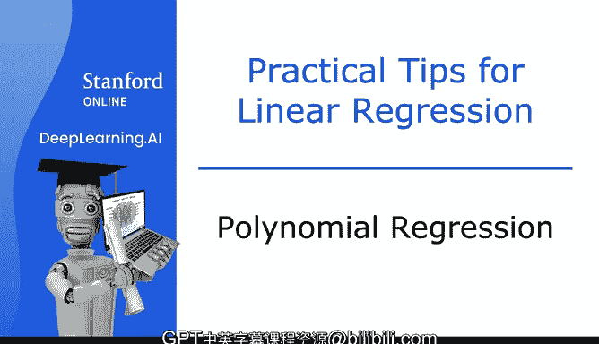
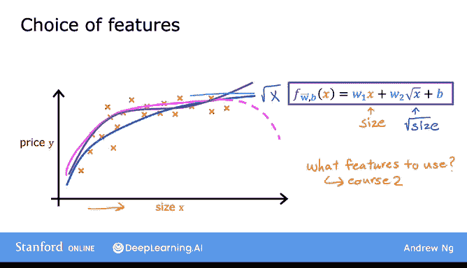
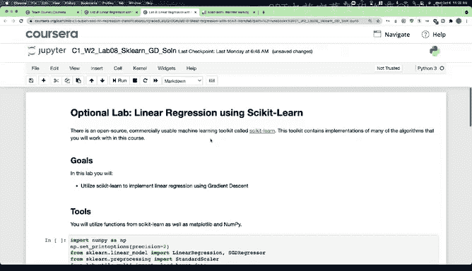
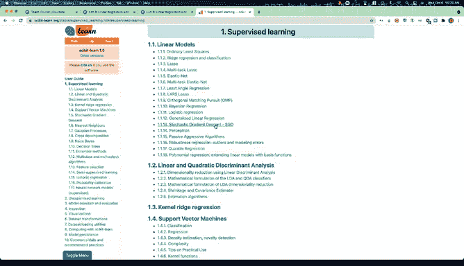
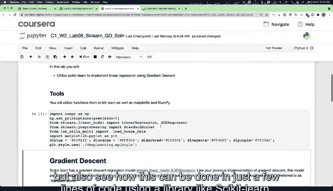

# 30：多项式回归 📈

在本节课中，我们将学习如何将线性回归的思想与特征工程相结合，从而引入一种新的算法——多项式回归。这种算法允许我们为数据拟合曲线和非线性函数，以更好地捕捉数据中的复杂模式。

---

## 从直线到曲线 🔄



到目前为止，我们一直在用直线拟合数据。然而，并非所有数据都适合用直线来描述。让我们将多元线性回归和特征工程的思想结合起来，引入一种名为多项式回归的新算法。该算法允许你为数据拟合曲线和非线性函数。

假设你有一个住房数据集，特征 `X` 代表房屋面积（平方英尺）。从数据分布来看，直线似乎不能很好地拟合这个数据集。


因此，你可能希望拟合一条曲线，例如一个二次函数。这个函数不仅包含面积 `x`，还包含 `x` 的平方（即面积乘以自身）。

## 二次函数与三次函数 📊

二次函数模型可能为数据提供更好的拟合。但你可能随后会发现，二次模型在逻辑上并不完全合理，因为二次函数最终会下降。我们通常不会期望房屋价格随面积增大而下降，因为房屋面积越大，通常价格越高。

于是，你可能会选择三次函数模型。该模型不仅包含 `x` 的平方，还包含 `x` 的立方。这个模型可能产生一条曲线，能更好地拟合数据，因为随着面积增大，价格最终会回升。

这两种都是多项式回归的例子，因为你将原始特征 `X` 提升到了 2 次方或 3 次方（或其他次方）。对于三次函数，第一个特征是面积，第二个特征是面积的平方，第三个特征是面积的立方。

## 特征缩放的重要性 ⚖️

需要特别指出的是，如果你创建了像原始特征平方这样的幂次特征，那么特征缩放就变得尤为重要。

例如，如果房屋面积范围在 1 到 1000 平方英尺之间，那么第二个特征（面积平方）的范围将是 1 到 1,000,000，而第三个特征（面积立方）的范围将是 1 到 1,000,000,000。与原始特征 `X` 相比，特征 `x²` 和 `x³` 的取值范围差异巨大。如果使用梯度下降法，应用特征缩放以使特征值处于可比范围内是非常重要的。

## 其他特征选择 🔍

除了使用面积的平方和立方，你还有广泛的特征选择。另一个可行的替代方案是使用 `x` 的平方根。

你的模型可能看起来像这样：
```
预测值 = w₁ * x + w₂ * √x + b
```
平方根函数的曲线随着 `x` 增大而增长趋缓，但永远不会完全平坦，也绝不会下降。因此，这可能是适用于该数据集的另一个特征选择。

你可能会问，如何决定使用哪些特征？在后续的专项课程中，你将学习如何选择不同的特征和模型，并有一个评估不同模型性能的过程，以帮助你决定包含或排除哪些特征。

目前，只需意识到你在特征选择上拥有灵活性。通过特征工程和多项式函数，你有可能为数据获得更好的模型。



## 实践环节：代码实现与工具 🛠️

在本视频随后的可选实验中，你将看到一些实现多项式回归的代码，这些代码使用了诸如 `x`、`x²` 和 `x³` 等特征。请查看并运行代码，了解其工作原理。


之后还有另一个可选实验，展示了如何使用一个流行的开源工具包来实现线性回归。




Scikit-learn 是一个非常广泛使用的开源机器学习库，被全球许多顶级人工智能和互联网机器学习公司的从业者所使用。




因此，无论现在还是将来，如果你在工作中使用机器学习，很可能会使用像 Scikit-learn 这样的工具来训练模型。

完成这个可选实验不仅会让你更好地理解线性回归，还能让你看到如何使用像 Scikit-learn 这样的库，仅用几行代码就能完成这些任务。




为了让你对这些算法有扎实的理解并能够应用它们，我认为重要的是你要知道如何自己实现线性回归，而不仅仅是调用某个像黑盒子一样的 Scikit-learn 函数。但 Scikit-learn 在当今机器学习的实践方式中确实扮演着重要角色。

## 本周总结与展望 🎉

本周的内容即将结束，恭喜你完成了本周的所有视频。请务必查看练习测验和练习实验。我希望练习实验能让你尝试和实践我们本周讨论的思想。在练习实验中，你将实现线性回归。希望你享受让这个学习算法为自己工作的过程。

祝你好运！我也期待在下周的视频中与你再见。下周我们将超越回归（预测数字），讨论我们的第一个分类算法，该算法可以预测类别。

下周见！

---

**本节课总结**：在本节课中，我们一起学习了多项式回归的概念。我们探讨了如何通过特征工程，将原始特征转化为高次项（如平方、立方）来拟合非线性数据。我们强调了特征缩放对于此类模型的重要性，并简要介绍了使用 Scikit-learn 库进行实现的实践方向。最后，我们为本周的学习画上句号，并预告了下一周关于分类算法的内容。