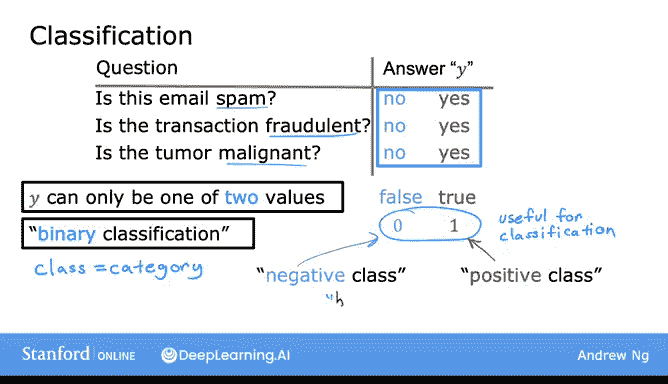
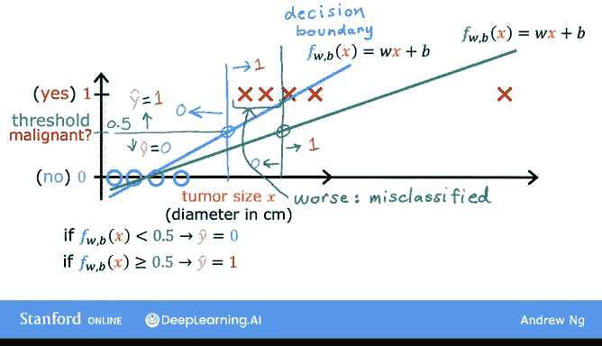
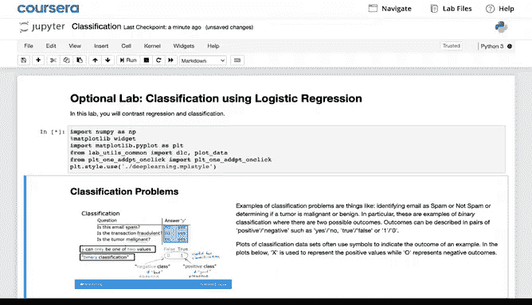
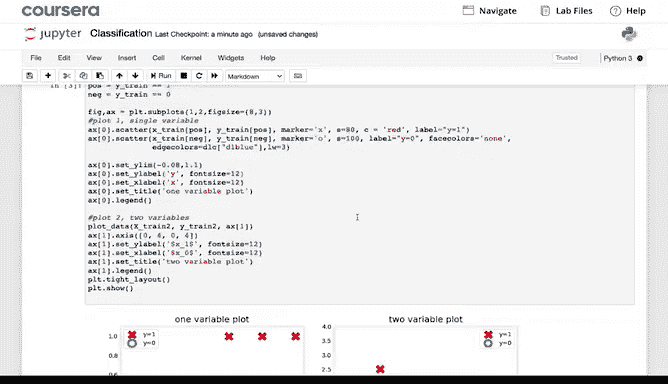
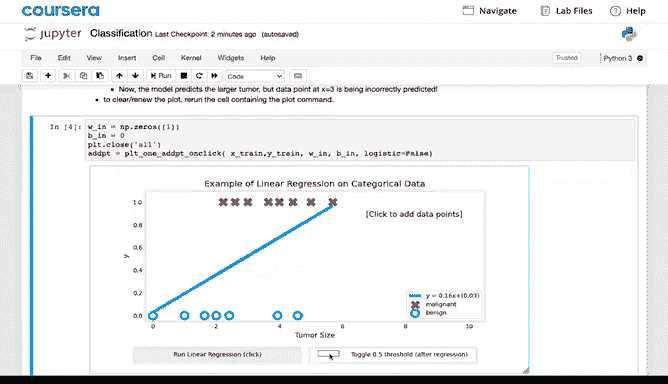
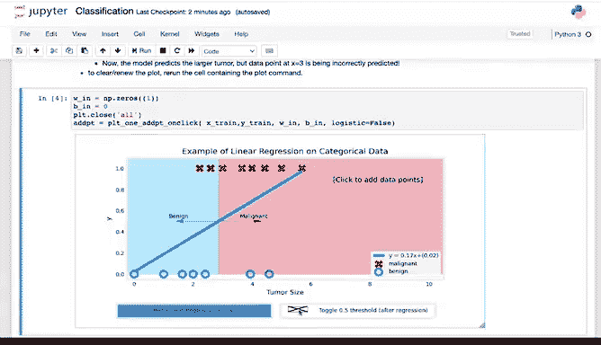

# 31：分类问题与逻辑回归动机 🎯

在本节课中，我们将探讨为什么线性回归不适用于分类问题，并引出一种专门用于分类的算法——逻辑回归。我们将通过具体例子理解分类问题的特点，并分析线性回归在处理此类问题时的局限性。

## 概述 📋

欢迎来到本课程的第三周。本周结束时，您将完成本专项课程的第一个课程。上周我们学习了用于预测连续数值的线性回归。本周我们将学习分类问题，其输出变量 `y` 只能取少数几个可能值中的一个，而不是无限范围内的任意数字。

## 分类问题示例 📧

以下是几个分类问题的例子。

*   **垃圾邮件识别**：判断一封电子邮件是否为垃圾邮件。输出答案是“否”或“是”。
*   **金融欺诈检测**：判断一笔在线金融交易是否为欺诈。例如，信用卡是否被盗用。
*   **肿瘤分类**：判断一个肿瘤是恶性还是良性。

在上述每个问题中，您想要预测的变量只能是两个可能值之一。这种只有两种可能输出的分类问题称为**二元分类**。“二元”指的是只有两个可能的类别。

## 类别表示约定 0️⃣1️⃣

按照惯例，我们可以用几种常见方式来表示这两个类别。

我们通常将类别指定为“否”或“是”，有时等价为“假”或“真”，或者非常普遍地使用数字 `0` 或 `1`。遵循计算机科学的惯例，`0` 表示假，`1` 表示真。我通常使用数字 `0` 和 `1` 来表示答案 `y`，因为这最符合我们想要实现的学习算法类型。

在术语上，通常将假或 `0` 类称为**负类**，将真或 `1` 类称为**正类**。例如，在垃圾邮件分类中，一封非垃圾邮件可称为负例，因为“是垃圾邮件吗？”这个问题的输出是“否”或 `0`。相反，一封垃圾邮件可称为正例，因为答案是“是”或 `1`。

通常，“负”和“正”不一定意味着坏与好或邪恶与善良，它们只是用来传达“不存在”（`0` 或假）与“存在”（`1` 或真）的概念，例如电子邮件中垃圾属性的存在与否，或交易中欺诈活动的存在与否，或肿瘤中恶性特征的存在与否。

将哪一类称为假/`0`，哪一类称为真/`1` 有些随意。通常两种选择都可以，因此不同的工程师可能会互换，将正类定义为好邮件的存在，或真实交易的存在，或健康患者的存在。

## 线性回归用于分类的局限性 ⚠️

那么如何构建分类算法呢？我们来看一个用于分类肿瘤是否为恶性（`1` 类，正类，是）或良性（`0` 类，负类）的训练集示例。我在横轴上绘制了肿瘤大小，在纵轴上绘制了标签 `y`。

现在，您可以在此训练集上尝试应用已知的算法——线性回归，并尝试用一条直线拟合数据。如果这样做，直线可能看起来像这样，这就是您的 `f(x)`。

线性回归预测的不仅是 `0` 和 `1` 值，还包括 `0` 和 `1` 之间的所有数字，甚至小于 `0` 或大于 `1` 的数字。但这里我们想要预测类别。

您可以尝试选择一个阈值，例如 `0.5`。这样，如果模型输出值低于 `0.5`，则预测 `y` 等于 `0`（非恶性）；如果模型输出值等于或大于 `0.5`，则预测 `y` 等于 `1`（恶性）。请注意，这个 `0.5` 的阈值在这一点与最佳拟合直线相交。因此，如果您在此处画一条垂直线，左侧的所有点最终预测为 `y=0`，右侧的所有点最终预测为 `y=1`。

对于这个特定数据，线性回归似乎可以做出合理的判断。

## 新增数据点带来的问题 🔄

现在，让我们看看如果数据中多了一个训练样本（右边很远的一个）会发生什么。同时我们也扩展一下横轴。请注意，这个训练样本实际上不应该改变您对数据点的分类方式。我们刚才画的这条垂直分界线作为截止点仍然有意义：肿瘤小于此值应分类为 `0`，大于此值应分类为 `1`。

但是，一旦在右侧添加了这个额外的训练样本，线性回归的最佳拟合线将像这样移动。如果您继续使用 `0.5` 的阈值，您现在会注意到，该点左侧的所有内容都被预测为 `0`（非恶性），而该点右侧的所有内容都被预测为 `1`（恶性）。

这不是我们想要的。因为在右侧添加那个样本不应该改变我们关于如何分类恶性与良性肿瘤的任何结论。但是，如果您尝试用线性回归来做这件事，添加这个感觉不应该改变任何东西的样本，最终会导致我们为这个分类问题学习到一个糟糕得多的函数。显然，当肿瘤很大时，我们希望算法将其分类为恶性。

我们刚才看到的是，当我们在右侧添加一个样本时，线性回归导致最佳拟合线移动，因此分界线（也称为决策边界）也向右移动。

## 引入逻辑回归 🧠

在下一个视频中，您将了解更多关于决策边界的内容，并学习一种称为**逻辑回归**的算法。该算法的输出值将始终介于 `0` 和 `1` 之间，并且会避免我们在幻灯片上看到的这些问题。

顺便说一下，逻辑回归这个名字令人困惑的一点是，尽管它包含“回归”一词，但实际上用于分类。不要被这个名字所迷惑，这个名字是历史原因造成的，它实际上用于解决输出标签 `y` 为 `0` 或 `1` 的二元分类问题。

## 可选实验与总结 📝

在即将进行的可选实验中，您还可以看看尝试将线性回归用于分类时会发生什么。有时您很幸运，它可能有效。但通常效果不佳，这就是为什么我自己不使用线性回归进行分类的原因。在可选实验中，您将看到一个尝试对两个类别进行分类的交互式图表，您可能会注意到这通常效果不佳。这没关系，因为这激发了对不同模型来完成分类任务的需求。

所以请查看这个可选实验，之后我们将进入下一个视频，学习用于分类的逻辑回归。

## 总结 ✨

本节课我们一起学习了分类问题的基本概念，理解了为什么线性回归不适合处理分类任务，并通过一个肿瘤分类的例子具体分析了线性回归的局限性。我们认识到，由于分类输出是离散的类别，而线性回归输出连续值，直接应用会导致决策边界不稳定。这为我们引入专门用于分类、且输出值被限制在 `0` 到 `1` 之间的逻辑回归算法做好了铺垫。